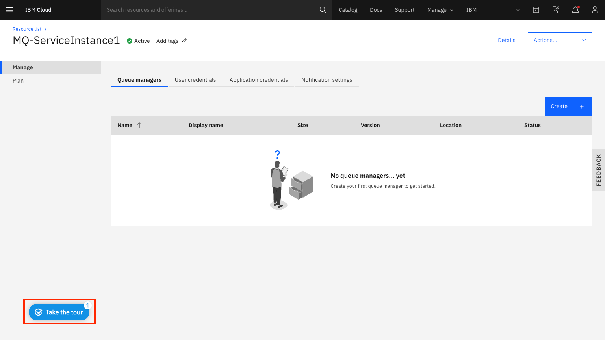
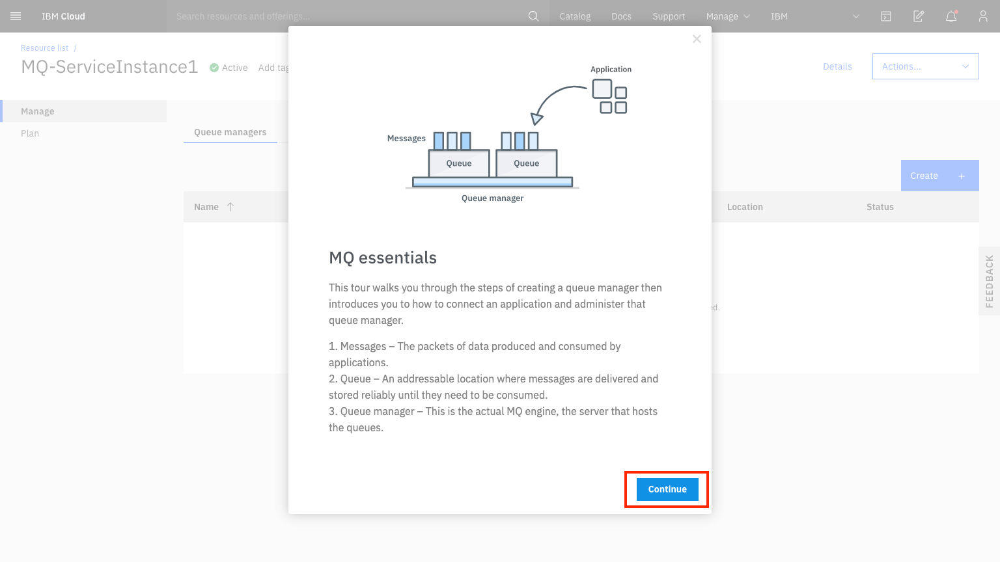

---
copyright:
  years: 2017, 2022
lastupdated: "2022-07-08"

subcollection: mqcloud

keywords: started, guided, tour
---

{{site.data.keyword.attribute-definition-list}}

# Getting started with {{site.data.keyword.mq_full}}
{: #getting_started}

{{site.data.keyword.mq_full}} enables you to quickly and easily deploy queue managers in the cloud and connect your applications to them, for reliable data transfer between different parts of your enterprise application landscape.
{: shortdesc}

This document describes two approaches to get started with {{site.data.keyword.mq_full}}:

- **Getting started using the Guided Tour** - this describes how to start the embedded tutorial, which will guide you through the process of creating and using your first {{site.data.keyword.mq_full}} queue manager.
- **Manually creating and using an {{site.data.keyword.mq_full}} queue manager** - this provides documented steps describing how to create and use your first {{site.data.keyword.mq_full}} queue manager.

## Before you begin
{: #getting_started_prepreqs}

* You need an [{{site.data.keyword.cloud}}](https://cloud.ibm.com/registration/) account.
* Permissions to create a {{site.data.keyword.mq_full}} service instance in the account.

## Launching an {{site.data.keyword.mq_full}} service Instance
{: #getting_started_create_instance}

To create an {{site.data.keyword.mq_short}} service instance:

1. Go to the [{{site.data.keyword.cloud_notm}} **Catalog**](https://cloud.ibm.com/catalog?category=integration){: external}
2. Select **MQ**
3. Select your desired region.
4. Type in a service name.
5. Select a plan, for example **Lite**.
6. Click **Create**.

You are now presented with a view of your service instance from where you will be able to view and manage your queue managers. This is also the page from which you can launch the Guided Tour.

## Getting started using the Guided Tour
{: #getting_started_guided_tour}

The {{site.data.keyword.mq_short}} service comes with a Guided Tour, which provides step by step guidance through the following steps:

- creating a queue manager
- registering an application to put and get messages on a queue
- administering a queue manager

You can launch the Guided Tour by clicking on the 'Take the tour' button at the bottom left of the page.

If you don't yet have any queue managers, the Guided Tour will automatically be expanded. {: note}

Once the Guided Tour is expanded, you can begin by clicking 'Continue'.

## Manually creating and using an {{site.data.keyword.mq_full}} queue manager
{: #getting_started_manual_create}

As an alternative to the Guided Tour, you can instead follow the documented steps below to create and use the {{site.data.keyword.mq_full}} service:

1. [Create a queue manager.](/docs/mqcloud?topic=mqcloud-mqoc_create_qm)
2. [Administer a queue manager](/docs/mqcloud?topic=mqcloud-mqoc_admin_mqweb) using the IBM MQ Web Console.
3. [Connect a sample application to a queue manager.](/docs/mqcloud?topic=mqcloud-mqoc_connect_app_qm)
