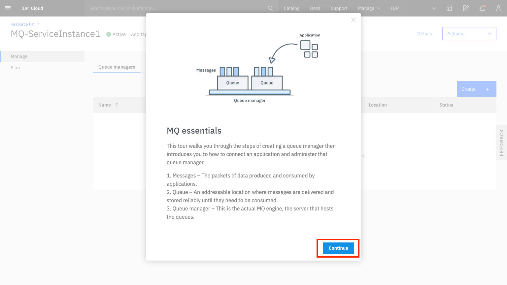

---
copyright:
  years: 2017, 2018
lastupdated: "2018-01-09"
---

{:new_window: target="_blank"}
{:shortdesc: .shortdesc}
{:screen: .screen}
{:codeblock: .codeblock}
{:pre: .pre}

# Getting started with MQ on IBM Cloud
{: #index}

MQ on IBM Cloud enables you to quickly and easily deploy queue managers in the cloud and connect your applications to them, for reliable data transfer between different parts of your enterprise application landscape.

The service comes with a Guided Tour, which guides you through the following steps:
 - creating a queue manager
 - creating an administrator user
 - using a demo application to put and get messages on a queue
 - accessing the IBM MQ Web Console

## Launching MQ on IBM Cloud
{: #launch_mqoc_create_qm}

In order to access the Guided Tour, you must first launch the IBM MQ on Cloud service, which is achieved by creating an IBM MQ on Cloud service instance.

**Note:** If you've already created a service instance, you can skip the following steps and continue with the next section **Using the Guided Tour**.

To create an MQ on Cloud service instance:
1. Log in to the IBM Cloud console, accessible at: http://console.bluemix.net/
2. Click **Catalog**.
3. Click **Integration**, and click **MQ**.
4. Type in a service name.
5. Select a plan, for example **Default**.
5. Click **Create**.

You are now presented with a view of your service instance from where you will be able to view and manage your queue managers after they have been created. This is also the page from which you can launch the Guided Tour.

## Using the Guided Tour

You can launch the Guided Tour by clicking on the folding icon at the top right of the page.

**Note:** if you don't yet have any queue managers, the Guided Tour will automatically be expanded.

Once the Guided Tour is expanded, you can begin by clicking 'Get Started'.

