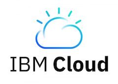
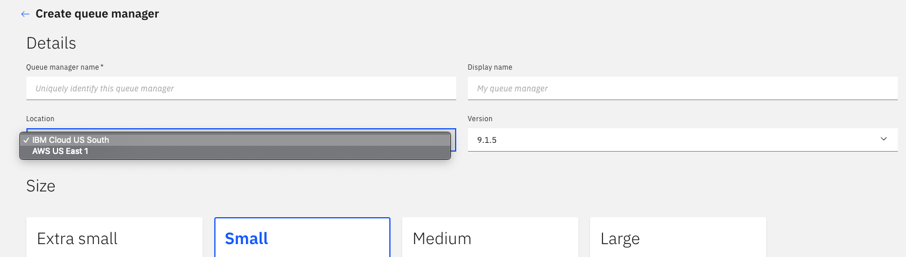

---
copyright:
  years: 2018, 2020
lastupdated: "2020-04-28"
---

{:new_window: target="_blank"}
{:shortdesc: .shortdesc}
{:screen: .screen}
{:codeblock: .codeblock}
{:pre: .pre}

# Deployment locations
{: #mqoc_qm_locations}

IBM MQ on Cloud provides a managed service that allows queue managers to be deployed to both {{site.data.keyword.cloud_notm}} and Amazon Web Services (AWS).

 and also 

{:shortdesc}

## Queue manager locations

The location of a service instance is selected from a dropdown list when creating the service instance.

The list of queue manager locations available depends on where the service instance was created. This list is displayed in the queue manager creation page, as shown below.

Queue managers can be deployed to IBM Cloud or Amazon Web Services by selecting the preferred location from the drop down list.

Service instance location         | Queue manager deployment locations
----------------------------------|--------------
`Dallas (us-south)`               | `IBM Cloud US South (Dallas)` `AWS US East 1 (North Virginia)`
`Frankfurt (eu-de)`               | `IBM Cloud Germany (Frankfurt)` `AWS EU West 1 (Ireland)`
`London (eu-gb)`                  | `IBM Cloud United Kingdom (London)`
`Sydney (au-syd)`                 | `IBM Cloud Sydney`
`Washington DC (us-east)`         | `IBM Cloud US East`

Lite queue managers are only available in IBM Cloud locations. Other sizes are available in all locations.

We recommend that you choose the cloud location which is geographically closest to your position -  this will help to lower latency and give optimal performance. Please contact us if you would like to discuss additional deployment locations.

The location of a deployed queue manager can be found by examining the queue manager details page:

**Note:**

Amazon Web Services and AWS are trademarks of Amazon.com, Inc. or its affiliates in the United States and/or other countries.
