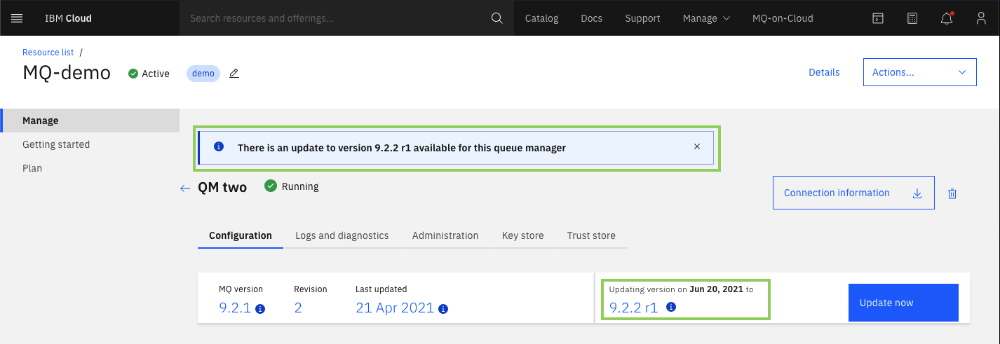

---
copyright:
  years: 2018, 2019
lastupdated: "22019-02-04"
---

{:new_window: target="_blank"}
{:shortdesc: .shortdesc}
{:screen: .screen}
{:codeblock: .codeblock}
{:pre: .pre}

# Queue manager versions
{: #mqoc_qm_versions}

In this section, you can learn about the IBM queue manager versions and revisions for MQ on IBM Cloud.

{:shortdesc}

## Queue manager details

The queue manager *Configuration* tab shows details about the current queue manager, including the MQ version, revision, and the date it was last updated. Hovering over the information icons reveals additional detail, such as the build level and the time of the last update.

### MQ version

The version and maintenance level of the queue manager for example, 9.0.5, represents the fifth Continuous Delivery (CD) release within the v9.0 family.

From time to time new versions of the MQ product will be released, such as during a new Continuous Delivery (CD) release. The new version of MQ will automatically become the default selection for new queue manager deployments, and existing queue managers will be notified that they have a specified time window in order to upgrade to the latest version.

### MQ build level

Hovering over the information icon next to the *MQ version* field reveals the build level. The build level includes the date that the MQ level was built, which changes when a fix has been applied to the queue manager deployment.

### Revision

The MQ on IBM Cloud service uses the term "revision" to describe different levels of the container image that runs inside an individual queue manager. Revisions are a sub-division within the MQ version. For example, the operating system image used in "9.0.4 r1" is not generally the same as "9.0.5 r1". Revisions are inclusive so "9.0.5 r3" would contain the changes in "9.0.5 r1" and "9.0.5 r2".

Periodically, a new revision will be released for a given MQ version. A new revision may include one or more of the following:
* Applied queue manager fixes, such as required security fixes.
* New or updated operating system dependencies.
* Fixes or new features specific to the MQ on Cloud service.

The new revision will automatically become the default selection for new queue manager deployments, and existing queue managers will be notified that they have a specified time window in order to update to the latest revision.

The update notification will be displayed on the **Queue managers** list view where an information text box will appear above the list of queue managers. An icon will also appear next to the **Version** field of applicable queue managers. Hovering over the information icon will reveal the date by which the queue manager should be updated.

The queue manager details page will also display any applicable update notification.

The information icon will change from a blue circle to an orange triangle when the time window for the update is within 14 days. If you do not [update your queue manager](/docs/services/mqcloud?topic=mqcloud-mqoc_qm_update) before that time elapses, the update will be performed automatically. This will happen within a 24 hour period of the given date.

**Note:** The length of the time window in which a manual update can take place depends on the severity of the fixes contained in the new revision. A high severity security fix would need to be applied more quickly than a low severity fix, as such, the automatic update would occur sooner than a low severity fix.

To get more information on the nature of the update, click on the down arrow next to the **Update now** button.

This shows a short summary of the contents of the update. Full details of the current and previous update history can be found by clicking on [View more details in docs](/docs/services/mqcloud?topic=mqcloud-mqoc_qm_ver_and_rev_content).

### Version update

Periodically, a new version of MQ will be released. New versions may include one or more of the following:
* New features or function
* New or updated operating system dependencies
* New or updated client dependencies
* Fixes and security updates

The new version will be offered as an alternative update choice until such a time as it becomes the default (or only) update choice. You can choose between the next revision (if available) and the next version for the update.

### Last updated

The date that is stated is when the queue manager was deployed. Following this, the date represents when it was most recently updated to a new version or revision.

Hovering over the information icon next to the *Last updated* field reveals the time of day of the last update .
