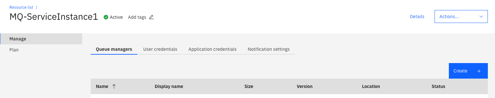

---
copyright:
  years: 2017, 2021
lastupdated: "2021-09-29"
---

{{site.data.keyword.attribute-definition-list}}

# Users and Applications
{: #users_and_apps}

{{site.data.keyword.mq_full}} access control is managed by the {{site.data.keyword.iamlong}}(IAM) service. Permissions in {{site.data.keyword.cloud_notm}} are mapped to access rights in the IBM MQ queue managers within your IBM MQ service instance. The following describes how that mapping is achieved.
{: shortdesc}

{{site.data.keyword.mq_full}} makes a distinction between *Administrators* and *Applications* - which in IAM terminology are equivalent to [Users](#x2069659){: term} and [Service IDs](#x9148163){: term}. Both these entities are capable of accessing an IBM MQ queue manager but they are in different groups and have different access rights.

Administrators are given an IAM [access policy](#x2853407){: term} which automatically adds them to the standard `mqm` group for all queue managers in their service instance, and therefore they have full administrator access rights.

Applications are given an IAM access policy which automatically adds them to the `mqwriters` group - this group gives applications permission to read/write to queues in the queue manager, but does not give them administration privileges.

On deployment of a queue manager within {{site.data.keyword.mq_full}}, two channels are created for you:

- `CLOUD_ADMIN_SVRCONN` is a channel for administration, and is therefore accessible by *Administrators*.
- `CLOUD_APP_SVRCONN` is a channel for queue access, and it therefore available to *Applications*.

## MQ Usernames
{: #users_and_apps_usernames}

To access a queue manager using IBM MQ - a username and a password are required. The username is restricted to 12 characters and must only contain lowercase (a-z) and numbers (0-9).

When creating users and applications in {{site.data.keyword.mq_full}}, you are required to give these entities a name (for an administrator, this must be a valid email address) from which a shorter name called an *MQ username* is generated. This shorter user name is based on the email address, but is guaranteed to be unique within the service instance, and also conform to the required format of an IBM MQ username.

## Passwords
{: #users_and_apps_passwords}

At the {{site.data.keyword.mq_short}} level, access control is implemented using [API keys](#x8051010){: term}. These are used by our system as the passwords associated with users and applications at the IBM MQ level.

In the panel showing the list of queue managers in your service instance, you will find two tabs which allow you to create *user credentials* and *application credentials*.

Administrators must generate and use their own Administrator API key. This must be used as their password to connect to a queue manager.
{: important}

The *Application credentials* panel allows you to create an individual API key associated with a specific application. This is the password to be used with that application when connecting to all queue managers in your service instance - thus each application has a different password.
