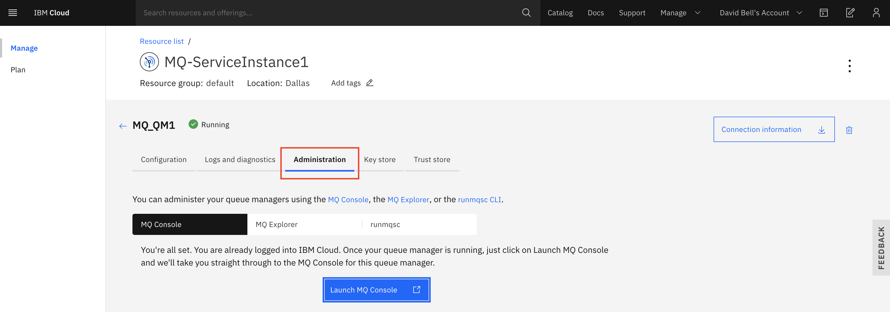

---
copyright:
  years: 2017, 2019
lastupdated: "2018-07-06"
---

{:new_window: target="_blank"}
{:shortdesc: .shortdesc}
{:screen: .screen}
{:codeblock: .codeblock}
{:pre: .pre}

# Administering a queue manager using the runmqsc command line
{: #mqoc_admin_mqcli}

Part of the "MQ clients" bundle, runqmsc is a command-line interface (CLI) tool that allows you to automate the configuration of MQ queue managers by executing a series of pre-defined steps at the command-line or in a script file. It is supported on a range of operating systems including Windows and Linux (but is not currently supported on Mac OS).

There are many actions you can perform by using runmqsc from an MQ client. You can
* Connect to a queue manager
* Create a new queue
* Put a message onto a queue
* Get a message from a queue
* Delete a queue
{:shortdesc}

---

## Prerequisites
{: #prereq_mqoc_admin_mqcli}

* An existing queue manager (for instructions, follow the [creating a queue manager](/docs/services/mqcloud?topic=mqcloud-mqoc_create_qm) guide).
* You have been granted permissions to access queue managers within your IBM MQ service instance (for instructions, follow the [configuring administrator access for a queue manager](/docs/services/mqcloud?topic=mqcloud-tut_mqoc_configure_admin_qm_access) guide).
* An existing installation of IBM MQ Client on your own machine.
 * Download the client from [here](http://www-01.ibm.com/support/docview.wss?uid=swg24042176#1).
   * Clicking the **HTTP** link next to the latest available version of the **CD Clients** will take you to **Fix Central**. From there you can search for and select the appropriate **Redist** (redistributable) client bundle for your operating system platform. This will include the sample applications and runmqsc.
   * Once downloaded, unpack the bundle into a location of your choosing.
   * Make a note of the full path to the `bin` directory, the location of which will depend upon where you chose to unpack the bundle. This path will be referenced as `<PATH_TO_BIN_DIR>` for the rest of this task.
   * Make a note of the full path to the directory containing the sample applications. This path will be referenced as `<PATH_TO_SAMPLE_BIN_DIR>` for the rest of this task.
     * For Windows, this will be the `bin` directory unpacked in the previous step, the location of which will depend upon where you chose to unpack the bundle.
     * For Linux, this will be the `samp/bin` directory unpacked in the previous step, the location of which will depend upon where you chose to unpack the bundle.

---

## Gather required connection details
{: #getdetails_mqoc_admin_mqexp}

1. Log in to the IBM Cloud console.
2. Click on the 'hamburger menu'.
3. Click **Dashboard**.
  * Ensure that **RESOURCE GROUP** is set to **All Resources**.
4. Locate and click on your IBM MQ service instance, found under the 'Services' heading.
5. From the list of your queue managers, click on the one you want to administer.
6. Make note of the **Queue manager name**, **Hostname** and **Port** values for use in the next steps.
7. If you already know your **MQ Username** and **IBM Cloud API Key**, you can skip to the [next section](#connect_mqoc_admin_mqcli) of this task. Otherwise, Click the **Administration** tab.

 

8. Make a note of your **MQ Username** for future use.
  * Note that you can edit your **MQ Username** at any time by following the [Editing or removing the MQ username for an existing user or application](/docs/services/mqcloud?topic=mqcloud-mqoc_administer_mq_username) guide.
9. If you do not already have an existing IBM Cloud API key:
  * Click **Create IBM Cloud API Key**.
  * Click **Show** to display the API key to copy and save it for later, or click **Download** to store the API key in a file.
    * Note that the API key generated in these steps is used to authenticate with **IBM Cloud** as the **user** who created it.  Therefore, it should not be shared with any other users and should be stored securely.
    * An API key created through the IBM MQ service can be reset from the queue manager **Administration** tab.
  * Click **Close**.

---

## Connect to your queue manager using runmqsc
{: #connect_mqoc_admin_mqcli}

**Note:** Please ensure that you have carried out the prerequisite steps listed [above](#prereq_mqoc_admin_mqcli).

1. Open a command shell to use in the next steps.
2. Export the 'MQSERVER' variable:
 * Linux: `export MQSERVER="CLOUD.ADMIN.SVRCONN/TCP/<Hostname>(<Port>)"`
 * Windows (Command prompt): `set MQSERVER=CLOUD.ADMIN.SVRCONN/TCP/<Hostname>(<Port>)`
 * Windows (PowerShell): `$env:MQSERVER="CLOUD.ADMIN.SVRCONN/TCP/<Hostname>(<Port>)"`
3. Run `<PATH_TO_BIN_DIR>/runmqsc -c -u <your MQ username> -w60 <QUEUE_MANAGER_NAME>`
4. Enter your **platform API key** when prompted for a password.

---

## Create a new test queue called 'DEV.TEST.1'
{: #createq_mqoc_admin_mqcli}

**Note:** queue names should start with **DEV.*** (example: DEV.myQueue) as application users have been configured with access to this prefix only.

In the same shell used in the previous steps:

1. Run `DEFINE QLOCAL (DEV.TEST.1)`
2. Run `DISPLAY QLOCAL(DEV.TEST.1)`
 * Details of queue 'DEV.TEST.1' are displayed.
3. Run `end`
 * The runmqsc session is closed.
 * Retain the prompt to use in the next steps.

---

## Put a message using the amqsputc sample program
{: #put_mqoc_admin_mqcli}

In the same shell used in the previous steps:

1. Export the 'MQSAMP_USER_ID' variable:
 * Linux: `export MQSAMP_USER_ID="<your MQ username>"`
 * Windows (Command prompt): `set MQSAMP_USER_ID=<your MQ username>`
 * Windows (PowerShell): `$env:MQSAMP_USER_ID="<your MQ username>"`
2. Run `<PATH_TO_SAMPLE_BIN_DIR>/amqsputc DEV.TEST.1`
3. Enter your **platform API key** when prompted for a password.
4. Type in a test message.
5. Hit `Enter` twice to exit the amqsputc sample.

---

## Get a message using the amqsgetc sample program
{: #get_mqoc_admin_mqcli}

In the same shell used in the previous steps:

1. Run `<PATH_TO_SAMPLE_BIN_DIR>/amqsgetc DEV.TEST.1`
2. Enter your **platform API key** when prompted for a password.

Your test message is displayed.

After a short period, the amqsputc sample program should end after finding no more messages.

---

## Delete the test queue
{: #deleteq_mqoc_admin_mqcli}

In the same shell used in the previous steps:

1. Run `<PATH_TO_BIN_DIR>/runmqsc -c -u <your MQ username> -w60 <QUEUE_MANAGER_NAME>`
2. Enter your **platform API key** when prompted for a password.
3. Run `DELETE QLOCAL(DEV.TEST.1)`
 * You receive a message stating that the queue has been deleted.
4. Run `DISPLAY QLOCAL(DEV.TEST.1)` to prove the queue has been deleted.
 * You receive a message stating that the queue was not found.
5. Run `end`
 * The runmqsc session is closed.

---

## Conclusion
{: #conc_mqoc_admin_mqcli}

You've successfully:
* Connected to a queue manager using `runmqsc` and have created a new test queue
* Used `amqsputc` to put a test message onto the test queue and have then used `amqsgetc` to get the test message
* Deleted the test queue to clean up

---

## Next steps
{: #next_mqoc_admin_mqcli}
* [Secured administration using runmqsc](/docs/services/mqcloud?topic=mqcloud-mqoc_remote_ssl_runmqsc_admin)  
* [Connecting an application to a queue manager](/docs/services/mqcloud?topic=mqcloud-mqoc_connect_app_qm)
