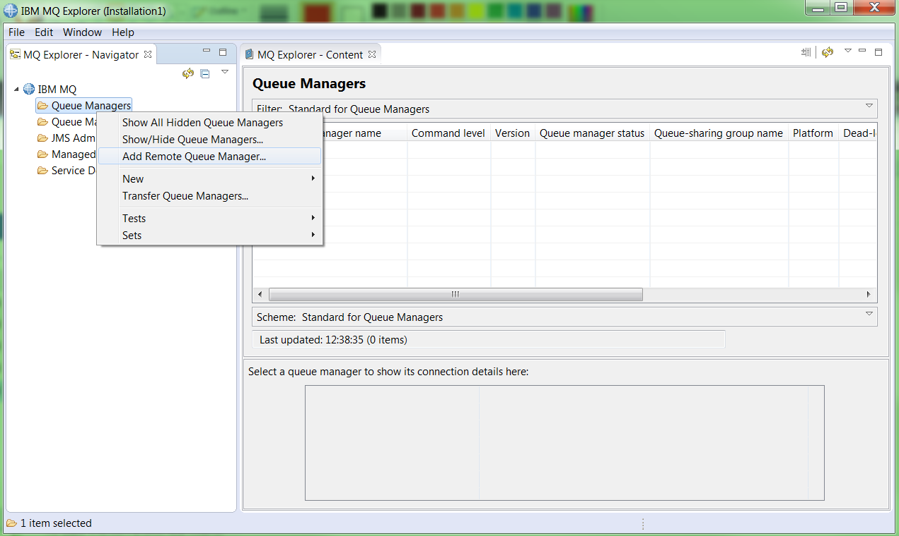
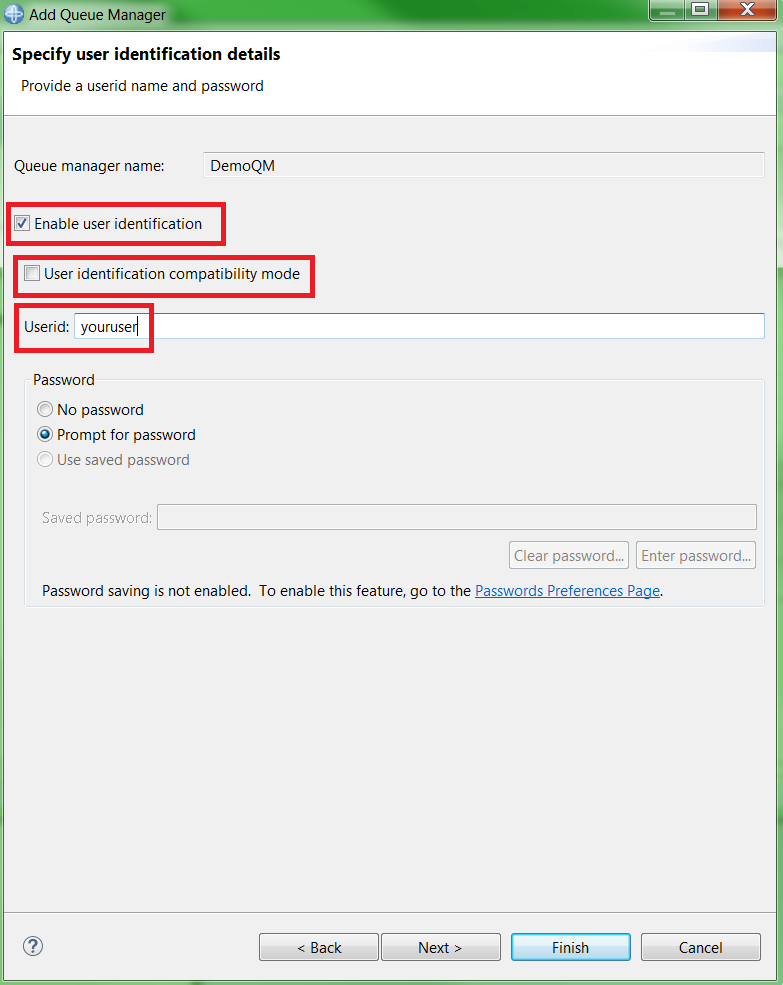

---
copyright:
  years: 2017, 2021
lastupdated: "2021-09-28"

subcollection: mqcloud

keywords: admin, administration, explorer, queue, manager
---

{{site.data.keyword.attribute-definition-list}}

# Administering a queue manager using MQ Explorer and the runmqsc command line
{: #mqoc_admin_mqcliexp}

This guide documents how to adminster an {{site.data.keyword.mq_full}} queue manager using the MQ Explorer application and the runmqsc command line interface.
{: shortdesc}

## MQ Explorer:
MQ Explorer is an Eclipse-based tool for administering IBM MQ that you install on a machine of your choice and which connects remotely to one or more queue managers using a client connection. There are native installers for Windows and Linux 64-bit environments and it can be run on Mac OS via a Docker container as described in the prerequisites below.

The Eclipse plugin for MQ explorer on Mac OS does not, at the time of writing, support TLS connection. The administration channel for MQ on Cloud queue managers newer than version 9.2.1 revision 1 will have TLS enabled. These should be administered from Linux or Windows.
{: note}

## runmqsc
Part of the "MQ clients" bundle, runqmsc is a command-line interface (CLI) tool that allows you to automate the configuration of MQ queue managers by executing a series of pre-defined steps at the command-line or in a script file. It is supported on a range of operating systems including Windows and Linux (but is not currently supported on Mac OS).

There are many actions you can perform by using MQ Explorer or runmqsc from an MQ client. You can

* Connect to a queue manager
* Create a new queue
* Put a message onto a queue
* Delete a queue

In addition to this, on MQ Explorer, you can `browse a queue to view messages`
In the runmqsc command line, you can also `get messages from a queue`

## Before you begin
{: #prereq_mqoc_admin_mqcliexp}

* An existing queue manager (for instructions, follow the [creating a queue manager](/docs/services/mqcloud?topic=mqcloud-mqoc_create_qm) guide).
* You have permission to access queue managers within your IBM MQ service instance (for instructions, follow the [configuring administrator access for a queue manager](/docs/services/mqcloud?topic=mqcloud-tut_mqoc_configure_admin_qm_access) guide).
* Depending on your method of administration, either:
- An existing installation of IBM MQ Explorer. Download and installation instructions for Windows and Linux can be obtained from [here](http://www-01.ibm.com/support/docview.wss?uid=swg24021041) and for Mac OS from [here](https://github.com/ibm-messaging/mq-container/tree/master/incubating/mq-explorer).
or
- An existing installation of IBM MQ Client on your own machine.
 * Download the client from [here](http://www-01.ibm.com/support/docview.wss?uid=swg24042176#1).
   * Clicking the **HTTP** link next to the latest available version of the **CD Clients** will take you to **Fix Central**. From there you can search for and select the appropriate **Redist** (redistributable) client bundle for your operating system platform. This will include the sample applications and runmqsc.
   * Once downloaded, unpack the bundle into a location of your choosing.
   * Make a note of the full path to the `bin` directory, the location of which will depend upon where you chose to unpack the bundle. This path will be referenced as `<PATH_TO_BIN_DIR>` for the rest of this task.
   * Make a note of the full path to the directory containing the sample applications. This path will be referenced as `<PATH_TO_SAMPLE_BIN_DIR>` for the rest of this task.
     * For Windows, this will be the `bin` directory unpacked in the previous step, the location of which will depend upon where you chose to unpack the bundle.
     * For Linux, this will be the `samp/bin` directory unpacked in the previous step, the location of which will depend upon where you chose to unpack the bundle.

## Gather required connection details
{: #getdetails_mqoc_admin_mqcliexp}

1. Log in to the IBM Cloud console.
2. Click on the 'hamburger menu'.
3. Click **Dashboard**.
    * Ensure that **RESOURCE GROUP** is set to **All Resources**.
4. Locate and click on your IBM MQ service instance, found under the 'Services' heading.
5. From the list of your queue managers, click on the one you want to administer.
6. Make note of the **Queue manager name**, **Hostname** and **Port** values for use in the next steps.
7. If you already know your **MQ Username** and **IBM Cloud API Key**, you can skip to the [next section](#connect_mqoc_admin_mqcliexp) of this task. Otherwise, Click the **Administration** tab.

    

8. Make a note of your **MQ Username** for future use.
    * Note that you can edit your **MQ Username** at any time by following the [Editing or removing the MQ username for an existing user or application](/docs/services/mqcloud?topic=mqcloud-mqoc_administer_mq_username) guide.
9. If you do not already have an existing IBM Cloud API key:
    * Click **Create IBM Cloud API Key**.
    * Click **Show** to display the API key to copy and save it for later, or click **Download** to store the API key in a file.
        * Note that the API key generated in these steps is used to authenticate with **IBM Cloud** as the **user** who created it.  Therefore, it should not be shared with any other users and should be stored securely.
        * An API key created through the IBM MQ service can be reset from the queue manager **Administration** tab.
    * Click **Close**.

## Connect to your queue manager
{: #connect_mqoc_admin_mqcliexp}

### Using MQ Explorer:

1. Start IBM MQ Explorer.
2. In the 'MQ Explorer - Navigator' panel, expand **IBM MQ**.
3. Right click **Queue Managers**.
4. Click **Add Remote Queue Manager...**.

    

5. Input the queue manager name you want to administer.
6. Click **Next**.
7. Input the Hostname you noted in step 2.
8. Overwrite the Port number with the one you noted in step 2.
9. Overwrite the server connection channel name with **CLOUD.ADMIN.SVRCONN**.

    

10. Click **Next**.
11. Click **Next**.
12. Tick the checkbox for 'Enable user identification'.
13. Untick the checkbox for 'User identification compatibility mode'.
14. Type your **MQ username** as the user id.

    

15. Click **Finish**.
16. Paste your **platform API key** into the 'Password' text box.
17. Click **OK**.

Your queue manager connection now appears under the **Queue Managers** folder in the 'MQ Explorer - Navigator' panel.

### Using runmqsc

1. Open a command shell to use in the next steps.
2. Export the 'MQSERVER' variable:
    * Linux: `export MQSERVER="CLOUD.ADMIN.SVRCONN/TCP/<Hostname>(<Port>)"`
    * Windows (Command prompt): `set MQSERVER=CLOUD.ADMIN.SVRCONN/TCP/<Hostname>(<Port>)`
    * Windows (PowerShell): `$env:MQSERVER="CLOUD.ADMIN.SVRCONN/TCP/<Hostname>(<Port>)"`
3. Run `<PATH_TO_BIN_DIR>/runmqsc -c -u <your MQ username> -w60 <QUEUE_MANAGER_NAME>`
4. Enter your **platform API key** when prompted for a password.

## Create a new test queue called 'DEV.TEST.1'

### Using MQ Explorer:
{: #mqoc_admin_mqcliexp_using_mqexp}

In the 'MQ Explorer - Navigator > IBM MQ > Queue Managers' view:

1. Expand the entry for your queue manager.
2. Right click **Queues**.
3. Select 'New' > 'Local Queue...'.
4. Type 'DEV.TEST.1' in the 'Name' text box.
5. Click **Finish**.
6. Click **OK**.

Your new queue appears in the list of queues.

### Using runmqsc

Queue names should start with **DEV.*** (example: DEV.myQueue) as application users have been configured with access to this prefix only. {: note}

In the same shell used in the previous steps:

1. Run `DEFINE QLOCAL(DEV.TEST.1)`
2. Run `DISPLAY QLOCAL(DEV.TEST.1)`
    * Details of queue 'DEV.TEST.1' are displayed.
3. Run `end`
    * The runmqsc session is closed.
    * Retain the prompt to use in the next steps.

## Put a message onto the test queue
{: #mqoc_admin_mqcliexp_put}

### Using MQ Explorer:

1. Right click on queue 'DEV.TEST.1'.
2. Click 'Put Test Message...'.
3. Type in a test message in the 'Message data' text box.
4. Click **Put message**.
5. Click **Close**.
6. Click **Refresh** in the 'Queues' panel.

You can see that the 'Current queue depth' for 'DEV.TEST.1' is now **1**.

### Using runmqsc:

We will make use of the sample program `amqsputc` to assist in putting messages on the test queue.
In the same shell used in the previous steps:

1. Export the 'MQSAMP_USER_ID' variable:
    * Linux: `export MQSAMP_USER_ID="<your MQ username>"`
    * Windows (Command prompt): `set MQSAMP_USER_ID=<your MQ username>`
    * Windows (PowerShell): `$env:MQSAMP_USER_ID="<your MQ username>"`
2. Run `<PATH_TO_SAMPLE_BIN_DIR>/amqsputc DEV.TEST.1 <your QMGR name>`
3. Enter your **platform API key** when prompted for a password.
4. Type in a test message.
5. Hit `Enter` twice to exit the amqsputc sample.

## Browse a message on the test queue
{: #mqoc_admin_mqcliexp_browse}

This step is unique to MQ Explorer and cannot be achieved using the command line. {: note}

1. Right click on queue 'DEV.TEST.1'.
2. Click 'Browse Messages...'.
3. Confirm you can see your test message and then click **Close**.

## Get a message using the amqsgetc sample program
{: #mqoc_admin_mqcliexp_get}

This step is unique to runmqsc and cannot be achieved on MQ Explorer. {: note}

In the same shell used in the previous steps:

1. Run `<PATH_TO_SAMPLE_BIN_DIR>/amqsgetc DEV.TEST.1 <your QMGR name>`
2. Enter your **platform API key** when prompted for a password.

Your test message is displayed.

After a short period, the amqsputc sample program should end after finding no more messages.

## Delete the test queue
{: #deleteq_mqoc_admin_mqcliexp}

### Using MQ Explorer

1. Right click on queue 'DEV.TEST.1'.
2. Click 'Delete'.
3. Click 'Delete'.
4. Check the 'Clear all messages from the queue' box.
5. Click **Delete**.
6. Click **OK**.

You can see that queue 'DEV.TEST.1' has been removed from the list of queues.

### Using runmqsc

In the same shell used in the previous steps:

1. Run `<PATH_TO_BIN_DIR>/runmqsc -c -u <your MQ username> -w60 <QUEUE_MANAGER_NAME>`
2. Enter your **platform API key** when prompted for a password.
3. Run `DELETE QLOCAL(DEV.TEST.1)`
    * You receive a message stating that the queue has been deleted.
4. Run `DISPLAY QLOCAL(DEV.TEST.1)` to prove the queue has been deleted.
    * You receive a message stating that the queue was not found.
5. Run `end`
    * The runmqsc session is closed.

## Conclusion
{: #conc_mqoc_admin_mqcliexp}

You've successfully:
* Connected to a queue manager using either MQ Explorer or `runmqsc` and have created a new test queue
* Put a test message onto the test queue
* Either browsed the the test queue to view the test message or used `amqsgetc` to view the test message
* Cleared and deleted the test queue to clean up

## Next steps
{: #next_mqoc_admin_mqcliexp}

Now that you have successfully learnt how to administer your queue manger using MQ explorer and runmqsc, try out the following:

* [Secured administration using MQ Explorer](/docs/services/mqcloud?topic=mqcloud-mqoc_remote_ssl_exp_admin) 
* [Secured administration using runmqsc](/docs/services/mqcloud?topic=mqcloud-mqoc_remote_ssl_runmqsc_admin)  
* [Connecting an application to a queue manager](/docs/services/mqcloud?topic=mqcloud-mqoc_connect_app_qm)