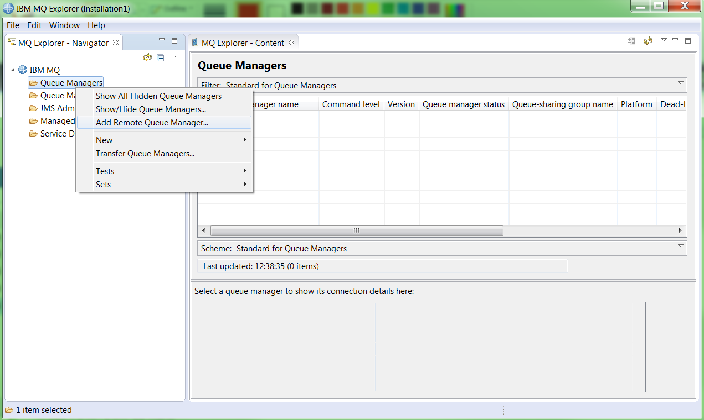
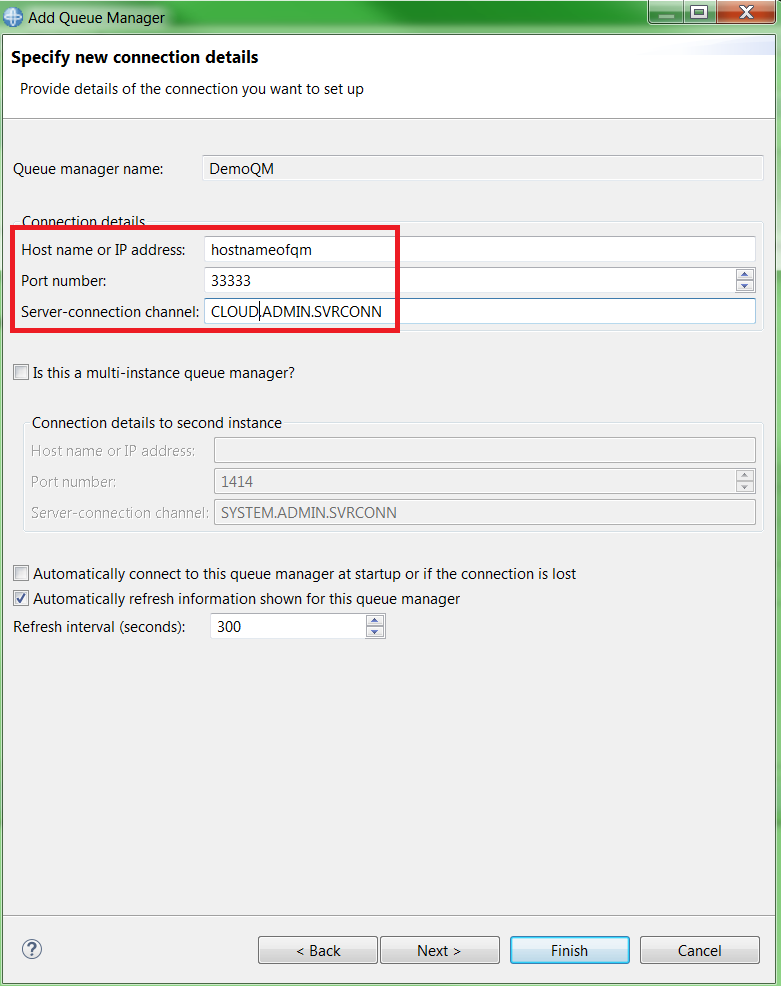
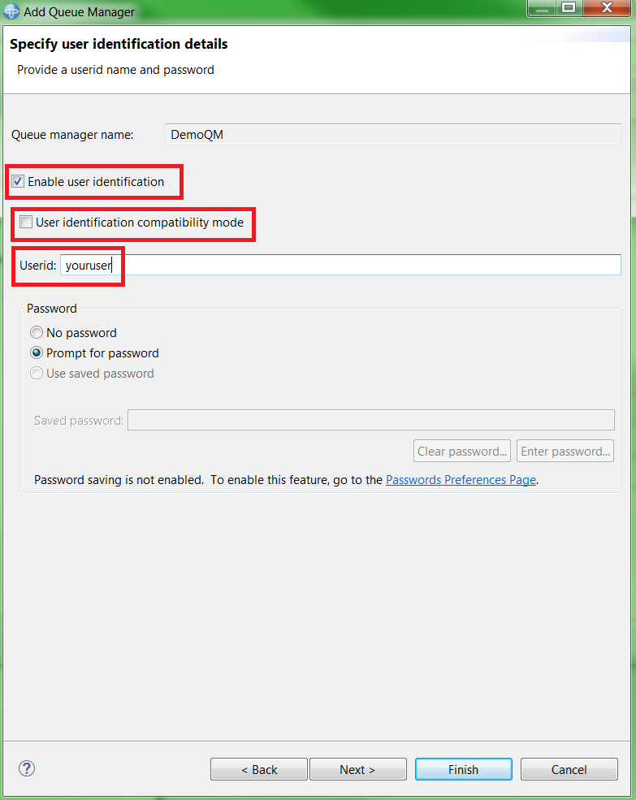

---
copyright:
  years: 2017, 2020
lastupdated: "2018-07-06"

subcollection: mqcloud

keywords: admin, administartion, explorer, queue, manager
---

{:new_window: target="_blank"}
{:shortdesc: .shortdesc}
{:screen: .screen}
{:codeblock: .codeblock}
{:pre: .pre}

# Administering a queue manager using MQ Explorer
{: #mqoc_admin_mqexp}

MQ Explorer is an Eclipse-based tool for administering IBM MQ that you install on a machine of your choice and which connects remotely to one or more queue managers using a client connection. There are native installers for Windows and Linux 64-bit environments and it can be run on Mac OS via a Docker container as described in the prerequisites below.

There are many actions you can perform through the MQ Explorer. You can:
* Connect to a queue manager
* Create a new queue
* Put a message onto a queue
* Browse a queue to view messages
* Delete a queue
{:shortdesc}

---

## Prerequisites
{: #prereq_mqoc_admin_mqexp}

* An existing queue manager (for instructions, follow the [creating a queue manager](/docs/services/mqcloud?topic=mqcloud-mqoc_create_qm) guide).
* You have permission to access queue managers within your IBM MQ service instance (for instructions, follow the [configuring administrator access for a queue manager](/docs/services/mqcloud?topic=mqcloud-tut_mqoc_configure_admin_qm_access) guide).
* An existing installation of IBM MQ Explorer. Download and installation instructions for Windows and Linux can be obtained from [here](http://www-01.ibm.com/support/docview.wss?uid=swg24021041) and for Mac OS from [here](https://github.com/ibm-messaging/mq-container/tree/master/incubating/mq-explorer).

---

## Gather required connection details
{: #getdetails_mqoc_admin_mqexp}

1. Log in to the IBM Cloud console.
2. Click on the 'hamburger menu'.
3. Click **Dashboard**.
  * Ensure that **RESOURCE GROUP** is set to **All Resources**.
4. Locate and click on your IBM MQ service instance, found under the 'Services' heading.
5. From the list of your queue managers, click on the one you want to administer.
6. Make note of the **Queue manager name**, **Hostname** and **Port** values for use in the next steps.
7. If you already know your **MQ Username** and **IBM Cloud API Key**, you can skip to the [next section](#connect_mqoc_admin_mqexp) of this task. Otherwise, Click the **Administration** tab.

 

8. Make a note of your **MQ Username** for future use.
  * Note that you can edit your **MQ Username** at any time by following the [Editing or removing the MQ username for an existing user or application](/docs/services/mqcloud?topic=mqcloud-mqoc_administer_mq_username) guide.
9. If you do not already have an existing IBM Cloud API key:
  * Click **Create IBM Cloud API Key**.
  * Click **Show** to display the API key to copy and save it for later, or click **Download** to store the API key in a file.
    * Note that the API key generated in these steps is used to authenticate with **IBM Cloud** as the **user** who created it.  Therefore, it should not be shared with any other users and should be stored securely.
    * An API key created through the IBM MQ service can be reset from the queue manager **Administration** tab.
  * Click **Close**.

---

## Connect to your queue manager using IBM MQ Explorer
{: #connect_mqoc_admin_mqexp}

**Note:** Please ensure that you have carried out the prerequisite steps listed [above](#prereq_mqoc_admin_mqexp).

1. Start IBM MQ Explorer.
2. In the 'MQ Explorer - Navigator' panel, expand **IBM MQ**.
3. Right click **Queue Managers**.
4. Click **Add Remote Queue Manager...**.

5. Input the queue manager name you want to administer.
6. Click **Next**.
7. Input the Hostname you noted in step 2.
8. Overwrite the Port number with the one you noted in step 2.
9. Overwrite the server connection channel name with **CLOUD.ADMIN.SVRCONN**.

10. Click **Next**.
11. Click **Next**.
12. Tick the checkbox for 'Enable user identification'.
13. Untick the checkbox for 'User identification compatibility mode'.
14. Type your **MQ username** as the user id.

15. Click **Finish**.
16. Paste your **platform API key** into the 'Password' text box.
17. Click **OK**.

Your queue manager connection now appears under the **Queue Managers** folder in the 'MQ Explorer - Navigator' panel.

---

## Create a new test queue called 'DEV.TEST.1'
{: #createq_mqoc_admin_mqexp}

In the 'MQ Explorer - Navigator > IBM MQ > Queue Managers' view:

1. Expand the entry for your queue manager.
2. Right click **Queues**.
3. Select 'New' > 'Local Queue...'.
4. Type 'DEV.TEST.1' in the 'Name' text box.
5. Click **Finish**.
6. Click **OK**.

Your new queue appears in the list of queues.

---

## Put a message onto the test queue
{: #put_mqoc_admin_mqexp}

1. Right click on queue 'DEV.TEST.1'.
2. Click 'Put Test Message...'.
3. Type in a test message in the 'Message data' text box.
4. Click **Put message**.
5. Click **Close**.
6. Click **Refresh** in the 'Queues' panel.

You can see that the 'Current queue depth' for 'DEV.TEST.1' is now **1**.

---

## Browse a message on the test queue
{: #get_mqoc_admin_mqexp}

1. Right click on queue 'DEV.TEST.1'.
2. Click 'Browse Messages...'.
3. Confirm you can see your test message and then click **Close**.

---

## Delete the test queue
{: #deleteq_mqoc_admin_mqexp}

1. Right click on queue 'DEV.TEST.1'.
2. Click 'Delete'.
3. Click 'Delete'.
3. Check the 'Clear all messages from the queue' box.
4. Click **Delete**.
5. Click **OK**.

You can see that queue 'DEV.TEST.1' has been removed from the list of queues.

---

## Conclusion
{: #conc_mqoc_admin_mqexp}

You've successfully:
* Connected to a queue manager using MQ Explorer and have created a new test queue
* Put a test message onto the test queue and have browsed the test queue to view the test message
* Cleared and deleted the test queue to clean up

---

## Next steps
{: #next_mqoc_admin_mqexp}
* [Secured administration using MQ Explorer](/docs/services/mqcloud?topic=mqcloud-mqoc_remote_ssl_exp_admin)  
* [Connecting an application to a queue manager](/docs/services/mqcloud?topic=mqcloud-mqoc_connect_app_qm)
