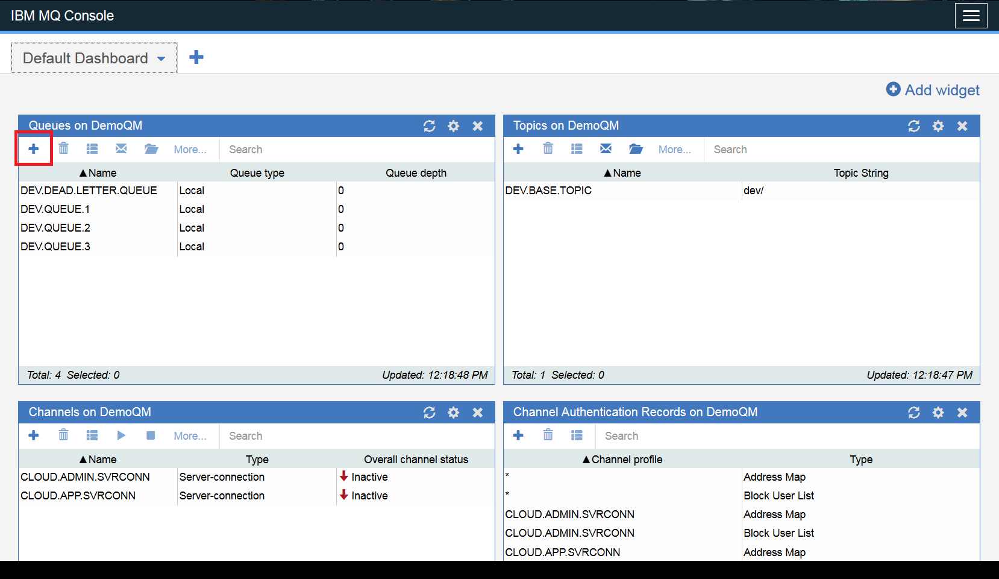
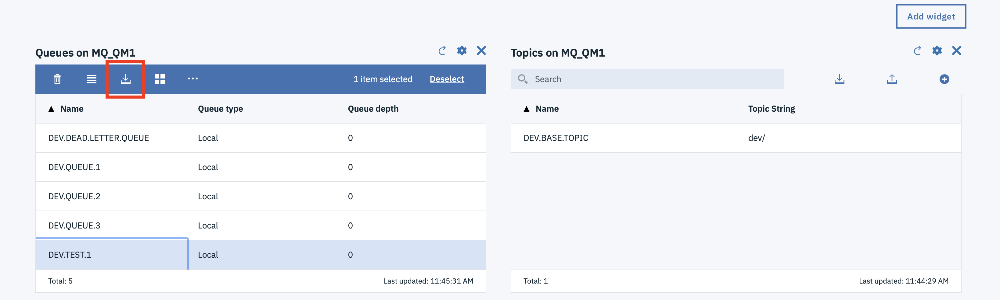
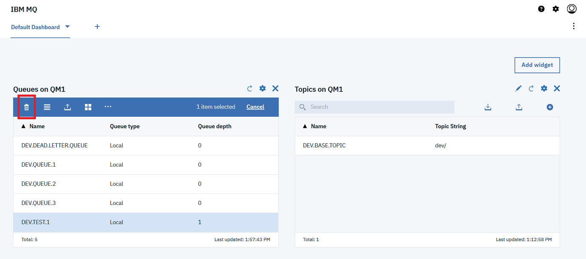

---
copyright:
  years: 2017, 2019
lastupdated: "2018-03-05"
---

{:new_window: target="_blank"}
{:shortdesc: .shortdesc}
{:screen: .screen}
{:codeblock: .codeblock}
{:pre: .pre}

# Administering a queue manager using IBM MQ Web Console
{: #mqoc_admin_mqweb}

The MQ Web Console is an administration tool for IBM MQ that you access using a web browser running on your own machine.

With the MQ Web Console, you can create a new queue, put a message onto the queue, browse the queue to view the message, and delete the queue.
{:shortdesc}

---

## Prerequisites
{: #prereq_mqoc_admin_mqweb}

* An existing queue manager (for instructions, follow the [creating a queue manager](/docs/services/mqcloud/mqoc_create_qm.html) guide).
* You have permission to access queue managers within your IBM MQ service instance (for instructions, follow the [configuring administrator access for a queue manager](/docs/services/mqcloud/tutorials/tut_mqoc_configure_admin_qm_access.html) guide).

---

## Login to the IBM Web Console for your queue manager
{: #connect_mqoc_admin_mqweb}

**Note:** Please ensure that you have carried out the prerequisite steps listed above.

1. Log in to the IBM Cloud console.
2. Click on the 'hamburger menu'.
3. Click **Dashboard**.
  * Ensure that **RESOURCE GROUP** is set to **All Resources**.
4. Locate and click on your IBM MQ service instance, found under the 'Services' heading.
5. From the list of your queue managers, click on the one you want to administer.
6. Click the **Administration** tab.

 

7. Make a note of your **MQ Username** for future use.
  * Note that you can edit your **MQ Username** at any time by following the [Editing or removing the MQ username for an existing user or application](/docs/services/mqcloud/mqoc_administer_mq_username.html) guide.
8. If you do not already have an existing IBM Cloud API key:
  * Click **Create IBM Cloud API Key**.
  * Click **Show** to display the API key to copy and save it for later, or click **Download** to store the API key in a file.
    * Note that the API key generated in these steps is used to authenticate with **IBM Cloud** as the **user** who created it.  Therefore, it should not be shared with any other users and should be stored securely.
    * An API key created through the IBM MQ service can be reset from the queue manager **Administration** tab.
  * Click **Close**.
9. Click **Launch MQ Console**, this will open the 'IBM MQ Web Console' in a new browser tab.
  * Note that the **Launch MQ Console** button will only be available when the queue manager is running and you have an existing IBM Cloud API key.
10. Type your **MQ username** into the 'User Name' text box.
11. Paste your **IBM Cloud API key** into the 'Password' text box.
12. Click **Login** and you're ready to go.

---

## Create a new test queue.
{: #createq_mqoc_admin_mqweb}

In the 'Queues on ...' widget:

1. Click the **'Create +'** button.

 

2. Type in 'DEV.TEST.1'.
  * Note the name can contain up to 48 characters. Valid characters are letters, numbers and the period, forward slash, underscore and percent symbols.
  * The queue name needs to be unique within the queue manager.
3. Select a queue type of 'Local'.
4. Click **Create**.

Your new queue now appears in the list.

---

## Put a message onto the test queue
{: #put_mqoc_admin_mqweb}

1. Click queue 'DEV.TEST.1'.
2. Click on the 'Put message' button.

 

3. Type in a test message.
4. Click **Put**.

You can see that the 'Queue depth' for 'DEV.TEST.1' is now **1**.

---

## Browse a message on the test queue
{: #get_mqoc_admin_mqweb}

1. Click queue 'DEV.TEST.1'.
2. Click the 'Browse messages' button.

 

3. Confirm you can see your test message and then click **Close**.

---

## Delete the test queue
{: #deleteq_mqoc_admin_mqweb}

1. Click on queue 'DEV.TEST.1'.
2. Click on the 'Delete' button.

 

3. Click **Clear queue**.
4. Click **Delete**.

You can see that the test queue has been removed from the list of queues.

---

## Conclusion
{: #conc_mqoc_admin_mqweb}

You've successfully:
* Connected to a queue manager using the IBM MQ Web Console and have created a new test queue
* Put a test message onto the test queue and have browsed the test queue to view the test message
* Cleared and deleted the test queue to clean up

---

## Next step
{: #next_mqoc_admin_mqweb}

Please see [Administration using the IBM MQ Console](https://www.ibm.com/support/knowledgecenter/en/SSFKSJ_9.0.0/com.ibm.mq.adm.doc/q127570_.htm) for more information on what you can do with IBM Web Console.

[Connecting an application to a queue manager](/docs/services/mqcloud/mqoc_connect_app_qm.html)
