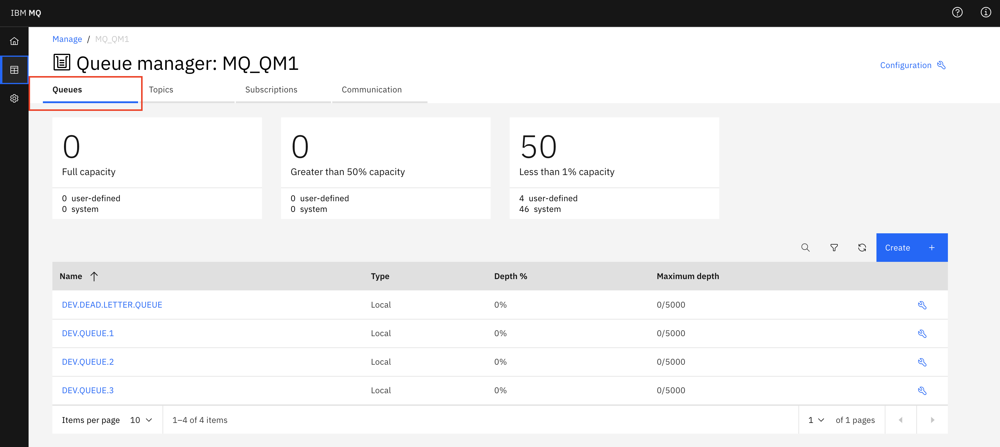
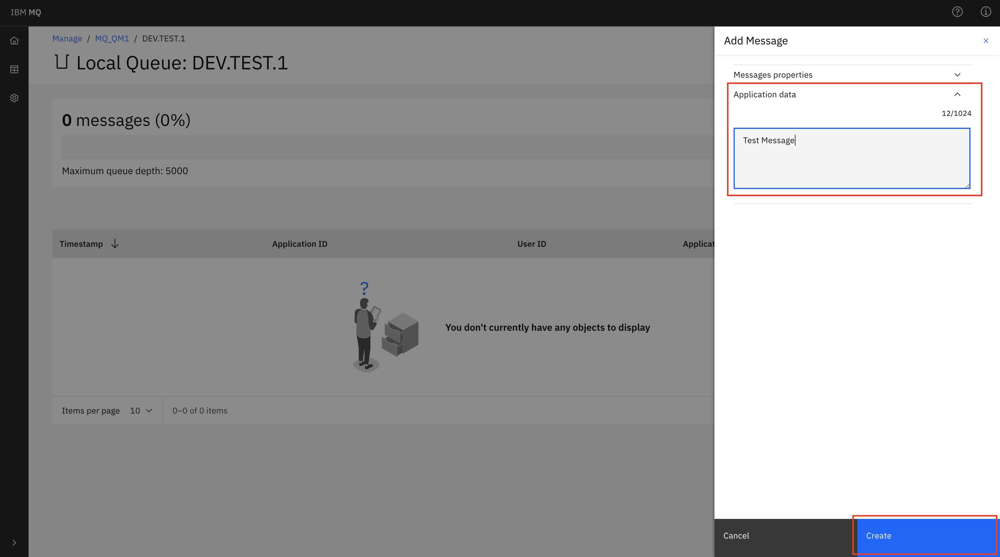

---
copyright:
  years: 2017, 2019, 2020
lastupdated: "2020-04-06"

subcollection: mqcloud

keywords: MQ, console, interface, admin, administration
---

{:new_window: target="_blank"}
{:shortdesc: .shortdesc}
{:screen: .screen}
{:codeblock: .codeblock}
{:pre: .pre}

# Administering a queue manager using IBM MQ Console
{: #mqoc_admin_mqweb}

The MQ Web Console is an administration tool for IBM MQ that you access using a web browser running on your own machine.

With the MQ Web Console, you can create a new queue, put a message onto the queue, browse the queue to view the message, and delete the queue.
{:shortdesc}

---

## Prerequisites
{: #prereq_mqoc_admin_mqweb}

* An existing queue manager (for instructions, follow the [creating a queue manager](/docs/services/mqcloud?topic=mqcloud-mqoc_create_qm) guide).
* You have permission to access queue managers within your IBM MQ service instance (for instructions, follow the [configuring administrator access for a queue manager](/docs/services/mqcloud?topic=mqcloud-tut_mqoc_configure_admin_qm_access) guide).

---

## Login to the IBM Web Console for your queue manager
{: #connect_mqoc_admin_mqweb}

**Note:** Please ensure that you have carried out the prerequisite steps listed above.

1. Log in to the IBM Cloud console.
2. Find your existing Service Instance, by entering part of its name in the search box and selecting your Service Instance, or:
  * Click the 'Hamburger menu'
  * Click 'Resource List'
  * Expand 'Services'
  * Click on your Service Instance
5. From the list of your queue managers, click on the queue manager you wish to administer.
6. Click the **Administration** tab.

 

7. Click **Launch MQ Console**, this will open the 'IBM MQ Web Console' in a new browser tab.
  * Note that the **Launch MQ Console** button will only be available when the queue manager is running.

8. Click on Manage in the side menu to view your MQ objects

 

---

## Create a new test queue.
{: #createq_mqoc_admin_mqweb}

1. Ensure the 'Queues' tab is selected

 

2. Click the **'Create +'** button.

 

3. Select a queue type of 'Local'.

2. Type in 'DEV.TEST.1'.
  * Note the name can contain up to 48 characters. Valid characters are letters, numbers and the period, forward slash, underscore and percent symbols.
  * The queue name needs to be unique within the queue manager.

4. Click **Create**.

You will see a success message, and your new queue now appears in the list.

---

## Put a message onto the test queue
{: #put_mqoc_admin_mqweb}

1. Click queue 'DEV.TEST.1'.

2. Click the **'Create +'** button.

3. Under 'Application data' enter a message

4. Click **Create**.

You can see the message is now on the queue.

---

## Browse a message on the test queue
{: #get_mqoc_admin_mqweb}

1. Click on the message in the table.

You can see the details of the message. Expand 'Application data' to view the message text.

---

## Delete the test queue
{: #deleteq_mqoc_admin_mqweb}

1. Ensure the 'Queues' tab is selected

 

2. Click on queue 'DEV.TEST.1'.

3. Click on the 3 dots button, then on 'Clear messages'

 

4. Click on the 3 dots button, then on 'Configuration'

 

5. Click **Delete Queue**.

 

You are returned to the 'Queues' tab. You can see that the test queue has been removed from the list of queues.

---

## Conclusion
{: #conc_mqoc_admin_mqweb}

You've successfully:
* Connected to a queue manager using the IBM MQ Web Console and have created a new test queue
* Put a test message onto the test queue and have browsed the test message
* Cleared and deleted the test queue to clean up

---

## Next step
{: #next_mqoc_admin_mqweb}

Please see [Administration using the IBM MQ Console](https://www.ibm.com/support/knowledgecenter/en/SSFKSJ_9.0.0/com.ibm.mq.adm.doc/q127570_.htm) for more information on what you can do with IBM Web Console.

[Connecting an application to a queue manager](/docs/services/mqcloud?topic=mqcloud-mqoc_connect_app_qm)
