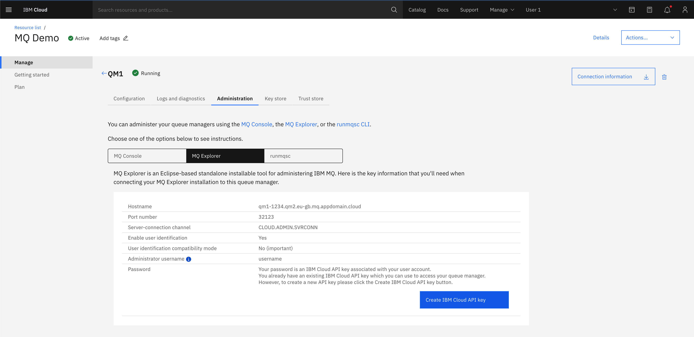

---
copyright:
  years: 2022
lastupdated: "2022-05-13"

subcollection: mqcloud

keywords: admin, administration, REST, API, SSL, TLS, explorer, discovery
---

{{site.data.keyword.attribute-definition-list}}

# View Swagger documentation for IBM MQ REST API
{: #mqoc_view_swagger_docs_ibm_mq_rest_api}

Follow these instructions to view the Swagger documentation for the IBM MQ REST APIs. 

This documentation is presented in Swagger formatting, and they can be viewed either through the Swagger UI or by retrieving the Swagger 2 documentation in a JSON format.

| View Type | URL |
| --- | --- |
| Swagger UI | https://web-{qm-hostname}/ibm/api/explorer |
| Swagger JSON | https://web-{qm-hostname}/ibm/api/docs |

## Accessing the Swagger UI
{: #mqoc_access_swagger_ui}

To access the Swagger UI you will need to retrieve your admin user credentials (username and password).

1. Go to your {{site.data.keyword.mq_short}} service instance, and open the queue manager details page.

2. Go to the administration tab and click on 'MQ Explorer' tab.



3. Now click on the "Create | Reset IBM Cloud API key" button. This will generate or regenerate an admin user API key to login to your queue manager.

4. In the dialog window titled "API key successfully created", you can show or copy the key. Click "Download" to retrieve a copy of the username and API key in a json format. 


5. Go back to the "Configuration" tab in the queue manager details view, and take note of the queue manager hostname. This can be found under 'Endpoints', 'Hostname'. Click the copy button to put on your clipboard.

6. Next open a new browser tab and go to `https://web-{your-qmgr-hostname}/ibm/api/explorer`

7. You will be presented with a login dialog box. Input the admin username you retrieved earlier and paste the API key as the password, and press Enter.

8. You should now see the Swagger UI documentation for IBM MQ REST APIs.


## Downloading Swagger documentation in JSON format
{: #mqoc_download_swagger_docs}

To retrieve the Swagger documentation in a JSON format instead, visit the`/ibm/api/docs` endpoint instead. To access this endpoint via a web browser you must first login to `/ibm/api/explorer` first and then visit `/ibm/api/docs` to retrieve the JSON documentation.

To do this via cURL, follow these instructions.

1. Retrieve the cookie from the `/ibm/api/explorer` endpoint

```bash
curl -k https://web-{your-qmgr-hostname}/ibm/api/explorer/ -c cookiejar.txt
```
{: pre}

2. Then send a request to the `/ibm/api/docs` endpoint supplying the cookie

```bash
curl -k https://web-{your-qmgr-hostname}/ibm/api/docs -b cookiejar.txt > api-docs.json
```
{: pre}

Congratulations, you have successfully viewed and retrieved the REST API documentation for your {{site.data.keyword.mq_full}} queue manager.
