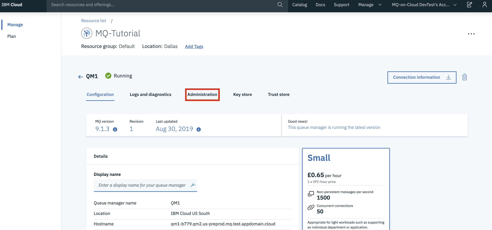
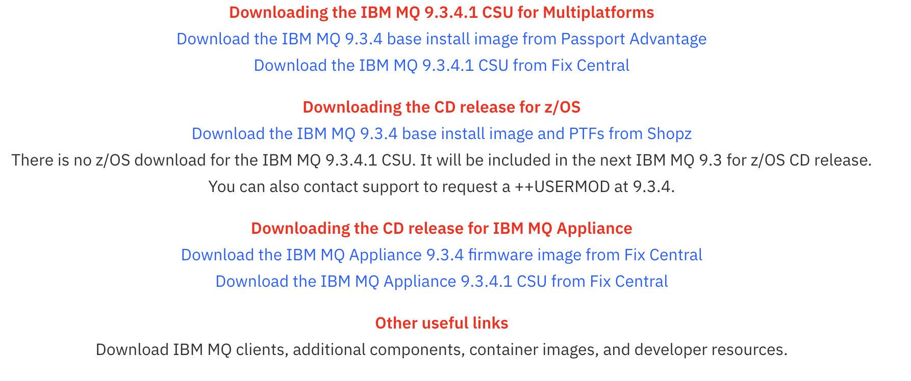

---
copyright:
  years: 2017, 2018
lastupdated: "2018-08-24"
---

{:new_window: target="_blank"}
{:shortdesc: .shortdesc}
{:screen: .screen}
{:codeblock: .codeblock}
{:pre: .pre}

# Enabling Application Advanced Message Security (AMS)
{: #mqoc_app_ams}

#### What is IBM MQ Advanced Message Security?
{: #mqoc_app_ams_what_is_ams}

In an asynchronous messaging system, one process connects to the queue manager to put a message, called a Sender or Publisher, and another completely independent process connects to the queue manager to consume the message, called a Receiver or Subscriber. These two processes are loosely coupled and have no direct knowledge of one another.  The only identity information that the consumer application can access is the identity information in the message itself. If the message is changed in transit or produced by an unauthorized sender, the consumer has no way to detect this situation with a plain text message. In this case, the consuming application trusts the identity of the message but cannot verify their authenticity. Also, this process opens number of possibilities to intercept and modify the message while in custody of the queue manager.

IBM® MQ Advanced Message Security expands MQ security services to provide security at the 'message' level to protect sensitive data, such as high-value financial transactions and personal information. MQ Advanced Message Security is based on interceptors, that is, outbound messages are intercepted, signed, and optionally encrypted prior to the handoff to queue manager. Inbound messages are received from queue manager to the AMS layer, decrypted and validated as necessary, and then handed off to the receiving application. AMS architecture is capable of cryptographic protection of messages and enforcement of fine-grained **protection policies** that authorize individual senders and recipients of messages, with few or no changes to the application program logic. 

There are two approaches to IBM MQ AMS, which we will refer to as Application AMS and [Queue Manager AMS](/docs/services/mqcloud/mqoc_qm_ams.html). This tutorial focuses on Application AMS.

* **AMS Protection Policy**  

    Protection policy defines the quality of protection to be used for protecting the messages. AMS provides message protection policies to allow message content to be signed and encrypted. AMS policies are defined by the MQ administrator on the target queues and each queue can have exactly zero or one policy. Policy can specify the algorithms that are used for signing and encryption operations. There are two types of message protection policies:  
    1. Message integrity policy where a digital signature is applied to the message, but the contents of the message remain in the plain text.
    2. Message privacy policy where the contents of the message are also encrypted. Message privacy policies also include message integrity.
    When encryption is specified, the policy must also specify all authorized recipients and the sender must have the public key of those recipients in the local keystore.  


* **End to End Message Security**

    End to End protection of the message requires us to consider the following aspects:
    1. Messages in transit are secured. 
    2. Assurance that messages are originated from the expected source.
    3. Messages can only be viewed by intended recipient.
    4. Assurance that messages have not been altered in transit.

    Putting the encryption mechanism into the queue manager itself eliminates the expense of modifying the applications but it doesn't fully solve the problem. Since the queue manager has the capability of encrypting and decrypting the messages, the recipient has no guarantee that the message that it receives is authentic. For example, in the cases of B2B, the topology is that of a hub and spoke where the clearinghouse serves as the hub and each spoke is a different business partner. In such scenarios for assurance of tamper-proof and authenticity of message, an end to end protection will be the desired solution.

    Application AMS provides end to end Message-level security by cryptographically binding the sender’s identity, as represented by the distinguished name in an X.509 certificate, to the message. If desired, the message can also be encrypted for specific recipients who are also identified by X.509 certificates. The ability to bind sender and recipient identities to a message and make it tamper-proof facilitates the creation of policies as to who can send or receive messages, and the enforcement of those policies is on a per-message basis.  

    **Note:** This tutorial uses self-signed certificates for sender and receiver. It is highly recommended to use CA certificates for production use cases. Self-signed certificates are used only for test and demo purposes.

{:shortdesc}

---

## Prerequisites
{: #mqoc_app_ams_prereq}

1. An **MQ on Cloud queue manager**. Here are steps to [create a new queue manager](/docs/services/mqcloud/mqoc_create_qm.html).  
  Having followed the MQ on cloud guided tour, or the manual steps provided on the same page, you should have:
    - Connection details downloaded in a connection_info.txt file
        - Consult *Appendix 1* at the bottom of this tutorial if you do not have this file
    - An admin username and apikey downloaded in a platformApiKey.json file
        - Consult *Appendix 2* at the bottom of this tutorial if you do not have this file

2. **IBM MQ Client**

    To complete this tutorial, you will require the IBM MQ command line tool '*runmqsc*' as well as the IBM MQ sample applications '*amqsputc*' and '*amqsgetc*' installed and on your PATH. If you do not have these commands, you can get them by installing the IBM MQ Client. *Appendix 3* at the end of this tutorial details how to do this.  
  
    **Note**. The IBM MQ Client is only available for *Windows* and *Linux*  

---

### Setup Sender and Receiver of Message
{: #mqoc_app_ams_users}

This tutorial uses two users **alice** and **bob** for the AMS setup and to demonstrate the end to end message security. *alice* as sender of the message and *bob* as recipient of the message. In the real world, senders and receivers of message run on different systems and enforcing the message protection among those senders and receivers of the message using AMS ensures messages are tamper-proof and authentic. 
For this tutorial, we need to create these users on MQ on Cloud service as an *User Permission* or an *Application Permission*. This tutorial uses *Application permissions*, that is, we grant permission to application **amqsputc** which allows it to access queue manager for putting messages, and the username that it uses for this permission would be **alice**. Simillarly, we grant permission to application **amqsgetc** to access queue manager for getting messages and username used for this permission will be **bob**.
1. Login to the IBM Cloud.
2. On the IBM Cloud Dashboard, from the list of Services, find the service instance under which your desired mq on cloud queue manager is available. Open the service instance by clicking on it.
  
3. This will open the queue manager view. Select the **Application permissions** tab.
  
4. Now click on the **Add Application** and fill up the form as shown in image below for user **alice**:  
    4.1 In the **Name:** field of the form, enter the value as **amqsputc**.  
    4.2 Click on **Generate MQ username**, this would generate a default username for the application.  
    4.3 We could use the default username generated or modify it to a more meaningful value as per context. This tutorial modifies it to username **alice**.  
    4.4 Click on **Add and generate API key**.  
      
5. Once the user is added, a new apiKey will be generated and showed in pop-up window. Click on **Download** to download the apiKey.json, save the file as `apiKey<userName>.json` (for ex:apiKeyalice.json) to a convenient location.  
  
6. Now click on the **Add Application** and fill up the form as shown in image below for user **bob**:  
    6.1 In the **Name:** field of the form, enter the value as **amqsgetc**.  
    6.2 Click on **Generate MQ username**, this would generate a default username for the application.  
    6.3 We could use the default username generated or modify it to a more meaningful value as per context. This tutorial modifies it to username **bob**.  
    6.4 Click on **Add and generate API key**.  
      
7. Once the user is added, a new apiKey will be generated and showed in pop-up window. Click on **Download** to download the apiKey.json, save the file as `apiKey<username>.json` (for ex:apiKeybob.json) to a convenient location.  
  

---

### Send and Receive Message before configuring AMS
{: #mqoc_app_ams_sr_noams}

As a first step of the AMS configuration, we can check if the **alice** and **bob** are able to send and receive the messages. This would help us to make sure that client and queue manager are able to communicate and exchange messages. In further sections of this tutorial, AMS setup and configuration is explained. At this point, we send and receive a message in plain-text on the target queue using the **alice** as sender and **bob** as receiver. 
1. Open two command shells. One for the user **alice** and another for the user **bob**:   
    1.1. We shall use one command shell for **alice** and carry out all the steps for **alice** on it. From now on, this command shell will be called as **alice's** command shell.  
    1.2. We shall use another command shell for **bob** and carry out all the steps for **bob** on it. From now on, this command shell will be called as **bob's** command shell.  
    1.3 **alice** and **bob** command shells will be required through-out this tutorial. Hence, please do not close them until you complete all the steps in this tutorial.
2. Create following environment variables on **alice's** command shell.
    ```
    On Linux:
        export MQSAMP_USER_ID=alice  
        export MQSERVER="CLOUD.ADMIN.SVRCONN/TCP/<HOSTNAME>(<PORT>)"

    On Windows:
        set MQSAMP_USER_ID=alice  
        set MQSERVER=CLOUD.ADMIN.SVRCONN/TCP/<HOSTNAME>(<PORT>)
    ```
    - `<HOSTNAME>` - this is 'hostname' in the file connection_info.txt(refer to Appendix#1)
    - `<PORT>` - this is 'listenerPort' in the file connection_info.txt(refer to Appendix#1)
3. Create following environment variables on **bob's** command shell.
    ```
    On Linux:
        export MQSAMP_USER_ID=bob  
        export MQSERVER="CLOUD.ADMIN.SVRCONN/TCP/<HOSTNAME>(<PORT>)"

    On Windows:
        set MQSAMP_USER_ID=bob  
        set MQSERVER=CLOUD.ADMIN.SVRCONN/TCP/<HOSTNAME>(<PORT>)
    ``` 
    - `<HOSTNAME>` - this is 'hostname' in the file connection_info.txt(refer to Appendix#1)
    - `<POST>` - this is 'listenerPort' in the file connection_info.txt(refer to Appendix#1)
4. From **alice's** command shell, run the sample program to send message to target queue.
    ```
    amqsputc DEV.QUEUE.1 <your Queue manager name>  
    ```
    4.1 Enter the application API key of **alice** when prompted for a password(*this is your 'apiKey' value in the file apiKeyalice.json*)  
    4.2 Type the text of the message, then press `Enter` key twice to send only a single message.  
  **Note**: Pressing the `Enter` key twice will exit the sample.  
      
5. Now, check that user **bob** is able to retrieve the messages from target queue.  
    5.1 From the **bob's** command shell, run the sample program to receive the message.  
    ```
    amqsgetc DEV.QUEUE.1 <your Queue manager name>  
    ```  
    5.2 Enter the application API key of **bob** when prompted for a password(*This is your 'apiKey' value in the file apiKeybob.json*).  
    5.3 You can see that message received `message <Hello>` confirms that user **bob** is able to read the message from target queue.  
      
    - Note that the message comes back in plain text while reading the queue, as this is how it is stored on the target queue.  

This test confirms that **alice** and **bob** can send and receive messages on target queue. Next step is to create configuration required by AMS for end to end security. This includes creating keystores and certificates for these users to enforce signing and encryption of messages.  

---

### Setup Keystores for *alice* and *bob*
{: #mqoc_app_ams_setup_ks}

Application AMS is based on public/private key encryption with keys stored in standard X.509 certificates, which in turn are stored in a platform-appropriate keystore. These certificates are the same type of certificate used for MQ Secure Sockets Layer (SSL) and Transport Layer Security (TLS) encryption, and in fact the application can utilize the same certificates and keystores for both if desired. This tutorial creates new keystore and certificates for users **alice** and **bob**.  
**Note:** All the **alice's** steps have to be executed on **alice's** command shell and all the **bob's** steps to be executed on **bob's** command shell.
1. Create directories for setting up keystores
    ```  
    For alice:
        - On Linux:  mkdir -p /home/alice/.mqs
        - On Windows: mkdir %HOMEDRIVE%\Users\alice\.mqs
    
    For bob:
        - On Linux: mkdir -p /home/bob/.mqs  
        - On Windows: mkdir %HOMEDRIVE%\Users\bob\.mqs
    ```  
2. Create key database    
   ```  
    For alice:   
      - On Linux: runmqakm -keydb -create -db /home/alice/.mqs/alicekey.kdb -pw passw0rd -stash  
      - On Windows: runmqakm -keydb -create -db %HOMEDRIVE%\Users\alice\.mqs\alicekey.kdb -pw passw0rd -stash
    
    For bob:  
      - On Linux: runmqakm -keydb -create -db /home/bob/.mqs/bobkey.kdb -pw passw0rd -stash 
      - On Windows: runmqakm -keydb -create -db %HOMEDRIVE%\Users\bob\.mqs\bobkey.kdb -pw passw0rd -stash  
   ```
3. Make sure the key database is readable(Linux only)  
    ```
    For alice:     
      chmod +r /home/alice/.mqs/alicekey.kdb  
    For bob:   
      chmod +r /home/bob/.mqs/bobkey.kdb  
    ```  
4. Create self-signed certificate for user **alice**
    ```
    On Linux: 
        - runmqakm -cert -create -db /home/alice/.mqs/alicekey.kdb -pw passw0rd -label Alice_Cert -dn "cn=alice,O=IBM,c=GB" -default_cert yes  

      On Windows: 
        - runmqakm -cert -create -db %HOMEDRIVE%\Users\alice\.mqs\alicekey.kdb -pw passw0rd -label Alice_Cert -dn "cn=alice,O=IBM,c=GB" -default_cert yes  
    ```
5. Create a self-signed certificate for user **bob**
    ```
    On Linux: 
        - runmqakm -cert -create -db /home/bob/.mqs/bobkey.kdb -pw passw0rd -label Bob_Cert -dn "cn=bob,O=IBM,c=GB" -default_cert yes  
      
      On Windows: 
        - runmqakm -cert -create -db %HOMEDRIVE%\Users\bob\.mqs\bobkey.kdb -pw passw0rd -label Bob_Cert -dn "cn=bob,O=IBM,c=GB" -default_cert yes
    ```
---

### Setup Protection Policy on the target queue
{: #mqoc_app_ams_setup_pp}

MQ Advanced Message Security uses security policies to specify the cryptographic encryption and signature algorithms for encrypting and authenticating messages that flow through the queues. We need to set an AMS policy on the queue to enable message security.  
1. Open a new command shell  
2. create MQSERVER environment variable  
    ```
    On Linux: export MQSERVER="CLOUD.ADMIN.SVRCONN/TCP/<HOSTNAME>(<PORT>)"  
    On Windows: set MQSERVER=CLOUD.ADMIN.SVRCONN/TCP/<HOSTNAME>(<PORT>)  
    ```  

    - `<HOSTNAME>` - this is '*hostname*' in the file connection_info.txt  
    - `<PORT>` - this is '*listenerPort*' in the file connection_info.txt  

3. Run *runmqsc* to connect to your remote queue manager  
    ```  
    runmqsc -c -u <ADMIN_MQ_USER> <QUEUE_MANAGER_NAME>  
    ```
    - `<ADMIN_MQ_USER>` - this is 'mqUsername' in the file platformApiKey.json(refer to *Appendix 2* at the bottom of this tutorial)  
    - `<QUEUE_MANAGER_NAME>` - this is 'queueManagerName' in the file connection_info.txt  
    - "-c" informs runmqsc it should connect to a remote queue manager using the MQSERVER variable  

4. The terminal will prompt you for a Password.   
    This is your 'apiKey' value in the file platformApiKey.json(refer to *Appendix 2* at the bottom of this tutorial)    

5. Terminal will now be waiting for input  
6. Create a new AMS Policy on the target queue

    ```
    SET POLICY(DEV.QUEUE.1) SIGNALG(SHA1) ENCALG(AES256) SIGNER('CN=alice,O=IBM,C=GB') RECIP('CN=bob,O=IBM,C=GB') ACTION(ADD)
    ```  
    - DEV.QUEUE.1 is the policy name and it must match the name of the queue which is to be protected.
    - SIGNALG(value) specifies the digital signature algorithm for signing of the messages.
    - ENCALG(value) specifies the digital encryption algorithm for encryption of the messages.
    - SIGNER(value) is the value of `-dn` of Sender(i.e. alice) in this tutorial.
    - RECIP(value) is the value of `-dn` of Receiver(i.e. bob) in this tutorial.
    - Detailed explanation about SET POLICY command can be found [here](https://www.ibm.com/support/knowledgecenter/en/SSFKSJ_9.0.0/com.ibm.mq.ref.adm.doc/q120800_.html).  

    

7. Verify the AMS policy we just defined, to make sure policy is defined and configured correctly with signing and encryption as per our setup.  
    ```  
    DISPLAY POLICY(DEV.QUEUE.1)
    ```  

    


#### Create an Alias Queue to verify message encryption

To demonstrate that the messages are encrypted when stored in queue, we use an alias queue. Retrieving messages via the alias queue will not trigger the interceptors on the target queue, so the message will be retrieved as is, without decryption, and so will give an accurate view on whether the message is plain text or encrypted.

1. Create an alias queue that targets to a queue  
    ```  
    DEFINE QALIAS (DEV.QUEUE.1.ALIAS) TARGET (DEV.QUEUE.1)  
    ```    
    - DEV.QUEUE.1.ALIAS is our name for the alias queue  
    - DEV.QUEUE.1 is the target queue we are using in this tutorial  

       

---

### Sharing public keys between *alice* and *bob*
{: #mqoc_app_ams_setup_share_certs}

When a protection policy is set with encryption, it must also specify all the authorized recipients of the message and the sender of that message must have the public key of those recipients in its local keystore. Policy can also specify authorized senders and this specification is enforced for messages that are signed or encrypted, in this case, receiver must have the public key of the sender to verify the identity of the message. That is, **alice** must have the public key of the **bob** in its keystore and **bob** will need the public key of **alice** in its key store.  

This section provides detailed steps to extract the public key of **bob** and add that to **alice's** keystore and extract the public key of **alice** and add that to **bob's** keystore.
1. Extract the public key of **bob** and add that to **alice's** keystore
    ```
    On Linux:  
        - runmqakm -cert -extract -db /home/bob/.mqs/bobkey.kdb -pw passw0rd -label Bob_Cert -target bob_public.arm  
        - runmqakm -cert -add -db /home/alice/.mqs/alicekey.kdb -pw passw0rd -label Bob_Cert -file bob_public.arm  
  
    On Windows:  
        - runmqakm -cert -extract -db %HOMEDRIVE%\Users\bob\.mqs\bobkey.kdb -pw passw0rd -label Bob_Cert -target bob_public.arm  
        - runmqakm -cert -add -db %HOMEDRIVE%\Users\alice\.mqs\alicekey.kdb -pw passw0rd -label Bob_Cert -file bob_public.arm
    ```
2. Extract the public key of **alice** and add that to **bob's** keystore
    ```
    On Linux:  
        - runmqakm -cert -extract -db /home/alice/.mqs/alicekey.kdb -pw passw0rd -label Alice_Cert -target alice_public.arm  
        - runmqakm -cert -add -db /home/bob/.mqs/bobkey.kdb -pw passw0rd -label Alice_Cert -file alice_public.arm  
    
    On Windows:  
        - runmqakm -cert -extract -db %HOMEDRIVE%\Users\alice\.mqs\alicekey.kdb -pw passw0rd -label Alice_Cert -target alice_public.arm  
        - runmqakm -cert -add -db %HOMEDRIVE%\Users\bob\.mqs\bobkey.kdb -pw passw0rd -label Alice_Cert -file alice_public.arm
    ```
3. Verify that **alice** has the **bob's** certificate(public part) and **bob** has the **alice's** certificate(public part)in their keystores. This can be done by running the following commands which prints certificate details:  

    ```
    For alice:  
      - On Linux: runmqakm -cert -details -db /home/alice/.mqs/alicekey.kdb -pw passw0rd -label Bob_Cert  
      - On Windows: runmqakm -cert -details -db %HOMEDRIVE%\Users\alice\.mqs\alicekey.kdb -pw passw0rd -label Bob_Cert  
    
    For bob:  
      - On Linux: runmqakm -cert -details -db /home/bob/.mqs/bobkey.kdb -pw passw0rd -label Alice_Cert  
      - On Windows: runmqakm -cert -details -db %HOMEDRIVE%\Users\bob\.mqs\bobkey.kdb -pw passw0rd -label Alice_Cert  
    ```

---
### Create keystore.conf file for *alice* and *bob*
{: #mqoc_app_ams_setup_ksconf}

AMS interceptors would expect a configuration file for the user(in this tutorial it is  alice and bob) that has details on where the keystore is located and label of the certificate to use. AMS will need them for signing and encryption of messages and for identity checking for end to end protection. AMS expects the configuration file to be named as **"keystore.conf"** and contain details in plain-text form. Each user must have a separate keystore.conf file. 

This section guides you in creating the **keystore.conf** file for **alice** and **bob**.  

1. Create a new file **keystore.conf** in the .mqs directory for user *alice* and copy following contents into it.  

    On Linux:  
    ```
    cms.keystore=/home/alice/.mqs/alicekey  
    cms.certificate=Alice_Cert  
    ```  
    On Windows:  
    ```
    cms.keystore=%HOMEDRIVE%\Users\alice\.mqs\alicekey  
    cms.certificate=Alice_Cert  
    ```   
    - Replace %HOMEDRIVE% with the value of it on your computer (for ex: C:)  

2. Create a new file **keystore.conf** in the .mqs directory of user *bob* and copy following contents into it.  
 
    On Linux:  
    ```  
    cms.keystore=/home/bob/.mqs/bobkey  
    cms.certificate=Bob_Cert  
    ```  
    On Windows:  
    ```
    cms.keystore=%HOMEDRIVE%\Users\bob\.mqs\bobkey  
    cms.certificate=Bob_Cert  
    ```  
    - Replace %HOMEDRIVE% with the value of it on your computer (for ex: C:)  

---

### Testing End to End Message Protection
{: #mqoc_app_ams_test}

MQ Advanced Message Security provides:  
* **Message Integrity**: Enables authentication of inbound traffic on a per-message basis, as well as strict restrictions on which queues those messages can be sent to and which recipients can receive them.  
* **Message Privacy:** Based on the protection policy set on target queue, AMS encrypts the message even before it is placed on the queue, thus ensuring that its contents are never exposed.  

Demonstration of end to end message security involves demonstrating message integrity and message privacy. We start by demonstrating the message integrity, where we can see that non-authorized users are not allowed to access the protected queue. We then check if the authorized users, from our example, **alice** and **bob** can send and receive messages on protected queue. We conclude by demonstrating that messages while at rest in protected queue are encrypted and not readable. 

##### Message Integrity Check
To demonstrate that message integrity is protected, any attempt to access the protected queue without complying to the signing or encryption policy shall fail. To test this, we run the sender program without setting the environment variable **MQS_KEYSTORE_CONF**. By that,AMS will fail to find the keystore and certificate to use for signing.  
You can observe that **alice** is able to establish connection to queue manager, but an attempt to open the protected queue will fails as this is the point AMS interceptor would check the identify for user **alice**.

1. Create following environment variables on **alice's** command shell.
    ```
    On Linux:
        export MQSAMP_USER_ID=alice  
        export MQSERVER="CLOUD.ADMIN.SVRCONN/TCP/<HOSTNAME>(<PORT>)"

    On Windows:
        set MQSAMP_USER_ID=alice  
        set MQSERVER=CLOUD.ADMIN.SVRCONN/TCP/<HOSTNAME>(<PORT>)
    ```
    - `<HOSTNAME>` - this is 'hostname' in the file connection_info.txt
    - `<PORT>` - this is 'listenerPort' in the file connection_info.txt

2. Run the sample program to receive the messages.  
    ```
    amqsputc DEV.QUEUE.1 <your Queue manager name>  
    ```
    - Enter the application API key of *alice* when prompted for a password(*This is your 'apiKey' value in the file apiKeyalice.json*)

  Image below shows that alice's attempt to open protected queue has failed with MQRC_NOT_AUTHORIZED.
     

#### Message Security Check - Authorized users to Send and Receive messages on Protected Queue.

**alice** and **bob** have all the required configuration created and fully comply with the protection policy defined on the target queue. This makes **alice** and **bob** authorized sender and recipient of the message on protected queue. As part of this demonstration, we run the sender program (**amqsputc**) using the **alice's** userid to send a message to protected queue. We then run receiver program (**amqsgetc**) using the **bob's** userid to receive the message.

1. Create following environment variables on alice's command shell.
    ```
    On Linux:
        export MQSAMP_USER_ID=alice  
        export MQSERVER="CLOUD.ADMIN.SVRCONN/TCP/<HOSTNAME>(<PORT>)"
        export MQS_KEYSTORE_CONF="/home/alice/.mqs/keystore.conf"

    On Windows:
        set MQSAMP_USER_ID=alice  
        set MQSERVER=CLOUD.ADMIN.SVRCONN/TCP/<HOSTNAME>(<PORT>)
        set MQS_KEYSTORE_CONF=C:\Users\alice\.mqs\keystore.conf
    ```
    - `<HOSTNAME>` - this is 'hostname' in the file connection_info.txt
    - `<PORT>` - this is 'listenerPort' in the file connection_info.txt
2. Create following environment variables on bob's command shell.
    ```
    On Linux:
        export MQSAMP_USER_ID=bob  
        export MQSERVER="CLOUD.ADMIN.SVRCONN/TCP/<HOSTNAME>(<PORT>)"
        export MQS_KEYSTORE_CONF="/home/bob/.mqs/keystore.conf"

    On Windows:
        set MQSAMP_USER_ID=bob  
        set MQSERVER=CLOUD.ADMIN.SVRCONN/TCP/<HOSTNAME>(<PORT>)
        set MQS_KEYSTORE_CONF=C:\Users\bob\.mqs\keystore.conf
    ``` 
    - `<HOSTNAME>` - this is 'hostname' in the file connection_info.txt
    - `<PORT>` - this is 'listenerPort' in the file connection_info.txt
3. From **alice's** command shell, run the sample program to send messages to protected queue.
    ```
    amqsputc DEV.QUEUE.1 <your Queue manager name>  
    ```
    3.1 Enter the application API key of *alice* when prompted for a password(*This is your 'apiKey' vaule in the file apiKeyalice.json*).  
    3.2 Type the text of the message, then press `Enter` key twice to send only a single message.  
  **Note**: Pressing the `Enter` key twice will exit the sample.  
    
4. From the bob's command shell, run the sample program to receive the messages.  
    ```
    amqsgetc DEV.QUEUE.1 <your Queue manager name>  
    ```
    4.1 Enter the application API key of *bob* when prompted for a password(*This is your 'apiKey' value in the file apiKeybob.json*)  
    4.2. You can see that received message `message <Hello>` confirms that bob is able to read the message data.  
    

#### Message Privacy Check - Data stored as encrypted.  

To demonstrate that the messages are encrypted, we test using an alias queue. Retrieving messages via the alias queue will not trigger the interceptors on the target queue, so the message will be retrieved as is, without decryption, and so will give an accurate view on whether the message is plain text or encrypted. As part of this demonstration, we run the sender program (**amqsputc**) using the **alice's** userid to send a message to protected queue. We then run receiver program (**amqsgetc**) using the **bob's** userid to receive the message from an alias queue.

1. Create following environment variables on alice's command shell.
    ```
    On Linux:
        export MQSAMP_USER_ID=alice  
        export MQSERVER="CLOUD.ADMIN.SVRCONN/TCP/<HOSTNAME>(<PORT>)"
        export MQS_KEYSTORE_CONF="/home/alice/.mqs/keystore.conf"

    On Windows:
        set MQSAMP_USER_ID=alice  
        set MQSERVER=CLOUD.ADMIN.SVRCONN/TCP/<HOSTNAME>(<PORT>)
        set MQS_KEYSTORE_CONF=C:\Users\alice\.mqs\keystore.conf
    ```
    - `<HOSTNAME>` - this is 'hostname' in the file connection_info.txt
    - `<PORT>` - this is 'listenerPort' in the file connection_info.txt
2. Create following environment variables on bob's command shell.
    ```
    On Linux:
        export MQSAMP_USER_ID=bob  
        export MQSERVER="CLOUD.ADMIN.SVRCONN/TCP/<HOSTNAME>(<PORT>)"
        export MQS_KEYSTORE_CONF=/home/bob/.mqs/keystore.conf

    On Windows:
        set MQSAMP_USER_ID=bob  
        set MQSERVER=CLOUD.ADMIN.SVRCONN/TCP/<HOSTNAME>(<PORT>)
        set MQS_KEYSTORE_CONF=C:\Users\bob\.mqs\keystore.conf
    ``` 
    - `<HOSTNAME>` - this is 'hostname' in the file connection_info.txt
    - `<PORT>` - this is 'listenerPort' in the file connection_info.txt
3. From **alice's** command shell, run the sample program to send messages to protected queue.
    ```
    amqsputc DEV.QUEUE.1 <your Queue manager name>  
    ```
    3.1 Enter the application API key of *alice* when prompted for a password(*This is your 'apiKey' value in the file apiKeyalice.json*).  
    3.2 Type the text of the message, then press `Enter` key twice to send only a single message.  
    **Note**: Pressing the `Enter` key twice will exit the sample.  
    
4. From the bob's command shell, run the sample program to receive the messages.  
    ```
    amqsgetc DEV.QUEUE.1.ALIAS <your Queue manager name>  
    ```
    4.1 Enter the application API key of *bob* when prompted for a password(*This is your 'apiKey' value in the file apiKeybob.json*)  
    4.2. You can see that message is received as `message <PDMQ>` shows data encrypted, thus confirming that message is stored as encrypted and not readable by non-authorized users.
    
---
## Conclusion
{: #mqoc_app_ams_conclusion}  

You have now completed this tutorial. As part of this guide, you have setup Application AMS for end to end security of messages. We have demonstrated that this ensures message integrity and message privacy are protected and that messages are readable only by authorized users.

----
## Appendix
{: #mqoc_app_ams_appendix}

### Appendix 1: **connection_info.txt**
To retrieve the connection_info.txt file containing queue manager connection details:  
  1. Login to the IBM Cloud service instance by clicking on the relevant service shown in the table  
    
  2. This will open the queue manager view. Select the queue manager you wish to retrieve the connection info from  
    
  3. Click **Connection information**  
    
  4. Download this file in 'JSON text format'  

### Appendix 2: **platformApiKey.json**  
To create or reset your administrator api key:  
  1. Login to the IBM Cloud service instance by clicking on the relevant service shown in the table  
    
  2. This will open the queue manager view. Select the queue manager you wish to retrieve the connection info from  
    
  3. Next, select the **Administration** tab  
    
  4. Now click the **Reset IBM Cloud API Key**  
- **Note:** The previous admin API key for this MQ Username will **no longer be valid**.  
    
      
    **Note:** If the button says **Create IBM Cloud API Key**, then you have not created an api key in this way before. Click the **Create IBM Cloud API Key** button.  
  5. Click **Download** to download platformApiKey.json containing an admin username and apikey  
    


### Appendix 3: **IBM MQ C Client**

If you do not have the IBM MQ Client command line tool and samples (runmqsc, amqsputc, amqsgetc), you can download it from [here](http://www-01.ibm.com/support/docview.wss?uid=swg24042176#1)  

1. Select the latest package as shown below, the latest version at time of writing being 9.1.0  
  
2. Select the 'IBM MQC redistributable client for <Your Operating System>' by ticking the box on the left of the package as shown below. It should have **Redist** in the file name. This tutorial was created using the Linux Ubuntu Operating system  
  
3. Select to download via HTTPS, this will allow you to download the client directly through your browser as shown below  
  
  - **Note**: if you do not have this option, try in an alternative browser.  
4. After clicking on continue. You will be redirected to screen shown below. Click on the symbol as shown by the red circle to begin your download  
  
5. Once downloaded, extract the file to a directory of your choice `<PATH_TO_MQCLIENT_DIR>`  
  - `tar -xvzf <IBM-MQC-Redist>.tar.gz <PATH_TO_MQCLIENT_DIR>`  
6. Add commands to path  
  - `export PATH=$PATH:<PATH_TO_MQCLIENT_DIR>/bin:<PATH_TO_MQCLIENT_DIR>/samp/bin`  