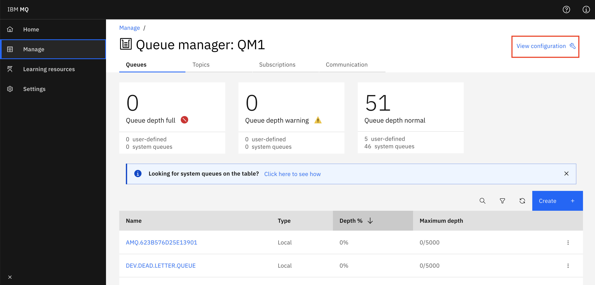
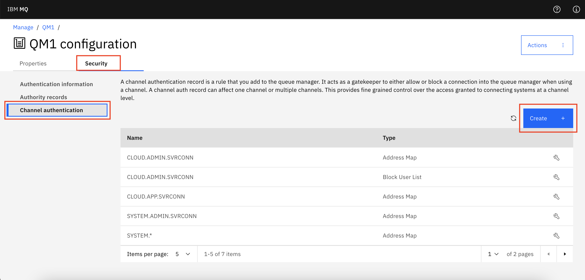
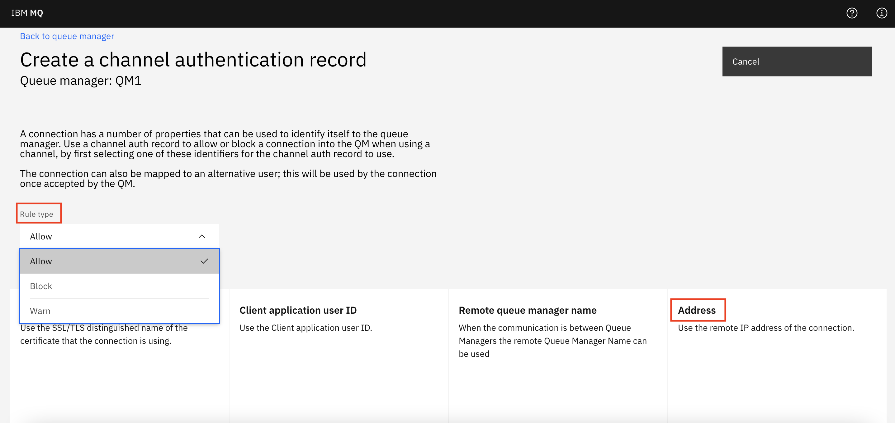
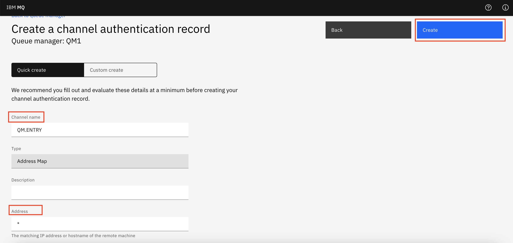

---
copyright:
  years: 2018, 2021
lastupdated: "2021-09-28"

subcollection: mqcloud

keywords: common, problem, FAQ, question, answer
---

{{site.data.keyword.attribute-definition-list}}

# Frequently Asked Questions
{: #mqoc_common_problems}

This document contains information about common questions or problems encountered by users of the {{site.data.keyword.mq_full}} service. It aims to answer questions or provide instruction on how to resolve issues without the need to raise a support ticket.
{: shortdesc}

When attempting to diagnose a problem with your queue manager the first place you should look is your queue manager logs. You can find information on how to download your queue manager logs on the [Downloading queue manager logs and diagnostics page](/docs/services/mqcloud?topic=mqcloud-mqoc_download_logs)

Contents:
* [Client application receives a "not authorized" response when attempting to connect to a queue manager even though a valid userid and password is supplied](#mqoc_jms_user_id)
* [Client application or queue manager cannot connect to a newly created channel](#mqoc_new_channel)
* [MQRCCF_ACCESS_BLOCKED (3382) when attempting to administer queue manager](#mqoc_client_conn_blocked)
* [MQRC_MAX_CONNS_LIMIT_REACHED (2025) when attempting to connect to a queue manager](#mqoc_client_conn_limit)
* [Messages cannot be put to a queue whose name does not start with 'DEV.'](#mqoc_auth_record)

## Client application receives a "not authorized" response when attempting to connect to a queue manager even though a valid userid and password is supplied.
{: #mqoc_jms_user_id}

While attempting to connect a client application to your {{site.data.keyword.mq_full}} queue manager you receive a return code indicating that the user was not authenticated successfully, such as one or more of the following;
* In MQ Explorer, `Access not permitted. You are not authorised to perform this operation (AMQ4036)`
* In a JMS or Java application `MQRC_NOT_AUTHORIZED` (2035)
* `AMQ9791E: The client application did not supply a user ID and password.`

### Explanation
{: #mqoc_jms_user_id_explain}

The default configuration of a {{site.data.keyword.mq_full}} queue manager specifies that any application connecting to the queue manager must supply valid user credentials. Users and applications can have credentials created by following the instructions in the [Users and Applications document page](/docs/services/mqcloud?topic=mqcloud-mqoc_users_and_apps).

IBM MQ client applications have two different methods of supplying credentials to a queue manager that is controlled by a switch called `compatibility mode`. You must ensure that when the application is connecting it is has **compatibility mode disabled**, otherwise only the first 8 characters of the password (long API key) is transmitted to the queue manager, and so the authentication check fails.

Client applications connecting using IBM MQ client libraries below version 8.0.0.0 are unable to supply long user credentials to the queue manager using this newer method and so will be unable to connect.

### Solution
{: #mqoc_jms_user_id_solution}

When connecting using MQ Explorer you must uncheck the option for `User identification compatibility mode` that is found in in the `User Identification details` page of the connection wizard.

Java or JMS applications can disable the compatibility mode flag as follows:
1. Ensure that the IBM MQ client libraries being used are version 8.0.0.0 or above
2. Ensure that the client application is supplying valid user credentials in the `MQCSP` structure. For more information on the `MQCSP` structure see [the Knowledge Center  here](https://www.ibm.com/support/knowledgecenter/en/SSFKSJ_9.1.0/com.ibm.mq.ref.dev.doc/q095620_.htm)
3. Disable compatibility mode as described in [this Knowledge Center page](https://www.ibm.com/support/knowledgecenter/en/SSFKSJ_9.1.0/com.ibm.mq.sec.doc/q118680_.htm) - for example by setting `JmsConstants.USER_AUTHENTICATION_MQCSP = true` or via the equivalent ConnectionFactory setting

Other products that connect to IBM MQ typically provide a mechanism for configuring this setting using their own administrative interfaces;
* IBM AppConnect Enterprise disables compatibility mode by default and so there are no problems connecting to queue managers in the MQ on Cloud service as [described in this blog post](https://developer.ibm.com/integration/blog/2018/09/28/support-ibm-mq-cloud-ibm-app-connect/)
* IBM DataPower provides an option to set the MQCSP User ID and MQCSP Password Alias as [described here](https://www.ibm.com/support/knowledgecenter/en/SS9H2Y_7.5.0/com.ibm.dp.doc/mq_configuringanmqqueuemanager.html)
* IBM MessageHub does not expose the compatibility mode as a configuration option and so an update should be made by IBM to allow connections from MessageHub to queue managers running in the MQ on Cloud service

### Explanation
{: #mqoc_jms_user_id_explain2}

Administrator credentials and Application credentials have different levels of authorization and are therefore not interchangable.
The **Administrator credentials** can be used to:

* Connect to the queue manager using the MQ Web Console
* Connect to the queue manager using MQ Explorer
* Connect to the queue manager using runmqsc
* Connect to the queue manager using the Administrative REST APIs
* Connect to the queue manger using a client configured to use the `CLOUD.ADMIN.SVRCONN` channel

The **Application credentials** can be used to:

* Connect to the queue manager using the messaging REST APIs
* Connect to the queue manger using a client configured to use the `CLOUD.APP.SVRCONN` channel

### Solution
{: #mqoc_jms_user_id_solution2}

If performing MQ administrative tasks use **Administrator credentials**

If connecting a client application use **Application credentials**

## Client application or queue manager cannot connect to a newly created channel
{: #mqoc_new_channel}

While attempting to connect a client application or queue manager to your {{site.data.keyword.mq_full}} queue manager via a channel you have recently created you receive a return code of `MQRC_NOT_AUTHORIZED` (2035) and the client cannot connect. Additionally, an error message is outputted with title `AMQ9777E: Channel was blocked`.

### Explanation
{: #mqoc_new_channel_explain}

The default configuration of an {{site.data.keyword.mq_full}} queue manager creates a channel authentication rule that blocks all connections except connections to the channels `CLOUD.ADMIN.SVRCONN` and `CLOUD.APP.SVRCONN`. If you create a new channel, no clients will be able to connect via that channel as they will be blocked by the channel authentication rule `CHLAUTH('*') TYPE(ADDRESSMAP) ADDRESS('*') USERSRC(NOACCESS)`

### Solution
{: #mqoc_new_channel_solution}

To resolve this problem create a new channel authentication rule that allows access to your channel. For example, if you have a channel called `QM.ENTRY` then create a channel authentication rule with the following values:

`SET CHLAUTH('QM.ENTRY') TYPE(ADDRESSMAP) ADDRESS('*') USERSRC(CHANNEL)`

Alternatively, you can use the MQ Console to create a channel authentication rule:
1. Navigate to the 'Administration' tab for your queue manager.

2. Ensure ‘MQ Console’ is selected and then click **Launch MQ Console**

3. Click on Manage in the side menu to view your MQ objects

4. Click on 'View configuration' at the top right.
    

5. Click on the 'Security' tab and on 'Channel Authentication', then click on **Create**.
    

6. From the 'Rule type' drop down menu, select `Allow`. After selecting the rule type, you'll be able to choose an identifier- select `Address`.
    

7. On the following page, add the channel name, for example `QM.ENTRY`. In the 'Address' text box add `*`. Finish by clicking on the **Create** button.
    

8. You should now see a new channel authentication record with your channel name.
## MQRCCF_ACCESS_BLOCKED (3382) when attempting to administer queue manager
{: #mqoc_client_conn_blocked}

While attempting to define, delete or alter objects in your {{site.data.keyword.mq_full}} queue manager your administration client receives an `MQRCCF_ACCESS_BLOCKED` (3382) return code. With clients running versions of IBM MQ v9.0.3 or below you might receive a return code of `MQRC_UNEXPECTED_ERROR` (2195)

Additionally, an error message is outputted with title `AMQ7355E: Object <Object name>, object type <Object type>, is locked to remote users.`

### Explanation
{: #mqoc_client_conn_blocked_explain}

Certain features of IBM MQ have been disabled for users of {{site.data.keyword.mq_full}}. These features are disabled either to prevent accidentally disabling the queue manager or potential misuse of the service. You might see that some of the locked attributes have values assigned to them, these are assigned automatically and cannot be changed.

If you try to define, alter or delete an object or attribute that has been disabled, your queue manager blocks this action with the return code `MQRCCF_ACCESS_BLOCKED` (3382). This return code was added at version 9.0.3 of IBM MQ, clients that are older than version 9.0.3 will not recognize this return code and so are likely to return `MQRC_UNEXPECTED_ERROR` (2195) instead.

The following features have been disabled:

* The following queue manager attributes: `CONNAUTH`, `CHADEXIT`, `CLWLEXIT`, `CLWLDATA`, `SSLCRYP`, `SSLKEYR`
* Authentication information objects of type `IDPWOS` & `IDPWLDAP`
* The following channel attributes: `MSGEXIT`, `MSGDATA`, `SCYEXIT`, `SCYDATA`, `SENDEXIT`, `SENDDATA`, `RCVEXIT`, `RCVDATA`
* `Listener` objects.
* `Service` objects. *Note:* You can start or stop an existing service object.
* `Process` objects.
* The following queue attributes: `PROCESS`
* `COMMINFO` objects.

## MQRC_MAX_CONNS_LIMIT_REACHED (2025) when attempting to connect to a queue manager
{: #mqoc_client_conn_limit}

While attempting to connect a client application or queue manager to your {{site.data.keyword.mq_full}} queue manager you receive a return code of `MQRC_MAX_CONNS_LIMIT_REACHED` (2025) and the client cannot connect.

Additionally, an error message is outputted with title `AMQ9694E: Program cannot connect because connection limit reached.`

### Explanation
{: #mqoc_client_conn_limit_explain}

{{site.data.keyword.mq_full}} applies limits to queue managers resources based on size. The values of each limit, and what are limited, are detailed in the information about each queue manager size when you create a new queue manager.

One of the limits applied to the queue manager is the number of concurrent client connections, this applies to both client applications and client queue managers. If you attempt to exceed the number of allowed connections your client application is blocked with the return code `MQRC_MAX_CONNS_LIMIT_REACHED` (2025) and an `AMQ9694E` error message is printed in the queue manager logs.

Because JMS uses two client connections to pass messages you need to be aware that if your queue manager connection limit is 10 you can only connect 5 JMS clients to your queue manager before reaching the connection limit.
{: note}

### Solution
{: #mqoc_client_conn_limit_solution}

To resolve this problem either:

* Disconnect unnecessary client connections to allow newer clients to connect
* Upgrade your queue manager to a larger size to allow more client connections

To let you know when you are getting close to your queue manager client connection limit, the queue manager outputs an `AMQ7358W` error message in the queue manager logs when it is at 80% of allowed client connections.

## Messages cannot be put to a queue whose name does not start with 'DEV.'
{: #mqoc_auth_record}

While attempting to send a message to a new queue whose name does not begin with 'DEV', you receive one of the below error messages:

* `JMSWMQ2007: Failed to send a message to destination '[YOUR QUEUE NAME]'`
* `MQRC_NOT_AUTHORIZED (2035)`.

### Explanation
{: #mqoc_auth_record_explain}

The default configuration of an {{site.data.keyword.mq_full}} queue manager is for all initial queues to be assigned with authority records, allowing users and applications to send and receive messages. All queues and topics beginning with 'DEV.' are configured to allow messages to be sent and received.

If a new queue or topic has been created whose name does not start with 'DEV.' the predefined authorization records will not apply. Therefore applications will not have the required permissions to send or receive messages to this queue or topic.

### Solution
{: #mqoc_auth_record_solution}

To resolve, the problem, use one of the following methods.

* Using `runmqsc`, run the following commands:

    `SET AUTHREC PROFILE('TEST.QUEUE') OBJTYPE(QUEUE) GROUP('demoapp') AUTHADD(PUT,GET,BROWSE,INQ)`

    `SET AUTHREC PROFILE('TEST.QUEUE') OBJTYPE(TOPIC) GROUP('demoapp') AUTHADD(SUB,PUB)`

    Replace 'TEST.QUEUE' with the name of your queue., and 'demoapp' wither your application username.  If you wish, you can grant access to an object to all connected applications by specifying the group 'mqwriter'.
    {: note}

* Via the web console:
    - Select the new queue then 'Configuration' under the three dots at the top of the screen.
    - Select 'Security' and click 'Add +'.
    - Select 'Group' and enter the name 'mqwriter' as the 'Group Name'. Tick the 'MQI' checkbox, and ensure only the boxes below MQI are checked.
    - Click the  'Create' button.
