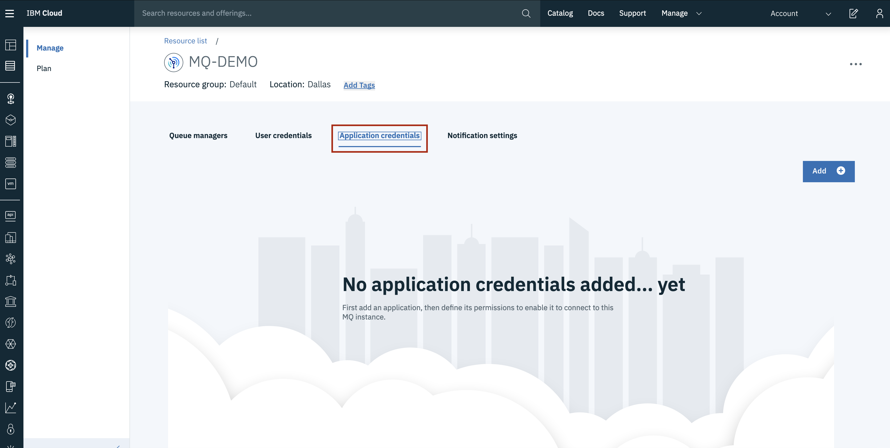

---
copyright:
  years: 2017, 2018
lastupdated: "2018-05-01"
---

{:new_window: target="_blank"}
{:shortdesc: .shortdesc}
{:screen: .screen}
{:codeblock: .codeblock}
{:pre: .pre}

# Configuring access for connecting an application to a queue manager
{: #mqoc_configure_app_qm_access}

To connect an application to a queue manager, it must have been granted permissions to access queue managers within your IBM MQ service instance.  The application must connect to the queue manager using its **MQ username** and the password must be the application's **API key**.
{:shortdesc}

 * **Note:** applications have access to connect to all queues and topics starting with **DEV.***.  They have permission to **put / get** messages and **publish / subscribe** to topics.

 If you want to know more about IBM MQ users and applications before proceeding, you
 can find [information here](/docs/services/mqcloud/learn/mqoc_users_and_apps.html)

---

## Granting an application permissions to access queue managers within your IBM MQ service instance
{: #grant_mqoc_configure_app_qm_access}

These instructions must be completed by a user who has **Administrator** privileges for your IBM MQ service instance.
  * **Note:** if you are the administrator of your IBM Cloud Account, then you should have the necessary privileges to perform these steps.

1. Log in to the IBM Cloud console.
2. Click on the 'hamburger menu'.
3. Click **Dashboard**.
  * Ensure that **RESOURCE GROUP** is set to **All Resources**.
4. Locate and click on your IBM MQ service instance, found under the 'Services' heading.
5. Click the **Application permissions** tab.

 

6. Click **Add application**.
7. Enter a **Name** and **Description** that will help you identify the application.
8. Click **Generate MQ username**.
  * Note: a unique MQ username will be auto-generated for the application.  You can edit the text-box to change this to your preferred username.  It must have a maximum of 12 characters and be lower case a-z or 0-9.  It must also be unique within your IBM MQ service instance.
9. Enter an **API key name** and **API key description** that will help you identify the application's API Key.
10. Click **Generate API key**.
11. Click **Show** to display the API key to copy and save it for later, or click **Download** to store the API Key in a file.
12. Click **Close**.

**Note:** For security reasons, the API key is only available to be copied or downloaded at the time of creation.  If the API key is lost, you must create a new API key.

The application that was added will now have permissions to access queue managers within your IBM MQ service instance.  You have now obtained the **MQ username** and **API key** for this application.

---

## Next step
{: #next_mqoc_configure_app_qm_access}

[Connecting an application to a queue manager](/docs/services/mqcloud/mqoc_connect_app_qm.html)
