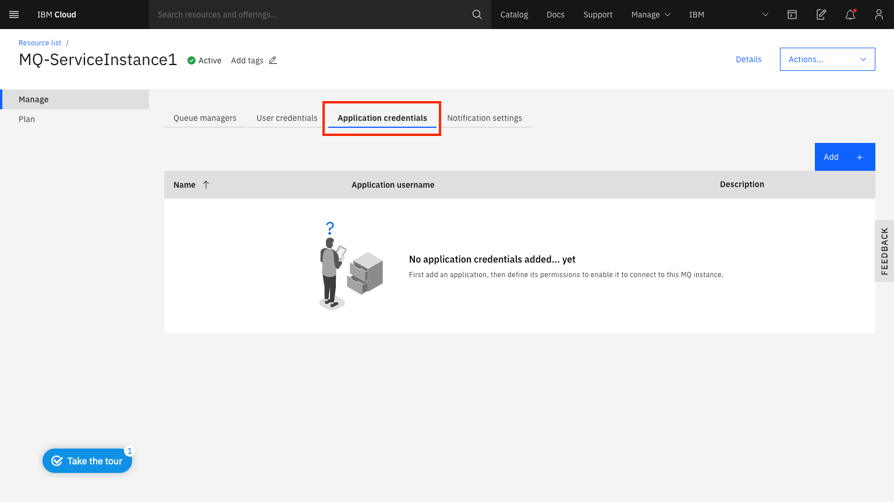

---
copyright:
  years: 2017, 2020
lastupdated: "2018-05-01"

subcollection: mqcloud

keywords: connect, access, client, queue, manager, IAM, permissions
---

{:new_window: target="_blank"}
{:shortdesc: .shortdesc}
{:screen: .screen}
{:codeblock: .codeblock}
{:pre: .pre}

# Configuring access for connecting an application to a queue manager
{: #mqoc_configure_app_qm_access}

To connect an application to a queue manager, it must have been granted permissions to access queue managers within your IBM MQ service instance.  The application must connect to the queue manager using its **Application username** and the password must be the application's **API key**.
{:shortdesc}

 * **Note:** applications have access to connect to all queues and topics starting with **DEV.***.  They have permission to **put / get** messages and **publish / subscribe** to topics.

 If you want to know more about IBM MQ users and applications before proceeding, you
 can find [information here](/docs/services/mqcloud?topic=mqcloud-mqoc_users_and_apps)

---

## Granting an application permissions to access queue managers within your IBM MQ service instance
{: #grant_mqoc_configure_app_qm_access}

If you are the administrator of your IBM Cloud Account, then you should have the necessary administrator privileges for your IBM MQ service instance.

If you **do not** have the necessary privileges, someone with the required privileges should follow these instructions to grant you access to queue managers within your IBM MQ service instance.

The required privileges to add new application credentials are configured in IAM and include:

 - Administrator for the **MQ** service in the required resource group
 - Administrator for the **User Management** service in account management services
 - The account owner will need to set the user list visibility to Unrestricted - using the procedure
 detailed here https://cloud.ibm.com/docs/account?topic=account-iam-user-setting

1. Log in to the IBM Cloud console to view the dashboard.
2. In the **Resource summary** panel click **Services**.
3. In the **Offering** filter box type `MQ`.
4. Locate and click on your IBM MQ service instance, found under the 'Services' heading.
5. Once in the MQ on Cloud service, click the **Application credentials** tab.

 

6. Click **Add**.
7. Enter a **Name** and **Description** that will help you identify the application.
8. A unique application username will be generated for you.
  * Note: You can edit the text-box to change this to your preferred username.  It must have a maximum of 12 characters and be lower case a-z or 0-9.  It must also be unique within your IBM MQ service instance.
9. Click **Add and Generate API key**.
10. Click **Show** to display the API key to copy and save it for later, or click **Download** to store the API Key in a file.
11. Click **Close**.

**Note:** For security reasons, the API key is only available to be copied or downloaded at the time of creation.  If the API key is lost, you must create a new API key.

The application that was added will now have permissions to access queue managers within your IBM MQ service instance.  You have now obtained the **application username** and **API key** for this application.

---

## Next step
{: #next_mqoc_configure_app_qm_access}

[Connecting an application to a queue manager](/docs/services/mqcloud?topic=mqcloud-mqoc_connect_app_qm)
