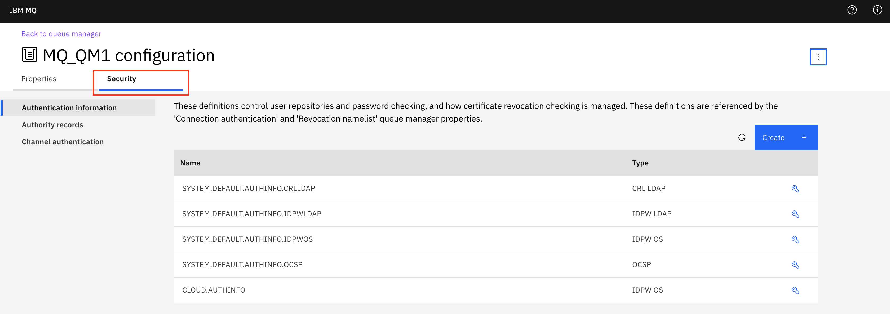

---
copyright:
  years: 2017, 2020
lastupdated: "2020-04-07"

subcollection: mqcloud

keywords: SSL, TLS, security, channel, enable
---

{:new_window: target="_blank"}
{:shortdesc: .shortdesc}
{:screen: .screen}
{:codeblock: .codeblock}
{:pre: .pre}

# Enabling TLS security for MQ channels in MQ on Cloud
{: #mqoc_configure_chl_ssl}

MQ on Cloud queue managers older than version 9.2.1 revision 2 were configured by default without TLS security. Later versions have TLS security on administration and application channels. This guide explains TLS security and allows you to upgrade earlier queue managers to the same security level as the newer ones. The later sections show how to download the required certificates for applications to connect to your queue manager.

The application or administration software needs to trust a public certificate for the MQ on Cloud queue manager certificate. 
This can be the issuer certificate, or the individual queue manager certificate. Both are available for download from the MQ on Cloud service console.

You will need to gather some data from your MQ on Cloud queue instance:

1. The administration user's username and password.
2. An application user's username and password.
3. The certificate chain ending in the queue manager certificate, starting from the root CA certificate.
4. The description of the queue manager formatted in JSON (called CCDT data).

The following paragraphs will guide you through gathering the data from the MQ on Cloud console, and will also guide you through the process of
setting up a keystore to manage trusted public certificates on your local machine.  Subsequent pages linked from the end of this document will show you
how to remotely administer using TLS, and also how to connect the C and JMS MQ samples to the queue manager.

The following description will be altering the CLOUD.ADMIN.SVRCONN channel - this will allow the administrator to connect securely.
Similarly, we will alter the CLOUD.APP.SVRCONN channel, which will be used by applications such as the C or JMS samples.

**Note** You will need access to the MQ tools for your operating system (for example runmqakm). These are part of an MQ installation on Linux and Windows, and have recently been made available in the [MacOS toolkit for Developers](https://developer.ibm.com/components/ibm-mq/tutorials/mq-macos-dev/). They can also be downloaded as a separate MQ Client from the [MQ Downloads](https://ibm.biz/MQdownloads) page.

## Reference Documentation
{: #mqoc_chl_ssl_prereq}

* The following links provide a handy reference for information on how to administer an MQ on Cloud queue manager using the standard administration tools. You may choose your preferred tool and follow the instructions in this document.

  - [Configuring administrator access for a queue manager](/docs/services/mqcloud?topic=mqcloud-tut_mqoc_configure_admin_qm_access)
  - [Administering a queue manager using IBM MQ Web Console](/docs/services/mqcloud?topic=mqcloud-mqoc_admin_mqweb)
  - [Administering a queue manager using IBM MQ Explorer](/docs/services/mqcloud?topic=mqcloud-mqoc_admin_mqcliexp)
  - [Administering a queue manager using runmqsc from an IBM MQ client](/docs/services/mqcloud?topic=mqcloud-mqoc_admin_mqcliexp)  


## Tasks on the MQ on Cloud queue manager
{: #mqoc_chl_ssl_tasks}

As mentioned earlier, enabling security on an MQ channel requires configuring a cipher spec, and exchanging public certificates between the queue manager and the client (and for Mutual TLS, also between the client and the queue manager). The configuration of the
cipher spec may be done using any of the three standard MQ administration tools. The method for each is described below, so pick your
preferred tool and follow the instructions. For access to the user credentials and certificate, the MQ on Cloud service console is required.

### Using the MQ on Cloud service console to gather credentials and certificates

1. Open the MQ on Cloud service console and locate your queue manager.

2. Gather the admin user's credentials
When you first select the **Administration** tab for your queue manager, your user will be given permissions as the administrator. You should note the user name, and follow the steps to download the API key (which is the password you will use to connect later).

3. Create an application user for the JMS and C applications
Select the **Application credentials** tab for your queue manager, and follow the process to add a new application credentials. Save the
generated API key, which is the password for applications to connect with.

4. Download the JSON CCDT description of your queue manager
Click the **Connection Info** button, and follow the instructions to download the CCDT form of the connection info. You might also want to download the text
version, which is easier to read, and a useful source of the queue manager name and url.

The CCDT file downloaded should look like this:

```
{
 "channel": [
  {
   "name": "CLOUD.ADMIN.SVRCONN",
   "clientConnection": {
    "connection": [
     {
      "host": "myhost.cloud.ibm.com",
      "port": 31605
     }
    ],
    "queueManager": "MQ_ONE"
   },
   "transmissionSecurity": {
    "cipherSpecification": "ANY_TLS12_OR_HIGHER"
   },
   "type": "clientConnection"
  },
  {
   "name": "CLOUD.APP.SVRCONN",
   "clientConnection": {
    "connection": [
     {
      "host": "myhost.cloud.ibm.com",
      "port": 31605
     }
    ],
    "queueManager": "MQ_ONE"
   },
   "transmissionSecurity": {
     "cipherSpecification": "ANY_TLS12_OR_HIGHER"
   },
   "type": "clientConnection"
  }
 ]
}

```
## Create a Keystore file
{: #mqoc_chl_ssl_keystore}

The following sections describe how to check that the channels already have TLS configured, and if not configure them to apply TLS security.

### Using MQ Console to alter the channels

1. Navigate to the **Administration** tab for your queue manager.


2. Ensure 'MQ Console' is selected and then click **Launch MQ Console**

3. Click on Manage in the side menu to view your MQ objects

 

4. Click on 'Communication' then 'App channels'

 

5. From the table, click the 3 dots for **CLOUD.ADMIN.SVRCONN** and select 'Configuration'

 

6. Select the **Edit** button

 

7. Select 'SSL' and in the **SSL CipherSpec** field, check that the value is `ANY_TLS12_OR_HIGHER`. This is not a list, so if you want to choose another cipher spec, please refer to the IBM MQ documentation for [Enabling CipherSpecs](https://www.ibm.com/support/knowledgecenter/en/SSFKSJ_9.1.0/com.ibm.mq.sec.doc/q014260_.htm)

 

8. Click **Save**

9. Repeat the above for the **CLOUD.APP.SVRCONN** channel.

10. Now refresh the queue manager SSL Security if you have altered any channel above:

  10.1 On the queue manager page, select **Configuration**.
    
  10.2 Select the **Security** tab.
   
  10.3 Select the three dots, then **Refresh SSL**
   
  10.4 Confirm by clicking **Refresh**

The Cipher spec is now configured.

### Using MQ Explorer to alter the channels

1. Refer to [Connect to your queue manager using MQ Explorer](/docs/services/mqcloud?topic=mqcloud-mqoc_admin_mqcliexp#connect_mqoc_admin_mqcliexp) and perform the steps to connect an MQ Explorer to your MQ on Cloud queue manager.

2. In the MQ Explorer - Navigator:    
    2.1 Navigate to **Queue Managers**, expand your queue manager and click on **Channels**.  
    2.2 In the **Channels** panel, double click on **CLOUD.ADMIN.SVRCONN**.  
    2.3 In the **CLOUD.ADMIN.SVRCONN** properties pannel, select **SSL**.  
    2.4 In the **SSL Cipher Spec:** field, make sure a cipher spec is selected (`ANY_TLS12_OR_HIGHER`).  
    2.5 Click **Apply** and then **OK**.  
3. Repeat the above for the channel **CLOUD.APP.SVRCONN**


4. If you have altered the cipher spec for any channel, refresh the security. Under **Queue Managers**, right click on the queue manager and select **Security -> Refresh SSL**.  

5. This completes enabling TLS encryption on the MQ channels. If you no longer need the MQ Explorer, you can disconnect the connection to queue manager by right clicking on queue manager and selecting **Disconnect**.  

To enable the client process to trust the queue manager we must download the public certificate that will be presented by the queue manager. 

The following steps can be used to download the public certificate and create that keystore.

1. Refer to [Connect to your queue manager using runmqsc](/docs/services/mqcloud?topic=mqcloud-mqoc_admin_mqcliexp#connect_mqoc_admin_mqcliexp) and perform the steps to
connect to your MQ on Cloud queue manager. Do not exit the runmqsc command shell as is will be used in steps below.

2. If your queue manager is 9.2.1 r1 or lower, run following commands to configure the channels:

    1.3 Click on the **Key store** tab, and identify the certificate that is marked as "In use: Queue manager" (by default this is **qmgrcert_yyyymm**).
    
    

  ```
  ALTER CHANNEL(CLOUD.ADMIN.SVRCONN) CHLTYPE(SVRCONN) SSLCAUTH(OPTIONAL) SSLCIPH(ANY_TLS12_OR_HIGHER)
  ALTER CHANNEL(CLOUD.APP.SVRCONN) CHLTYPE(SVRCONN) SSLCAUTH(OPTIONAL) SSLCIPH(ANY_TLS12_OR_HIGHER)
  REFRESH SECURITY TYPE(SSL)
  end
  ```
3. This completes enabling TLS encryption on the MQ channels. If you no longer need the runmqsc cli, you can exit now.

4. Create a client key store and copy the public part of queue manager certificate chain into it.  

    4.1 Create a client key store using the ‘runmqakm’ tool.
     ```
     runmqakm -keydb -create -db key.kdb -pw <your password> -type pkcs12 -expire 0 -stash

     # In some operating systems you may have to update the file permissions to make the keystore readable
     chmod +rw key.kdb
     ```
    4.2 Import the queue manager certificate into the key store (this is the **qmgrcert** you downloaded from the MQ on Cloud user interface earlier).
     ```
     runmqakm -cert -add -db key.kdb -file qmgrcert_yyyymm.pem -label qmgrcert -stashed -type pkcs12 -format ascii
     ```
    4.3 Check your certificates have been added.
     ```
     runmqakm -cert -list -db key.kdb
     ```

     **Note:** The type parameter above is **pkcs12**.  Some samples suggest using **kdb**, but the resulting key.kdb is not readable by keytool, so for this exercise **pkcs12** is preferred.

## Optionally Create a Keystore file in jks format
{: #mqoc_chl_ssl_keystore_jks}

Some of the following tutorials require a keystore in JKS format (For example the AMS tutorial). 
The following steps can be used to create that keystore.

1. Create a jks key store and copy the public part of queue manager certificate chain into it.  

  In windows and Linux environments, use the ikeycmd tool:

    1.1 Create a client key store using the ‘ikeycmd’ tool.
     ```
     ikeycmd -keydb -create -db key.jks -pw <your password> -type jks -expire 0 -stash 

     # In some operating systems you may have to update the file permissions to make the keystore readable
     chmod +rw key.jks
     ```
     
    1.2 Import the queue manager certificate into the key store (this is the **qmgrcert** you downloaded from the MQ on Cloud user interface earlier).
     ```
     ikeycmd -cert -add -db key.jks -file qmgrcert_yyyymm.pem -label qmgrcert -pw <your password>
     ```
    1.3 Check your certificates have been added.
     ```
     ikeycmd -cert -list -db key.jks
     ```

  In Mac OSX environment, use the keytool:

    1.1 Create a client key store and import the certificate.
     ```
     `keytool -importcert -file qmgrcert_yyyymm.pem  -alias qmgrcert  -keystore key.jks -storepass <your password> 
     ```
    1.2 Check your certificates have been added.
     ```
     keytool -list -keystore key.jks -storepass <your password>
     ```

## Next steps
{: #mqoc_chl_ssl_next}

### Securing Administration

The next step is to configure the client end of the communication to trust the queue manager certificate. Choose the administration tool that you would like to use and follow the appropriate instructions below.

* [Configuring security for remote administration using IBM MQ Explorer](/docs/services/mqcloud?topic=mqcloud-mqoc_remote_ssl_exp_admin)  
* [Configuring security for remote administration using runmqsc CLI](/docs/services/mqcloud?topic=mqcloud-mqoc_remote_ssl_runmqsc_admin)  

### Securing Application Connections

The next step is to configure your application connection so that it is uses TLS encryption when connecting to the queue manager.
* [Connect securely from MQI C & JMS application](/docs/services/mqcloud?topic=mqcloud-mqoc_connect_app_ssl)
