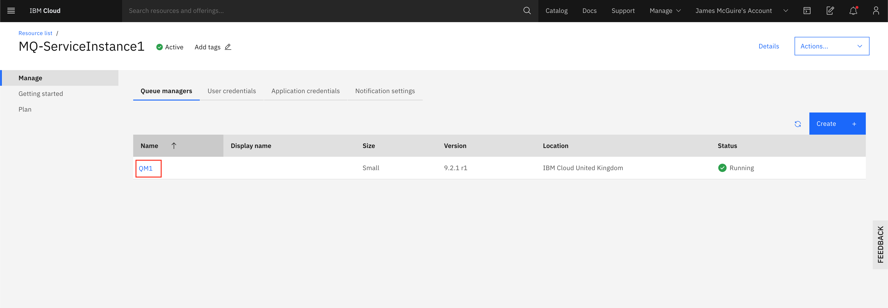
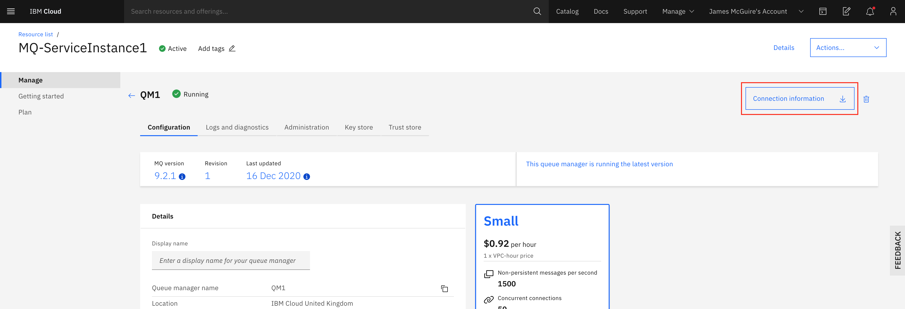

---
copyright:
  years: 2017, 2021
lastupdated: "2021-09-28"

subcollection: mqcloud

keywords: connect, client, application, TLS, secure
---

{{site.data.keyword.attribute-definition-list}}

# Connecting a sample application to a queue manager
{: #mqoc_connect_app_qm}
 
You can easily and simply connect an application to a queue manager. You can run your application in a number of ways, deployed in the cloud for instance. For validation purposes and the purposes of this example, you can run the IBM MQ sample applications from your own machine (your laptop for example).
{: shortdesc}

By completing the following task, you can:
1. Connect to an existing queue manager using the IBM MQ Client samples from your own machine.
2. Put a test message onto a queue.
3. Get the test message from a queue.

As of MQ 9.2.1r2, a deployed queue manager will have TLS enabled by default on the predefined channels. If your queue manager is newer than 9.2.1r1, you should follow the prerequsites section of this tutorial, then proceed to [this tutorial](/docs/services/mqcloud?topic=mqcloud-mqoc_connect_app_ssl).
{: important}

## Before you begin
{: #prereq_mqoc_connect_app_qm}

* You need an existing queue manager, which can be created by following [these instructions](/docs/mqcloud?topic=mqcloud-mqoc_create_qm).
* For establishing a secured connection to MQ on Cloud queue manager, you must first [set up TLS encryption on the MQ channel](/docs/services/mqcloud?topic=mqcloud-mqoc_configure_chl_ssl).
* An application has been granted permissions to access queue managers within your IBM MQ service instance. You have obtained the MQ username and API key for this application (for instructions, follow the [configuring access for connecting an application to a queue manager](/docs/services/mqcloud?topic=mqcloud-mqoc_configure_app_qm_access) guide).
* If you do not intend to use one of the predefined 'DEV.QUEUE.' queues to put and get messages, follow the [Assigning user/group access to a queue](/docs/services/mqcloud?topic=mqcloud-mqoc_configure_auth_record) guide to configure the authorization record required for this queue.
* If you are using a JSON CCDT for your application , you must have a 9.1.2 (or above) installation of the client.
* An existing installation of IBM MQ Client on your own machine.
   * Download the client from [here](http://www-01.ibm.com/support/docview.wss?uid=swg24042176#1).
       * Clicking the **HTTP** link next to the latest available version of the **CD Clients** will take you to **Fix Central**. From there you can search for and select the appropriate **Redist** (redistributable) client bundle for your operating system platform. This will include the sample applications.
   * Once downloaded, unpack the bundle into a location of your choosing.
   * Make a note of the full path to the directory containing the sample applications. This path will be referenced as `<PATH_TO_SAMPLE_BIN_DIR>` for the rest of this task.
       * For Windows, this will be the `bin` directory unpacked in the previous step, the location of which will depend upon where you chose to unpack the bundle.
       * For Linux, this will be the `samp/bin` directory unpacked in the previous step, the location of which will depend upon where you chose to unpack the bundle.

## TLS additional setup
{: #preptlsccdt_mqoc_connect_app_qm}

To use a connect via TLS, we will need to specify the channel definitions using a CCDT file.

1. Open a web browser, and navigate to your MQ on Cloud service instance in IBM Cloud.
2. Find your queue manager in the queue manager list and click on it's name to navigate to the queue manager details page.

    

3. Click the "Connection Information" button in the top right of this page.

    You may also want to download the text version, which is easier to read, and a useful source of the queue manager name and url.
    {: tip}

    

    

4. In the dialog click "JSON CCDT" to download the JSON CCDT description of your queue manager and save it in a suitable location:
    * If you wish to confirm the contents of the channel definitions, it should be a similar format to the example below:
    ```json
    {
      "channel": [
        {
          "name": "CLOUD.ADMIN.SVRCONN",
          "clientConnection": {
            "connection": [
              {
                "host": "myqueuemanager.qm.us-south.mq.appdomain.cloud",
                "port": 31500
              }
            ],
            "queueManager": "qm1"
          },
          "transmissionSecurity": {
            "cipherSpecification": "ANY_TLS12_OR_HIGHER",
          },
          "type": "clientConnection"
        },
        ...
      ]
    }
    ```

5. Create a Keystore file 
    * Follow these instructions to [create a keystore file](/docs/services/mqcloud?topic=mqcloud-mqoc_configure_chl_ssl#mqoc_chl_ssl_keystore) for use in this application setup.
    * Once the keystore has been created you must set the **MQSSLKEYR** environment variable.

    **MQSSLKEYR** is the full path from the system root to the key store file. Note that the filename requires no suffix - so for a key store named key.kdb, specify just "key".

    * Mac/Linux - `export MQSSLKEYR=/Users/you/store/key`
    * Windows (Command prompt) - `set MQSSLKEYR=c:\mystore\key`
    * Windows (PowerShell) - `$env:MQSSLKEYR=c:\mystore\key`

## Prepare for connection
{: #prepconn1_mqoc_connect_app_qm}

Open a command shell on your own machine.
1. Set the 'MQCCDTURL' variable:
    * Mac/Linux: `export MQCCDTURL=file:////Users/you/definitions/connection_info_ccdt.json`
    * Windows: `set MQCCDTURL=file:///c:/mydefinitions/connection_info_ccdt.json`
    * Windows (PowerShell): `$env:MQCCDTURL=file:///c:/mydefinitions/connection_info_ccdt.json`

    MQCCDTURL can be replaced by two other environment variables **MQCHLLIB** (the full path to the directory  of your ccdt file) and **MQCHLTAB** (the filename of the ccdt file)
    {: note}
 
2. Set the 'MQSAMP_USER_ID' variable:
    * Mac/Linux: `export MQSAMP_USER_ID="<application MQ username>"`
    * Windows (Command prompt): `set MQSAMP_USER_ID=<application MQ username>`
    * Windows (PowerShell): `$env:MQSAMP_USER_ID="<application MQ username>"`

    The next steps should be run from this same command shell.
    { :note}

## Put a message onto the test queue using amqsputc
{: #put1_mqoc_connect_app_qm}

**Note: ** Please ensure that you have carried out the prerequisite steps listed above - in particular configuring application access to the queue manager.

In the same shell used in the previous step:

1. Run `<PATH_TO_SAMPLE_BIN_DIR>/amqsputc DEV.QUEUE.1 <your QMGR name>`
    * Where `<PATH_TO_SAMPLE_BIN_DIR>` is the path to the sample applications bin directory you made note of in the Prerequisites section above.
2. Enter the **application API key** when prompted for a password.
3. Type in a test message.
4. Press `Enter` twice to exit the amqsputc sample.

## Get a message using amqsgetc
{: #get1_mqoc_connect_app_qm}

In the same shell used in the previous step:

1. Run `<PATH_TO_SAMPLE_BIN_DIR>/amqsgetc DEV.QUEUE.1 <your QMGR name>`
    * Where `<PATH_TO_SAMPLE_BIN_DIR>` is the path to the sample applications bin directory you made note of in the Prerequisites section above.
2. Enter the **application API key** when prompted for a password.

Your test message is displayed.

After a short period, the amqsgetc sample program should end after finding no more messages.

## Conclusion
{: #conc_mqoc_connect_app_qm}

You have successfully:
* Connected to a queue manager using a sample application from your own machine.
* Put a test message onto a queue.
* Obtained the test message from the queue.
