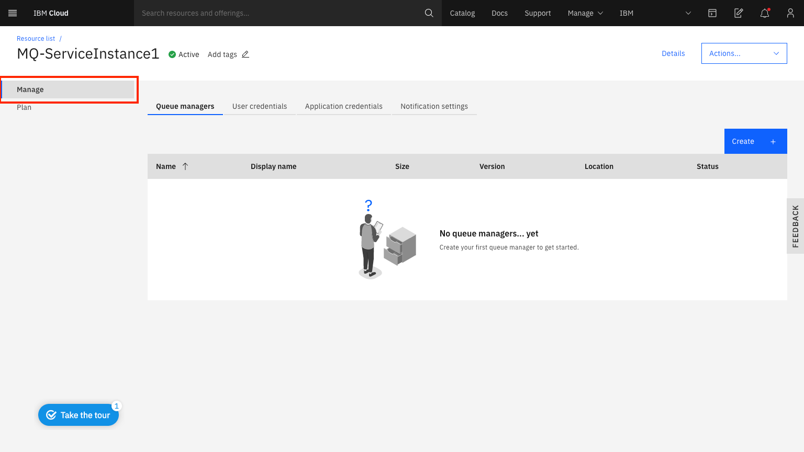

---
copyright:
  years: 2017, 2021
lastupdated: "2021-09-27"

subcollection: mqcloud

keywords: create, queue, manager
---

{{site.data.keyword.attribute-definition-list}}

# Creating a queue manager
{: #mqoc_create_qm}

You can quickly and easily create a new queue manager in {{site.data.keyword.mq_full}}.
{: shortdesc}

In this task, you will do the following:

1. Launch {{site.data.keyword.mq_full}}.
2. Create a queue manager.

## Launching {{site.data.keyword.mq_full}} Instance
{: #launch_mqoc_create_qm}

**Note:** If you've already created a service instance, you can skip the following steps and continue with **Creating a queue manager**.

1. Log in to the IBM Cloud console.
2. Click **Catalog**.
3. Select **Integration** from the Services navigator, and click the **MQ** tile.
4. Select a region from the drop down boox.
5. Select a pricing plan
6. Type in a service name.
7. Click **Create**.

You are now presented with a view of your service instance from where you will be able to view and manage your queue managers after they have been created.

## Creating a queue manager
{: #crqm_mqoc_create_qm}

Starting from the 'Manage' menu option within the service instance view:

 

1. Click **Create**.
2. Choose a unique name for your new queue manager.
    * Please ensure that your queue manager name only contains characters from the following set: a-z, A-Z, 0-9, underscore, and period.
3. Choose a display name that you can quickly identify your queue manager with.
4. Choose the location where the queue manager will be deployed.
5. Select the queue manager size.
6. Click **Create**.

A record of your new queue manager will appear with a status of `Deploying`.

The status of your new queue manager will automatically refresh every 30 seconds.

When you see that your queue manager has a status of `Running`, it's ready to be configured for use.

## Conclusion
{: #conc_mqoc_create_qm}

You have successfully launched {{site.data.keyword.mq_full}} and created a queue manager.

## Next step
{: #next_mqoc_create_qm}

Administer your new queue manager, using one of the [queue manager administration options](/docs/services/mqcloud?topic=mqcloud-mqoc_admin_qm)
