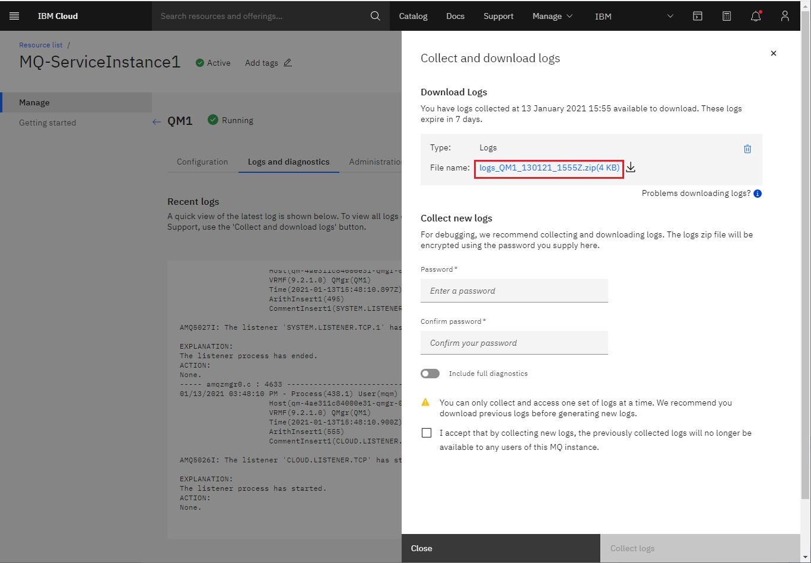

---
copyright:
  years: 2017, 2020
lastupdated: "2020-04-28"

subcollection: mqcloud

keywords: queue, manager, logs, download, diagnostics
---

{:new_window: target="_blank"}
{:shortdesc: .shortdesc}
{:screen: .screen}
{:codeblock: .codeblock}
{:pre: .pre}

# Downloading queue manager logs and diagnostics
{: #mqoc_download_logs}

You might find that your IBM MQ queue manager is not behaving as you expected. For example, if you try to connect a client application to your queue manager and find that your client application is rejected.

To help diagnose the cause of your problem, you might want to check the queue manager logs for information.

The queue manager logs and diagnostics are available in a downloadable zip file.  Follow the steps below to download this file.
{:shortdesc}

## Prerequisites
{: #prereq_mqoc_download_logs}

* Before you can download your queue manager logs or diagnostics, you need to be logged into IBM Cloud and have your service instance queue managers page open.

 1. Log in to the IBM Cloud console.
 2. Click on the 'hamburger menu'.
 3. Click **Dashboard**.
   * Ensure that **RESOURCE GROUP** is set to **All Resources**.
 4. Locate and click on your IBM MQ service instance, found under the 'Services' heading.
 5. From the list of your queue managers, click on the one you want to gather the logs for.

## Collect logs and diagnostics

1. Click the **Logs and diagnostics** tab in your queue manager view. This tab is only enabled once the queue manager status has been confirmed as Running. The initial view on the Logs and diagnostics tab shows the most recent logs for the queue manager.

 

2. Click the **Collect and download logs** button to reveal the side panel.

3. Enter a password for the zip file and click **Collect logs**.

4. Wait for the logs to finish collecting. Any available log downloads will show in the **Download logs** section at the top of the panel. The side panel can be closed while you are waiting for the logs to finish processing.

5. From the logs side panel, click on the log filename to download the logs.

 

6. Follow your browser's instructions to save the file to your computer.

## Result

You have successfully downloaded the logs and diagnostics.
