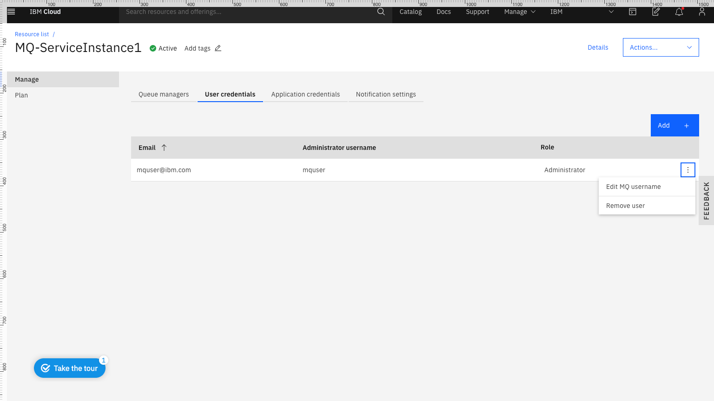

---
copyright:
  years: 2017, 2018
lastupdated: "2018-03-05"
---

{:new_window: target="_blank"}
{:shortdesc: .shortdesc}
{:screen: .screen}
{:codeblock: .codeblock}
{:pre: .pre}

# Editing the MQ username for an existing user
{: #mqoc_edit_admin_username}

These instructions will **edit** the MQ username for an existing user.
  * **Warning:** the user will no longer be able to connect to queue managers with their original MQ username.

1. Log in to the IBM Cloud console.
2. Click on the 'hamburger menu'.
3. Click **Dashboard**.
  * Ensure that **RESOURCE GROUP** is set to **All Resources**.
4. Locate and click on your IBM MQ service instance, found under the 'Services' heading.
5. Click the **User permissions** tab.
6. Click the **Actions** menu **...** for the user's entry in the list of User permissions.

 

7. Click **Edit MQ username**.
8. Enter a new MQ username.
  * Note: the MQ username must have a maximum of 12 characters and be lower case a-z or 0-9.  It must also be unique within your IBM MQ service instance.
9. Click **Save**.
