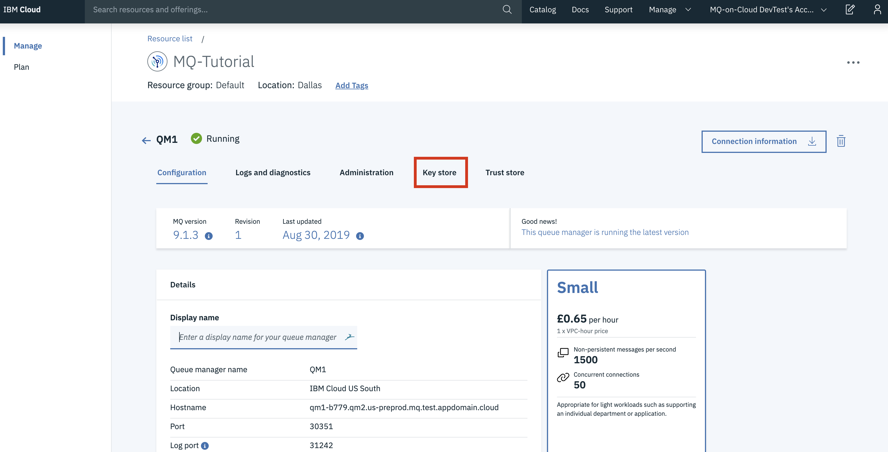
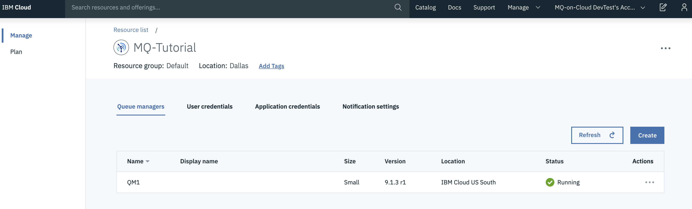
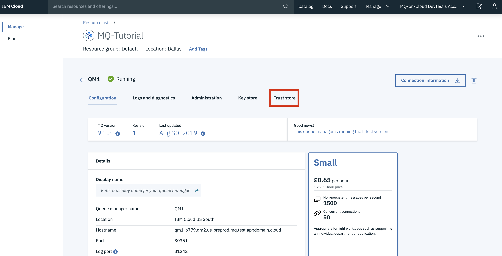
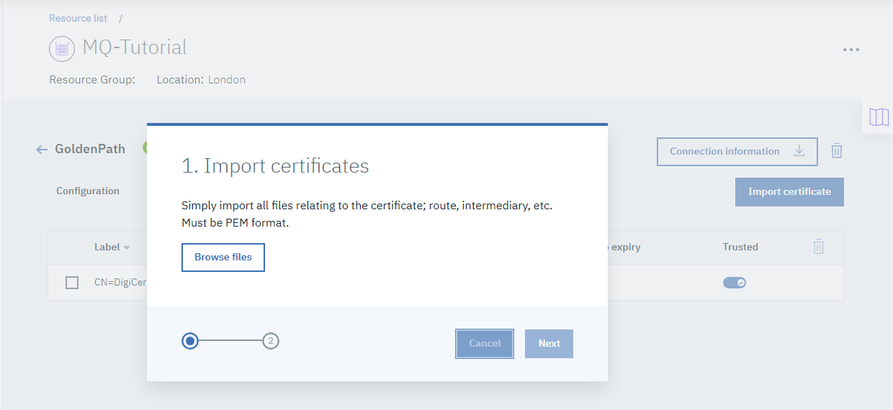
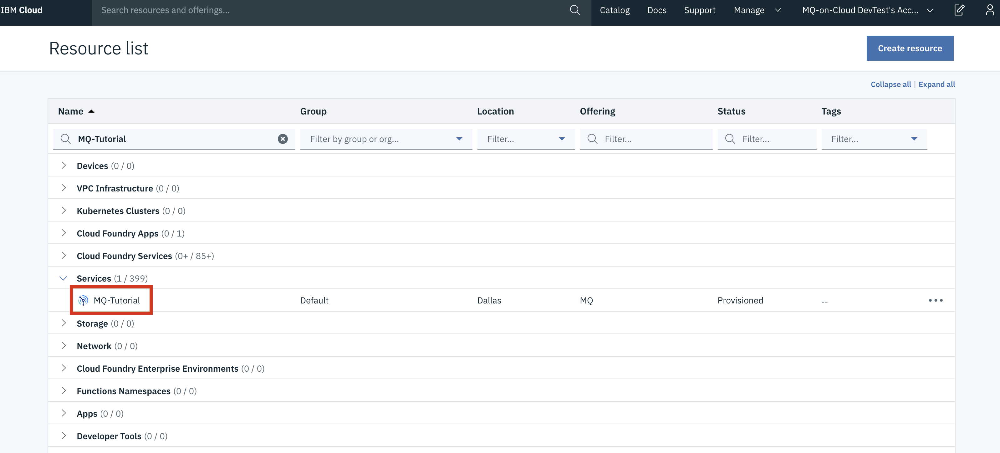
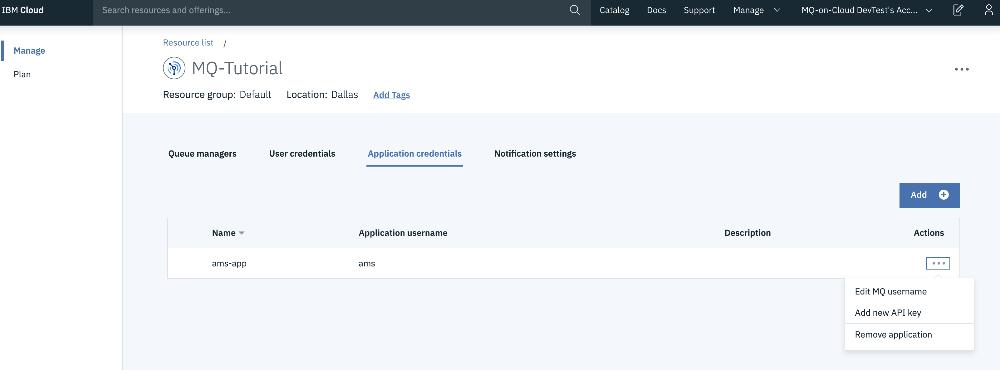
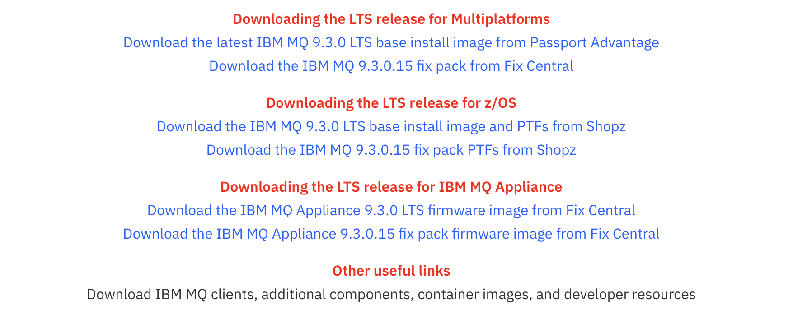

---
copyright:
  years: 2017, 2022
lastupdated: "2022-05-27"

subcollection: mqcloud

keywords: JMS, SSL, TLS, client
---

{{site.data.keyword.attribute-definition-list}}

# Enabling TLS between a client and a queue manager
{: #mqoc_jms_tls}

This guide details how to enable standard and mutual TLS authentication between a queue manager and a client application. This will allow messages to be sent and received securely over the network.

For MQ on Cloud queue managers of version 9.2.1 revision 2 and above, TLS is enabled by default. These instructions cover enabling TLS for queue managers below that revision.
{: note}


Standard TLS ensures the client trusts the server that it is communicating with. Mutual TLS involves the server ensuring it trusts the client too. TLS makes use of public key cryptography to encrypt messages over the network. Public keys belonging to trusted servers and applications are stored in a trust store. Applications and servers store their own own private key in a key store.

## Prerequisites
{: #prereq_mqoc_jms_tls}

In order to proceed with this tutorial, it is vital that you have the following prerequisites:

1. **{{site.data.keyword.mq_full}} queue manager**
    - If you do not already have an {{site.data.keyword.mq_full}} queue manager, you can create one by following the [getting started](https://cloud.ibm.com/docs/mqcloud?topic=mqcloud-getting_started).
1. **Connection details** for the queue manager downloaded in a connection_info.txt file
1. An admin username and apikey downloaded in a platformApiKey.json file
1. An application username and apikey downloaded in an apiKey.json file
    - You can consult **Appendix 1** at the end of this tutorial for how to get these files if you don't have them.
1. **A JMS application**
    - This tutorial requires a JMS application to successfully complete it. We recommend you follow the tutorial detailed in **Appendix 2** in order to ensure you have a suitable JMS application for this tutorial.
1. **IBM's JDK**
    - You will need a Java JDK to complete this tutorial. It is recommended that you use the IBM JDK. This JDK contains support for modern encryption types and higher levels of security, which are needed for this tutorial. You will make use of `java`, `javac` and `ikeycmd` tools. If you do not have these commands, follow the steps in **Appendix 3** at the end of this tutorial to download and install the IBM JDK. If you are running this tutorial on Mac OSX, there are instructions later for using keytool instead of ikeycmd.
1. **IBM MQ Client**
    - To complete this tutorial you will need the IBM MQ command line tool `runmqsc` installed and exported to your `PATH`. If you do not have this command, you can get it by installing the IBM MQ Client. **Appendix 4** at the end of this tutorial details how to do this.

## Securing Applications with Standard (One Way) TLS
{: #oneway_mqoc_jms_tls}

Standard TLS authentication ensures that a client can only talk to trusted queue managers, while also encrypting the messages travelling between the queue manager to the client.

In this section of the document, you will first demonstrate an existing, un-secure connection between a client and a queue manager, and then transform it into a TLS enabled, secure connection.

After enabling TLS on the queue manager's channel, the JMS application will need to be configured to trust the queue manager before it can communicate with it. First you will export the public part of the queue manager's security certificate. This part of the certificate is known as a public key. MQ on Cloud comes with a default security certificate, provided by *Let's Encrypt R3*. The JMS application will store the queue managers public key in a trust store. You will therefore create a trust store, and import the queue managers public key into it. The JMS application will then be updated to use the trust store.

### Step 1: Run unencrypted JMS application

If your queue manager is version 9.2.1 revision 2 or higher, you will not be able to run JMS without TLS, move on to section 5.
{: important}

You will have already run the JMS application if you have completed the prerequisites
{: note}

The JMS application must be run to confirm that is runs, though the messages are not encrypted. Use the following commands depending on your operating system:

- Windows
    - Recompile `javac -cp .\com.ibm.mq.allclient-9.0.4.0.jar;.\javax.jms-api-2.0.1.jar com\ibm\mq\samples\jms\JmsPutGet.java`
    - Run  `java -cp .\com.ibm.mq.allclient-9.0.4.0.jar;.\javax.jms-api-2.0.1.jar;. com.ibm.mq.samples.jms.JmsPutGet`
- Linux
    - Recompile `javac -cp ./com.ibm.mq.allclient-9.0.4.0.jar:./javax.jms-api-2.0.1.jar com/ibm/mq/samples/jms/JmsPutGet.java`
    - Run `java -cp ./com.ibm.mq.allclient-9.0.4.0.jar:./javax.jms-api-2.0.1.jar:. com.ibm.mq.samples.jms.JmsPutGet`

This will be the expected output:

```text
  Your lucky number today is 283
  SUCCESS
```

### Step 2: Connecting to the queue manager via runmqsc

TLS communication must be enabled on the queue manager. You will use the command `runmqsc` in order to connect to the remote MQ on Cloud queue manager. `runmqsc` uses an environment variable to determine the details of the queue manager to connect to.

1. Export the MQ variable with `export MQSERVER="CLOUD.ADMIN.SVRCONN/TCP/<HOSTNAME>(<PORT>)"` where:
    - `<HOSTNAME>` - this is '*hostname*' in the file connection_info.txt
    - `<PORT>` - this is '*listenerPort*' in the file connection_info.txt
1. Enter the following command into the console window:
    - `runmqsc -c -u <ADMIN_MQ_USER> -w60 <QUEUE_MANAGER_NAME>` where:
        - `<ADMIN_MQ_USER>` - this is '*mqUsername*' in the file platformApiKey.json
        - `<QUEUE_MANAGER_NAME>` - this is '*queueManagerName*' in the file connection_info.txt
        - `-c` informs `runmqsc` it should connect to a remote queue manager using the *MQSERVER* variable
    - runmqsc will prompt you for a password - this is the api key in the *PlatformApiKey.json* file you downloaded as part of the guided tour.

The `runmqsc` command should show that authentication was successful. The terminal will output a blank line and wait for user input.

### Step 3: Configuring the queue manager for TLS

Having connected to the queue manager, one way TLS communication can be configured.

1. Check the current status of the queue manager by running `DISPLAY CHANNEL(CLOUD.APP.SVRCONN)` which will display the current settings of the channel you are about to change.
2. Update the channel to enable standard TLS by running `ALTER CHL('CLOUD.APP.SVRCONN') CHLTYPE(SVRCONN) SSLCIPH(ECDHE_RSA_AES_128_CBC_SHA256) SSLCAUTH(OPTIONAL)`
    - setting `SSLCIPH` to `ECDHE_RSA_AES_128_CBC_SHA256` and `SSLCAUTH` to `OPTIONAL` will disable the use of mutual authentication, and a combination of OPTIONAL with the setting of Cipher Spec will enable standard TLS.
3. Running `DISPLAY CHANNEL(CLOUD.APP.SVRCONN)` will confirm that the changes have taken effect.
4. Exit `runmqsc` with `end`

### Step 4: Rerun the JMS application

Now run JMS application again. This time it should fail because the queue manager is enforcing TLS, but the client application is not yet configured to use TLS.

- On Windows:
    - Run `java -cp .\com.ibm.mq.allclient-9.0.4.0.jar;.\javax.jms-api-2.0.1.jar;. com.ibm.mq.samples.jms.JmsPutGet`
- On Linux:
    - Run `java -cp ./com.ibm.mq.allclient-9.0.4.0.jar:./javax.jms-api-2.0.1.jar:. com.ibm.mq.samples.jms.JmsPutGet`

This is the expected error shown in the last Java backtrace:

```text
  Caused by: com.ibm.mq.jmqi.jmqiException: CC=2;RC=2397;AMQ9641: Remote CipherSpec error for channel 'CLOUD.APP.SVRCONN' to  host ''. [3=CLOUD.APP.SVRCONN]
```

### Step 5: Export the queue manager's public key certificate

The JMS application needs to trust the queue manager for one way TLS. The public key must first be exported from the server so that it can be imported into the application trust store and used by the JMS application.

1. Click on the queue manager being configured - this will display more details about this queue manager.
1. Click on 'Key store'. This is where the security certificates on the queue manager are stored.
    
1. The default security certificate labelled 'Default: qmgrcert' can be seen:
    
    1. The public part of the certificate must be downloaded. Click on the three dots in the upper right of the certificate:
    1. This will bring up a toolbar. Click on 'Download public certificate' to download the public key of the certificate.
      

Additional step for M1 Macs with ARM Processors:

This information is relevant from version 9.3.1 onwards where there was a change in how to connect to a Queue Manager with TLS.

For background the MQ MacOS toolkit makes use of native MQ client libraries delivered as universal binaries to support both x86 and Arm64. Whilst the toolkit itself consists of universal binaries it has a downstream dependency for encryption. For x86 the toolkit uses GSKit, for Arm64 it uses OpenSSL and this requires a .pem formatted truststore for TLS. 

This means that is there is currently an additional requirement to export the following environment variable:

1. `export MQSSLKEYR=<path_to_your_pem_file>/qmgrcert.pem`

### Step 6: Create a trust store and import the queue manager's public key

The following command creates a key database our application can use as a trust store. Navigate to the same folder as the JMS application and execute this command:

In Windows and Linux environments only:
1. run `ikeycmd -keydb -create -db <trustStoreName>.jks -pw <trustStorePassword> -type jks -expire 0` where:
    - `<trustStorePassword>` - choose a password and remember it for future use.
1. To add the certificate to the new trust store run `ikeycmd -cert -add -db <trustStoreName>.jks -file qmgrcert.pem -label qmgrcert -pw <trustStorePassword>`

In Mac OSX environments, run `keytool -importcert -file qmgrcert.pem  -alias qmgrcert -keystore <trustStoreName>.jks -storepass <trustStorePassword>`
 
A key database has now successfully been created to use as a trust store, and the queue manager's public key has been imported to our new trust store.

### Step 7: Configure the JMS application to use the trust store for TLS

The JMS application now needs to be configured to use the new trust store. 

1. Open the JMS application with a text editor, and navigate to the following section of code:
    ```java
      try {
      // Create a connection factory
      JmsFactoryFactory ff = JMSFactoryFactory.getInstance(WMQConstants.WMQ_PROVIDER);
      JmsConnectionFactory cf = ff.createConnectionFactory();
    ```
1. Insert the following immediately after the code shown above:
    ```java
      cf.setStringProperty(WMQConstants.WMQ_SSL_CIPHER_SPEC,"ECDHE_RSA_AES_128_CBC_SHA256");
      cf.setStringProperty(WMQConstants.WMQ_CHANNEL, "CLOUD.APP.SVRCONN");
      cf.setIntProperty(WMQConstants.WMQ_CONNECTION_MODE, WMQConstants.WMQ_CM_CLIENT);
      System.setProperty("javax.net.ssl.trustStore", "<trustStoreName>.jks");
      System.setProperty("javax.net.ssl.trustStorePassword", "<trustStorePassword>");
    ```
    - `<trustStorePassword>` - this is the same password created to protect the key database.

### Step 8: Rerun the JMS application

Once these changes have been made, save the program and re-compile it and follow by running the following command:

- Windows
    - Recompile `javac -cp .\com.ibm.mq.allclient-9.0.4.0.jar;.\javax.jms-api-2.0.1.jar com\ibm\mq\samples\jms\JmsPutGet.java`
    - Run  `java -cp .\com.ibm.mq.allclient-9.0.4.0.jar;.\javax.jms-api-2.0.1.jar;. com.ibm.mq.samples.jms.JmsPutGet`
- Linux
    - Recompile `javac -cp ./com.ibm.mq.allclient-9.0.4.0.jar:./javax.jms-api-2.0.1.jar com/ibm/mq/samples/jms/JmsPutGet.java`
    - Run `java -cp ./com.ibm.mq.allclient-9.0.4.0.jar:./javax.jms-api-2.0.1.jar:. com.ibm.mq.samples.jms.JmsPutGet`

This time, the program should be able to successfully 'put' and 'get' messages from the queue manager.

The messages travelling over the network are now encrypted and the client now trusts the server.

## Securing Applications with Mutual (Two Way) TLS
{: #twoway_mqoc_jms_tls}

Standard TLS is commonly used when connecting to servers or websites. Using standard TLS, a client can be sure that it is connecting to the trusted server. In addition, mutual TLS ensures that the server only accepts connections from trusted clients. This is again achieved through the use of security certificates.

Before starting this section, you should have completed the Standard TLS section above. The JMS client application should currently be communicating with a queue manager using standard TLS authentication. You will now enable mutual TLS.

### Step 1: Connect to and configure the queue manager

First, the queue manager needs to be configured and mutual authentication must be enforced.

1. Run `runmqsc -c -u <ADMIN_MQ_USER> -w60 <QUEUE_MANAGER_NAME>` to connect to the queue manager where:
    - `<ADMIN_MQ_USER>` - this is '*mqUsername*' in the file platformApiKey.json
    - `<QUEUE_MANAGER_NAME>` - this is '*queueManagerName*' in the file connection_info.txt
2. Run `ALTER CHL('CLOUD.APP.SVRCONN') CHLTYPE(SVRCONN) SSLCIPH(ECDHE_RSA_AES_128_CBC_SHA256) SSLCAUTH(REQUIRED)`
    - Notice now that *SSLCAUTH* is changed to 'REQUIRED'. This is configuring the queue manager to only accept communication from trusted clients.

### Step 2: Rerun the JMS application

Rerun the JMS application.

- On Windows:
    - Run `java -cp .\com.ibm.mq.allclient-9.0.4.0.jar;.\javax.jms-api-2.0.1.jar;. com.ibm.mq.samples.jms.JmsPutGet`
- On Linux:
    - Run `java -cp ./com.ibm.mq.allclient-9.0.4.0.jar:./javax.jms-api-2.0.1.jar:. com.ibm.mq.samples.jms.JmsPutGet`

The application will fail as the queue manager is configured for mutual TLS, but the client is still configured for standard TLS.

### Step 3: Create the keystore

A key store must now be created to store a private certificate for the JMS application to use. Navigate to the same folder as the JMS application and execute the following command:

In Windows and Linux environments only, run `ikeycmd -keydb -create -db key -pw <keyStorePassword> -type jks -expire 0` and note down the password for future use.

A key database has now successfully been created to use as a key store.

Confirm a new file can be seen called *key.jks* in the file system by running `ls`.

### Step 4: Create a self signed public/private key pair for JMS application

1. Create a self-signed certificate for the client to use:
    - In Windows and Linux environments:
        - `ikeycmd -cert -create -db key.jks -pw <keyStorePassword> -sig_alg SHA256WithRSA -label clientcert -dn "O=<Your Organisation>, C=<Your Country>"`
            - `<keyStorePassword>` - pick a password for your key store file
            - `<Your Organisation>` - your company may have specified a particular value to use, otherwise use your own input
            - `<Your Country>` - your company may have specified a particular value to use, otherwise use your own input
    - In Mac OSX environment:
        -  `keytool -genkey -alias clientcert -keyalg RSA -sigalg SHA256withRSA -keysize 2048 -keystore key.jks -dname "O=<Your Organisation>, C=<Your Country>" -storepass mypass`
2. Extract the public key of the security certificate from the key store:
    - In Windows and Linux environments:
        - `ikeycmd -cert -extract -db key.jks -pw <keyStorePassword> -label clientcert -target clientcert.pem`
            - `<keyStorePassword>` - this is the password entered above to protect the key store.
    - In Mac OSX environment:
        - `keytool -export -keystore key.jks -storepass <keyStorePassword> -alias clientcert -file clientcert.cer`
        - `cat clientcert.cer | openssl x509 -inform DER >clientcert.pem`

### Step 5: Configure the JMS application to use a key store for mutual TLS

1. Open the JMS application with a preferred text editor, and navigate to the following section of code:
    ```java
      try {
      // Create a connection factory
      JmsFactoryFactory ff = JMSFactoryFactory.getInstance(WMQConstants.WMQ_PROVIDER);
      JmsConnectionFactory cf = ff.createConnectionFactory();

      ...
    ```
2. Insert the following code immediately after the code shown above:
    ```java
      System.setProperty("javax.net.ssl.keyStore", "key.jks");
      System.setProperty("javax.net.ssl.keyStorePassword", "<keyStorePassword>");
    ```
    - `<keyStorePassword>` - this is the password created to protect the key store.

### Step 6: Import the JMS public key into a queue manager trust store

In order for the queue manager to trust the client, the next step is to import the public part of the JMS client’s security certificate into the queue manager’s trust store; This action ensures that the queue manager trusts the client. This can be done from the web user interface:

1. Click on the queue manager name from the available list:
    
2. Click on the 'Trust store' tab as shown below:
    
3. Click the 'Import certificate' button:
    
    1. In the window that opens, browse for the public certificate extracted in the earlier step.
4. In order for the queue manager to refresh its security cache and pick up these changes, refresh the SSL security on the queue manager.
    - Using the `runmqsc` command to connect to the queue manager, execute `REFRESH SECURITY TYPE(SSL)`
    - The console will output `AMQ8560I: IBM MQ security cache refreshed.` as a notification of the change.
    - When this operation has finished, disconnect runmqsc from the queue manager by typing `end`

Running refresh security will end all connections to this queue manager, so consider the most appropriate time to use this command
{: important}

The queue manager has now been configured to enforce mutual authentication and the client’s public key has been added to the queue manager’s trust store. Therefore, the client application and server will now be able to communicate through encrypted channels.

### Step 7: Rerun the JMS application

To demonstrate mutual TLS has been correctly configured between the client and the server, recompile and run the program using the same Java commands as usual:

- Windows
    - Recompile `javac -cp .\com.ibm.mq.allclient-9.0.4.0.jar;.\javax.jms-api-2.0.1.jar com\ibm\mq\samples\jms\JmsPutGet.java`
    - Run  `java -cp .\com.ibm.mq.allclient-9.0.4.0.jar;.\javax.jms-api-2.0.1.jar;. com.ibm.mq.samples.jms.JmsPutGet`
- Linux
    - Recompile `javac -cp ./com.ibm.mq.allclient-9.0.4.0.jar:./javax.jms-api-2.0.1.jar com/ibm/mq/samples/jms/JmsPutGet.java`
    - Run `java -cp ./com.ibm.mq.allclient-9.0.4.0.jar:./javax.jms-api-2.0.1.jar:. com.ibm.mq.samples.jms.JmsPutGet`

The tutorial has successfully been completed.

## Appendix
{: #appendix_mqoc_jms_tls}

### Appendix 1: Downloading the {{site.data.keyword.mq_full}} files

This section describes how to gather the various files that would have been downloaded during the guided tour, but which might have since been lost.

#### Connection_info.json

To retrieve the connection_info.txt file containing queue manager connection details:

1. Login to the IBM Cloud service instance by clicking on the relevant service shown in the table:
    
2. This will open the queue manger view:
    
3. Select the queue manager to be configured to use TLS on to open the next window. Select the 'Connection information' button:
    
4. Download this file in the format of 'Plain text for human use'

#### PlatformApiKey.json

To create or reset your administrator api key:

1. Login to the IBM Cloud service instance by clicking on the relevant service shown in the table
    
2. This will open the queue manager view. Select the queue manager you wish to retrieve the connection info from
    
3. Next, select the **Administration** tab
    
4. Now click the **Reset IBM Cloud API Key**
    - **Note:** The previous admin API key for this MQ Username will **no longer be valid**
    
    - **Note:** If the button says **Create IBM Cloud API Key**, then you have not created an api key in this way before. Click the **Create IBM Cloud API Key** button.
5. Click **Download** to download platformApiKey.json containing an admin username and apikey
    

#### apiKey.json

To create a new application api key:

1. Login to the IBM Cloud service instance by clicking on the relevant service shown in the table
    
2. This will open the queue manager view. Select the **Application permissions** tab
    
3. Now click the 3 dots next to the application you will use for the AMS tutorial
    
4. Click **Add new API key**
    - Note. Existing app API keys will continue to work
    
5. Click **Download** to download apiKey.json containing an app username and apikey
    

### Appendix 2: JMS Application tutorial

Use the tutorial provided at the link below to create a JMS application which can connect to a queue manager and send and receive simple messages.

Several variables will need changing from the tutorial in order to configure the JMS application to connect to the on cloud queue manager you are using for this TLS tutorial. The values that need changing in the JMS application are below:

Most of the values required can be found in the *connection_info.txt* file; this should have been downloaded by following the guided tour. If you do not have the file, consult Appendix 1.
The guided tour details how to create the ‘APP_USER’ and ‘APP_PASSWORD’ variables and download them in a file called ‘apiKey.json’, the ‘APP_PASSWORD’ refers to the API key. If you do not have this file, consult Appendix 1.
{: note}

- HOST         = listed as ‘*Hostname:*’ in the ‘connection_info.txt’ file
- PORT         = listed as ‘*Listener port:*’ in the ‘connection_info.txt’ file
- CHANNEL      = change this value to: ‘CLOUD.APP.SVRCONN’
- QMGR         = listed as ‘*Queue manager name:*’ in the ‘connection_info.txt’ file
- APP_USER     = listed as ‘*mqUsername:*’ in the ‘apiKey.json’ file
- APP_PASSWORD = listed as ‘*apiKey:*’ in the ‘apiKey.json’ file
- QUEUE_NAME   = do NOT change this value

To create the basic, unsecured JMS application follow [this tutorial](https://developer.ibm.com/tutorials/mq-develop-mq-jms/)

### Appendix 3: Downloading and installing the IBM SDK**

1. Download JDK
    - You should download the IBM JDK from [here](https://www.ibm.com/support/pages/java-sdk-downloads-version-80). Select the right download for your platform and install.
1. Depending on which package you downloaded you need to run it to install.
    - For example, if you downloaded ibm-java-x86_64-sdk-8.0-5.17.bin, run `./ibm-java-x86_64-sdk-8.0-5.17.bin`
    - For Windows you need to download the Eclipse package that contains the JDK.
1. Add to PATH
    - On Windows `set PATH=C:\IBM_Eclipse\eclipseDevelopmentPackage\ibm_sdk80\bin;%PATH%`
    - On Linux `export PATH=<install location>/ibm-java-x86_64-80/jre/bin:<install location>/ibm-java-x86_64-80/bin:$PATH`

### Appendix 4: Downloading the IBM MQ Client

The IBM client is required to connect to the queue manager using `runmqsc`.

For getting details about the various available MQ client versions please follow [this link](https://www.ibm.com/docs/en/latest?topic=roadmap-mq-downloads).

Select the latest package, the latest version at time of writing being [9.3](https://www.ibm.com/support/pages/downloading-ibm-mq-93)

1. You can see the download links for the latest CD release under the **CD** tab and latest LTS maintenance release under the **LTS** tab, as indicated below.
    - **CD release**
    
    - **LTS release**
    

2. Click on the **Other useful links** and then choose the **IBM MQ redistributable clients** .
3. Select the `IBM MQC redistributable client for <Your Operating System>` by ticking the box on the left of the package as shown below. It should have **Redist** in the file name. This tutorial was created using the Linux Ubuntu Operating system
    
4. Select to download via HTTPS, this will allow you to download the client directly through your browser as shown below
    
        - **Note**: if you do not have this option, try in an alternative browser.
5. After clicking on continue. You will be redirected to screen shown below. Click on the download icon to begin your download
    
6. Once downloaded, extract the file to a directory of your choice `<PATH_TO_MQCLIENT_DIR>`
    - `tar -xvzf <IBM-MQC-Redist>.tar.gz <PATH_TO_MQCLIENT_DIR>`
7. Add commands to path
    - `export PATH=$PATH:<PATH_TO_MQCLIENT_DIR>/bin`
