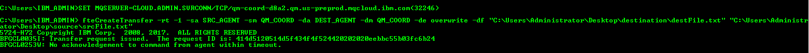

---
copyright:
  years: 2018, 2019
lastupdated: "2018-11-02"
---

{:new_window: target="_blank"}
{:shortdesc: .shortdesc}
{:screen: .screen}
{:codeblock: .codeblock}
{:pre: .pre}

# Initiate Managed File Transfer (MFT) with MQ on Cloud
{: #mqoc_mft_create_transfer}

---
## Step 2. Initiate a File Transfer
{: #mqoc_mft_create_transfer_step2}

We expect you have read and followed the information provided in this [link](/docs/services/mqcloud?topic=mqcloud-mqoc_mft_qmgr_enablement). If you have done this, you will have a setup ready for Managed File Transfer that can be used for transferring the files/folders.

1. Confirm if both of your agents are in `Active State`/`Ready State`. To check there status execute
    - `fteListAgents -p <configurationOptions>`
        - `configurationOptions` - by convention this is the name of a coordination queue manager.

2. Once both of your agents are in `Active state`/`Ready State`, you can initiate a transfer by executing the following command.
    - Open **terminal 1** where source agent was created and run the following command
    - `fteCreateTransfer -rt -1 -sa <sourceAgentName> -sm <SourceAgentQueueManagerName> -da <destinationAgentName> -dm <destinationAgentQueueManagerName> -de overwrite -df <destinationFileLocation> <sourceFileLocation>`
        - `destinationFileLocation` - name of a destination file for the file transfer. You must specify a valid file name on the system where the destination agent is running.
        - `sourceFileLocation` - name of a source file for the file transfer. You must specify a valid file name on the system where the source agent is running.
    - **e.g.-**
        - for windows : fteCreateTransfer -rt -1 -sa SRC_AGENT -sm QM_COORD -da DEST_AGENT -dm QM_COORD -de overwrite -df "C:\Users\Administrator\Desktop\destination\destFile.txt" "C:\Users\Administrator\Desktop\source\srcFile.txt"
        - for linux : fteCreateTransfer -rt -1 -sa SRC_AGENT -sm QM_COORD -da DEST_AGENT -dm QM_COORD -de overwrite -df "/home/document/destinationfolder/destFile.txt" "/home/document/dourcefolder/srcFile.txt"

    

    **Note :** You may see a message 'No acknowledgement to command from agent within timeout'. This message is not an error, this message means that transfer command has been submitted to command queue manager but no acknowlegdement recieved within a default time period. This might occur due to possible delay in recieving the acknowlegdement from the coordination queue manager.

    - For a full list of command arguments of **fteCreateTransfer**, Refer to this link [fteCreateTransfer KnowledgeCenter](https://www.ibm.com/support/knowledgecenter/en/SSFKSJ_9.0.0/com.ibm.wmqfte.doc/start_new_transfer_cmd.html)

3. Your file transfer is now initiated and will get completed depending on the file size. Once the transfer is completed your file would now be present in the `<Destination File Location>`.

You have configured IBM MQ Managed File transfer and have successfully used it to transfer a file. For more information and more advanced use case, please see the documentation here [link](https://www.ibm.com/support/knowledgecenter/en/SSFKSJ_9.0.0/com.ibm.wmqfte.doc/configuring_main.html).
