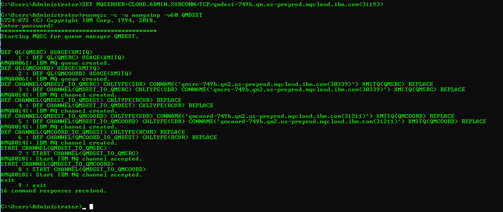
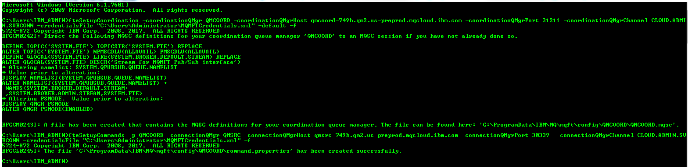
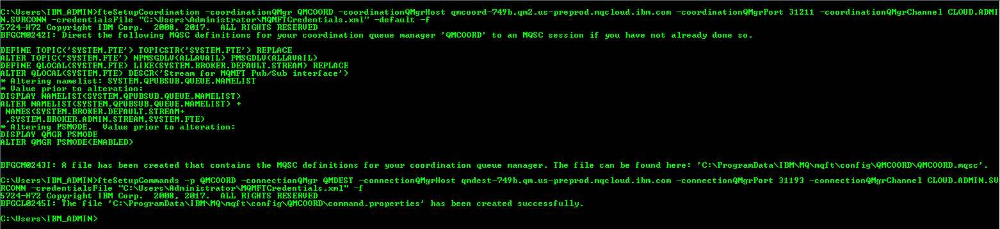
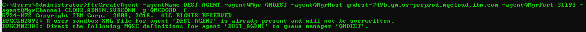
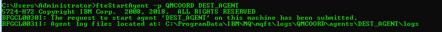
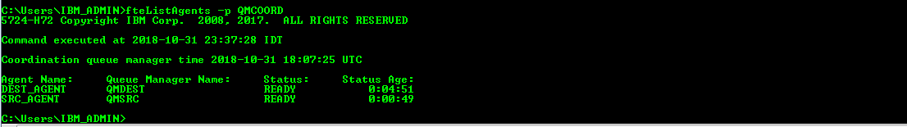

---
copyright:
  years: 2018
lastupdated: "2018-11-02"
---

{:new_window: target="_blank"}
{:shortdesc: .shortdesc}
{:screen: .screen}
{:codeblock: .codeblock}
{:pre: .pre}

# Performing Managed File Transfer (MFT) with MQ on Cloud
{: #mqoc_mft_enablement}

---
## Step 1.2 Multiple Queue Manager Topology
{: #mqoc_mft_multiple_qmgr_topology}

We expect you have read the information provided in this [link](/docs/services/mqcloud/mqoc_mft_qmgr_enablement.html). We will use multiple queue managers that act as the agent queue manager, command queue manager and coordination queue manager.

let’s consider three different MQ on Cloud Queue Manager.

**Configuration details:**

We will be using three MQ on Cloud queue manager and will name it as **QMCOORD**, **QMSRC**, **QMDEST** and we will use them as coordination queue manager, source agent queue manager and destination agent queue manager respectively. Also, we will create two Managed file transfer agents and will name them as SRC_AGENT and DEST_AGENT.

- QMCOORD queue manager which acts as Coordination queue manager.
- QMSRC queue manager on MQ on Cloud which acts as source agent queue manager along with command queue manager.
- QMDEST queue manager on MQ on Cloud which acts as destination agent queue manager and command queue manager.
- SRC_AGENT source agent which is connected to QMSRC agent queue manager.
- DEST_AGENT destination agent which is connected to QMDEST agent queue manager.

In the above configuration we have considered the following:

1. We will configure the Agent queue manager to be the command queue manager for both source and destination agents. This is general recommendation from MFT as this makes mft commands of a particular agent go to its own queue manager.
MFT commands can be run against the Agent's queue manager.
2. In this tutorial we are using 3 different Systems. System 1 will be used to configure coordination queue manager, System 2 will be used for configuring Source Agent queue manager and System 3 will be used for configuring Destination Agent Queue manager.
3. Coordination queue manager and agent queue manager has to be connected for various communication. All the three queue managers can be connected using MQ cluster or sender/receiver channels. In this demo we are considering sender receiver channel configuration.
4. On all the system we are using profiles with administrative privileges.

**NOTE :** In the steps documented below, we will be creating MQ channels and MQ queues which will be used by queue managers for communicating with each other. While creating these MQ resources provide appropriate access and permissions to these objects. refer the [MQ Security Mechanism](https://www.ibm.com/support/knowledgecenter/en/SSFKSJ_9.0.0/com.ibm.mq.sec.doc/q010000_.html).

**Prerequisites :**

You will now create three MQ on cloud queue managers :

1. Create a new MQ on cloud queue manager, and name it as **QMCOORD** and download Connection Details(save this file as coordinationQMgrConnectionDetails.json). Follow the same steps(as suggested in PreRequisites step 2).
2. Create a new MQ on cloud queue manager, and name it as **QMSRC** and download its Connection Details(save this file as sourceAgentQMgrConnectionDetails.json). Follow the same steps(as suggested in PreRequisites step 2).
3. Create a new MQ on cloud queue manager, and name it as **QMDEST** and download its Connection Details(save this file as destinationAgentQMgrConnectionDetails.json). Follow the same steps(as suggested in PreRequisites step 2).
4. We are using three different Computers, we will name then as **SYSTEM 1**, **SYSTEM 2** and **SYSTEM 3**. These systems will be used for setting up the managed file transfer queue managers.

**Note :** Download and store the secret API key. The same API key can be used while authenticating with cloud queue manager.

4. Go to SYSTEM 1 terminal and open an admin terminal, lets name this terminal as **Terminal 1**. Configure **QMCOORD** as coordination queue manager by executing following command :

    - 4.1 Specify coordination queue manager details as MQSERVER environment variable in the admin terminal  
        - The `runmqsc` cli requires an environment variable be set to identify the remote queue manager it should connect to. In the **admin terminal**, export MQSERVER variable with the following command:

            - For Windows : `SET MQSERVER=CLOUD.ADMIN.SVRCONN/TCP/<HOSTNAME>(<PORT>)`
            - For Linux : `export MQSERVER="CLOUD.ADMIN.SVRCONN/TCP/<HOSTNAME>(<PORT>)"`
                - `<HOSTNAME>` - this is '*hostname*' in the file coordinationQMgrConnectionDetails.json
                - `<PORT>` - this is '*listenerPort*' in the file coordinationQMgrConnectionDetails.json

    - 4.2 `fteSetupCoordination -coordinationQMgr <queueManagerName> -coordinationQMgrHost <queueManagerHostname> -coordinationQMgrPort <queueManagerPort> -coordinationQMgrChannel <queueManagerChannel> -credentialsFile <filePath> -default`
        - `<queueManagerName>` - this is '*queueManagerName*' in the file connection_info.txt
        - `<queueManagerHostname>` - this is the 'hostname' in the file connection_info.txt
        - `<queueManagerPort>` - this is the 'listenerPort' in the file connection_info.txt
        - `<queueManagerChannel>` - this is the 'adminChannelName' in the file connection_info.txt
        - `<filePath>` - this is the 'filePath' where credentials file is present 
        
          **e.g.** -  
            - Windows: `C:\Users\Administrator\MQMFTCredentials.xml`   
            - Linux: `/home/usr/MQMFTCredentials.xml`
            - refer [appendix 4](/docs/services/mqcloud/mqoc_mft_qmgr_enablement.html#appendix-4-sample-mqmftcredentialsxml-file) for more details
        - `-default` - Optional. Updates the default configuration options to those associated with the coordination queue manager specified in this command
        - **e.g -** 
            - **for windows :** `fteSetupCoordination -coordinationQMgr QMCOORD -coordinationQMgrHost qmcoord-749b.qm2.us-preprod.mqcloud.ibm.com -coordinationQMgrPort 31211 -coordinationQMgrChannel CLOUD.ADMIN.SVRCONN -credentialsFile "C:\Users\Administrator\MQMFTCredentials.xml" -default -f`
            - **for linux :** `fteSetupCoordination -coordinationQMgr QMCOORD -coordinationQMgrHost qmcoord-749b.qm2.us-preprod.mqcloud.ibm.com -coordinationQMgrPort 31211 -coordinationQMgrChannel CLOUD.ADMIN.SVRCONN -credentialsFile "/home/document/MQMFTCredentials.xml" -default -f` 

            

    * For a full list of command arguments of **fteSetupCoordination**, Refer to this link [fteSetupCoordination KnowledgeCenter](https://www.ibm.com/support/knowledgecenter/en/SSFKSJ_9.0.0/com.ibm.wmqfte.doc/setup_coord_cmd.html)

    - 4.3 Run `runmqsc` to connect to your remote queue manager
         - `<ADMIN_MQ_USER>` - this is 'mqUsername' in the file platformApiKey.json
         - `<QUEUE_MANAGER_NAME>` - this is 'queueManagerName' in the file coordinationQMgrConnectionDetails.json
         - `-c` informs runmqsc it should connect to a remote queue manager using the MQSERVER variable

         - **e.g.** `runmqsc -c -u mamgainp -w60 QMCOORD`

    - 4.4 Create the MQ objects required by the queue manager to work as a coordination queue manager that targets your mq on cloud queue manager
        - A mqsc file will be created at location `MQ_DATA_PATH\mqft\config\coordination_qmgr_name\<coordination_qmgr_name>.mqsc`. You should copy and paste the content of this file into your terminal.

    

5. Create Channels and required Objects on coordintaion queue manager i.e. **QMCOORD** for communication between **QMSRC** and **QMDEST**. Perform all these steps using **Terminal 1**.
    - 5.1 Specify coordination queue manager details as MQSERVER environment variable in the admin terminal  
        - The `runmqsc` cli requires an environment variable be set to identify the remote queue manager it should connect to. In the **admin terminal**, export MQSERVER variable with the following command:

            - For Windows : `SET MQSERVER=CLOUD.ADMIN.SVRCONN/TCP/<HOSTNAME>(<PORT>)`
            - For Linux : `export MQSERVER="CLOUD.ADMIN.SVRCONN/TCP/<HOSTNAME>(<PORT>)"`
                - `<HOSTNAME>` - this is '*hostname*' in the file coordinationQMgrConnectionDetails.json
                - `<PORT>` - this is '*listenerPort*' in the file coordinationQMgrConnectionDetails.json
    - 5.2 Run `runmqsc` to connect to your remote queue manager
        - `<ADMIN_MQ_USER>` - this is 'mqUsername' in the file platformApiKey.json
        - `<QUEUE_MANAGER_NAME>` - this is 'queueManagerName' in the file coordinationQMgrConnectionDetails.json
        - `-c` informs runmqsc it should connect to a remote queue manager using the MQSERVER variable

      - **e.g.** `runmqsc -c -u mamgainp -w60 QMCOORD`
    - 5.3 execute following commands in the cli 
        - `DEF QL(QMSRC) USAGE(XMITQ)`
        - `DEF QL(QMDEST) USAGE(XMITQ)`
        - `DEF CHANNEL(QMCOORD_TO_QMSRC) CHLTYPE(SDR) CONNAME('<HOSTNAME_OF_QMSRC>(<PORT_OF_QMSRC>)') XMITQ(QMSRC) REPLACE`
            - **e.g. :** `DEF CHANNEL(QMCOORD_TO_QMSRC) CHLTYPE(SDR) CONNAME('qmsrc-749b.qm2.us-preprod.mqcloud.ibm.com(30339)') XMITQ(QMSRC) REPLACE`
        - `DEF CHANNEL(QMSRC_TO_QMCOORD) CHLTYPE(RCVR) REPLACE`
        - `DEF CHANNEL(QMCOORD_TO_QMDEST) CHLTYPE(SDR) CONNAME('<HOSTNAME_OF_QMDEST>(<PORT_OF_QMDEST>)') XMITQ(QMDEST) REPLACE`
            - **e.g. :** `DEF CHANNEL(QMCOORD_TO_QMDEST) CHLTYPE(SDR) CONNAME('qmdest-749b.qm.us-preprod.mqcloud.ibm.com(31193)') XMITQ(QMDEST) REPLACE`
        - `DEF CHANNEL(QMDEST_TO_QMCOORD) CHLTYPE(RCVR) REPLACE`

    

    - 5.4 do not close this terminal as we have to start the channels(in later steps)

6. Goto your System 2, Open a new Terminal on your system and lets name this terminal as **Terminal 2**. Create channels and required objects on QMSRC.
    - 6.1 Specify source agent queue manager details as MQSERVER environment variable in the admin terminal  
        - The `runmqsc` cli requires an environment variable be set to identify the remote queue manager it should connect to. In the **admin terminal**, export MQSERVER variable with the following command:

            - For Windows : `SET MQSERVER=CLOUD.ADMIN.SVRCONN/TCP/<HOSTNAME>(<PORT>)`
            - For Linux : `export MQSERVER="CLOUD.ADMIN.SVRCONN/TCP/<HOSTNAME>(<PORT>)"`
                - `<HOSTNAME>` - this is '*hostname*' in the file sourceAgentQMgrConnectionDetails.json
                - `<PORT>` - this is '*listenerPort*' in the file sourceAgentQMgrConnectionDetails.json
    - 6.2 Run `runmqsc` to connect to your remote queue manager
        - `<ADMIN_MQ_USER>` - this is 'mqUsername' in the file platformApiKey.json
        - `<QUEUE_MANAGER_NAME>` - this is 'queueManagerName' in the file sourceAgentQMgrConnectionDetails.json
        - `-c` informs runmqsc it should connect to a remote queue manager using the MQSERVER variable

        - **e.g.** `runmqsc -c -u mamgainp -w60 QMSRC`
    - 6.3 execute following commands in the cli 
        - `DEF QL(QMDEST) USAGE(XMITQ)`
        - `DEF QL(QMCOORD) USAGE(XMITQ)`
        - `DEF CHANNEL(QMSRC_TO_QMDEST) CHLTYPE(SDR) CONNAME('<HOSTNAME_OF_QMDEST>(<PORT_OF_QMDEST>)') XMITQ(QMDEST) REPLACE`
            - **e.g. :** `DEF CHANNEL(QMSRC_TO_QMDEST) CHLTYPE(SDR) CONNAME('qmdest-749b.qm.us-preprod.mqcloud.ibm.com(31193)') XMITQ(QMDEST) REPLACE`
        - `DEF CHANNEL(QMDEST_TO_QMSRC) CHLTYPE(RCVR) REPLACE `
        - `DEF CHANNEL(QMSRC_TO_QMCOORD) CHLTYPE(SDR) CONNAME('<HOSTNAME_OF_QMCOORD>(<PORT_OF_QMCOORD>)') XMITQ(QMCOORD) REPLACE`
            - **e.g. :** `DEF CHANNEL(QMSRC_TO_QMCOORD) CHLTYPE(SDR) CONNAME('qmcoord-749b.qm2.us-preprod.mqcloud.ibm.com(31211)') XMITQ(QMCOORD) REPLACE`
        - `DEF CHANNEL(QMCOORD_TO_QMSRC) CHLTYPE(RCVR) REPLACE`
    
    - 6.4 do not close this terminal as we have to start the channels(in later steps)

7. Go to your System 3, Open a new Terminal on your system and lets name this terminal as **Terminal 3**. Create channels and required objects on QMDEST.
    - 7.1 Specify destination agent queue manager details as MQSERVER environment variable in the admin terminal.  
        - The `runmqsc` cli requires an environment variable be set to identify the remote queue manager it should connect to. In the **admin terminal**, export MQSERVER variable with the following command:

            - For Windows : `SET MQSERVER=CLOUD.ADMIN.SVRCONN/TCP/<HOSTNAME>(<PORT>)`
            - For Linux : `export MQSERVER="CLOUD.ADMIN.SVRCONN/TCP/<HOSTNAME>(<PORT>)"`
                - `<HOSTNAME>` - this is '*hostname*' in the file destinationAgentQMgrConnectionDetails.json
                - `<PORT>` - this is '*listenerPort*' in the file destinationAgentQMgrConnectionDetails.json
    - 7.2 Run `runmqsc` to connect to your remote queue manager
        - `<ADMIN_MQ_USER>` - this is 'mqUsername' in the file platformApiKey.json
        - `<QUEUE_MANAGER_NAME>` - this is 'queueManagerName' in the file destinationAgentQMgrConnectionDetails.json
        - `-c` informs runmqsc it should connect to a remote queue manager using the MQSERVER variable

        - **e.g.** `runmqsc -c -u mamgainp -w60 QMDEST`
    - 7.3 execute following commands in the cli 
        - `DEF QL(QMSRC) USAGE(XMITQ)`
        - `DEF QL(QMCOORD) USAGE(XMITQ)`
        - `DEF CHANNEL(QMDEST_TO_QMSRC) CHLTYPE(SDR) CONNAME('<HOSTNAME_OF_QMSRC>(<PORT_OF_QMSRC>)') XMITQ(QMSRC) REPLACE`
            - **e.g. :** `DEF CHANNEL(QMDEST_TO_QMSRC) CHLTYPE(SDR) CONNAME('qmsrc-749b.qm2.us-preprod.mqcloud.ibm.com(30339)') XMITQ(QMSRC) REPLACE`
        - `DEF CHANNEL(QMSRC_TO_QMDEST) CHLTYPE(RCVR) REPLACE`
        - `DEF CHANNEL(QMDEST_TO_QMCOORD) CHLTYPE(SDR) CONNAME('<HOSTNAME_OF_QMCOORD>(<PORT_OF_QMCOORD>)') XMITQ(QMCOORD) REPLACE`
            - **e.g. :** `DEF CHANNEL(QMDEST_TO_QMCOORD) CHLTYPE(SDR) CONNAME('qmcoord-749b.qm2.us-preprod.mqcloud.ibm.com(31211)') XMITQ(QMCOORD) REPLACE`
        - `DEF CHANNEL(QMCOORD_TO_QMDEST) CHLTYPE(RCVR) REPLACE`      
    
    - 7.4 do not close this terminal as we have to start the channels(in later steps)

8. Start channels on all the systems
    - 8.1 goto **Terminal 1**, which is connected to QMCOORD(i.e. coordination queue manager)
        - 8.1.1. Execute following commands in the cli :
            - `START CHANNEL(QMCOORD_TO_QMSRC)`
            - `START CHANNEL(QMCOORD_TO_QMDEST)`

        

    - 8.2 goto **Terminal 2**, which is connected to QMSRC(i.e. source agent queue manager)
        - 8.2.1. Execute following commands in the cli :
            - `START CHANNEL(QMSRC_TO_QMDEST)`
            - `START CHANNEL(QMSRC_TO_QMCOORD)`

        
        
    - 8.3 goto **Terminal 3**, which is connected to QMDEST(i.e. destination agent queue manager)
        - 8.3.1. Execute following commands in the cli :
            - `START CHANNEL(QMDEST_TO_QMSRC)`
            - `START CHANNEL(QMDEST_TO_QMCOORD)`

        

9. Go to  **terminal 2**. Setup QMSRC as agent queue manager and command queue manager
    - 9.1 This system needs to know the coordination queue manager it is getting conneted to
        - execute command `fteSetupCoordination -coordinationQMgr <queueManagerName> -coordinationQMgrHost <queueManagerHostname> -coordinationQMgrPort <queueManagerPort> -coordinationQMgrChannel <queueManagerChannel> -credentialsFile <filePath> -default`
            - **e.g. :** `fteSetupCoordination -coordinationQMgr QMCOORD -coordinationQMgrHost qmcoord-749b.qm2.us-preprod.mqcloud.ibm.com -coordinationQMgrPort 31211 -coordinationQMgrChannel CLOUD.ADMIN.SVRCONN -credentialsFile "C:\Users\Administrator\MQMFTCredentials.xml" -default -f`
    - 9.2 Configure **QMSRC** as command queue manager for agent
        - execute command `fteSetupCommands -p <configurationName> -connectionQMgr <sourceAgentQueueManagerName> -connectionQMgrHost <agentQueueManagerHost> -connectionQMgrPort <agentQueueManagerPort> -connectionQMgrChannel <queueManagerChannel> -credentialsFile <filePath> -f`
            - `agentQueueManagerHost` - Required. this is the ‘hostname’ in the file connection_info.txt of **SourceAgentQueueManager**.
            - `agentQueueManagerPort` - Required. this is the ‘listenerPort’ in the file connection_info.txt of **SourceAgentQueueManager**.
            - `agentQueueManagerChannel` - Required. this is the ‘adminChannelName’ in the file connection_info.txt of **SourceAgentQueueManager**.
            - `configurationOptions` - by convention this is the name of a coordination queue manage
            -  `<filePath>` - this is the 'filePath' where credentials file is present **e.g.** - `C:\Users\Administrator\MQMFTCredentials.xml` refer [appendix 4](/docs/services/mqcloud/mqoc_mft_qmgr_enablement.html#appendix-4-sample-mqmftcredentialsxml-file) for more details
            - `-f` -  Optional. Forces the command to overwrite the existing configuration. 
            
            - **e.g. :** `fteSetupCommands -p QMCOORD -connectionQMgr QMSRC -connectionQMgrHost qmsrc-749b.qm2.us-preprod.mqcloud.ibm.com -connectionQMgrPort 30339  -connectionQMgrChannel CLOUD.ADMIN.SVRCONN -credentialsFile "C:\Users\Administrator\MQMFTCredentials.xml" -f`

            

    - 9.3.  In **terminal 2** run following commands to create a **SRC_AGENT** (Source Agent):
        -  `fteCreateAgent -agentName <agentName> -agentQMgr <agentQueueManager> -agentQMgrHost <agentQueueManagerHost>
-agentQMgrPort <agentQueueManagerPort> -agentQMgrChannel <agentQueueManagerChannel> -p <configurationOptions> -f   -credentialsFile <filePath>`
            - `agentName` - Required. Name of the agent to create.
            - `agentQueueManager` - Required. Name of the agents's queue manager.This is ’queueManagerName’ in the file connection_info.txt of **SourceAgentQueueManager**.
            - `agentQueueManagerHost` - Required. this is the ‘hostname’ in the file connection_info.txt of **SourceAgentQueueManager**.
            - `agentQueueManagerPort` - Required. this is the ‘listenerPort’ in the file connection_info.txt of **SourceAgentQueueManager**.
            - `agentQueueManagerChannel` - Required. this is the ‘adminChannelName’ in the file connection_info.txt of **SourceAgentQueueManager**.
            - `configurationOptions` - by convention this is the name of a coordination queue manage
            -  `<filePath>` - this is the 'filePath' where credentials file is present **e.g.** - `C:\Users\Administrator\MQMFTCredentials.xml` refer [appendix 4](/docs/services/mqcloud/mqoc_mft_qmgr_enablement.html#appendix-4-sample-mqmftcredentialsxml-file) for more details
            - `-f` -  Optional. Forces the command to overwrite the existing configuration.
            - **e.g. :** `fteCreateAgent -agentName SRC_AGENT -agentQMgr QMSRC -agentQMgrHost qmsrc-749b.qm2.us-preprod.mqcloud.ibm.com -agentQMgrPort 30339 -agentQMgrChannel CLOUD.ADMIN.SVRCONN -p QMCOORD -credentialsFile "C:\Users\Administrator\MQMFTCredentials.xml" -f`

    - 9.4 Run `runmqsc` to connect to your remote queue manager
        - `<ADMIN_MQ_USER>` - this is 'mqUsername' in the file platformApiKey.json
        - `<QUEUE_MANAGER_NAME>` - this is 'queueManagerName' in the file sourceAgentQMgrConnectionDetails.json
        - `-c` informs runmqsc it should connect to a remote queue manager using the MQSERVER variable

        - **e.g.**  `runmqsc -c -u mamgainp -w60 QMSRC`

    - 9.5 The terminal will prompt you for a **Password**
        - This is your <ADMIN_API_KEY> = '*apiKey*' in the file platformApiKey.json of **QMSRC**.

    - 9.6 Terminal will now be waiting for input

    - 9.7 Create the MQ objects required by the queue manager to work as an agent queue manager that targets your mqoc queue manager.
        - A mqsc file will be created at location `MQ_DATA_PATH\mqft\config\coordination_qmgr_name\agents\agent_name\agent_name_create.mqsc`. You should copy and paste the content of this file into your **terminal 2**.

    - 9.8. Start the agent created above using following command
        - `fteStartAgent -p <configurationOptions> <agentName>` where
            - `configurationOptions` - by convention this is the name of a coordination queue manage
            - `agentName` - Required. name of the IBM MQ Managed File Transfer agent to start.
            - **e.g. :** `fteStartAgent -p QMCOORD SRC_AGENT`

            

10. Go to  **terminal 3** and repeat the same steps and create a **DEST_AGENT** :
    - 10.1 This system needs to know the coordination queue manager it is getting conneted to
        - execute command `fteSetupCoordination -coordinationQMgr <queueManagerName> -coordinationQMgrHost <queueManagerHostname> -coordinationQMgrPort <queueManagerPort> -coordinationQMgrChannel <queueManagerChannel> -credentialsFile <filePath> -default`

            - **e.g. :** `fteSetupCoordination -coordinationQMgr QMCOORD -coordinationQMgrHost qmcoord-749b.qm2.us-preprod.mqcloud.ibm.com -coordinationQMgrPort 31211 -coordinationQMgrChannel CLOUD.ADMIN.SVRCONN -credentialsFile "C:\Users\Administrator\MQMFTCredentials.xml" -default -f`

    - 10.2 Configure **QMDEST** as command queue manager for agent
        - execute command `fteSetupCommands -p <configurationName> -connectionQMgr <DestinationAgentQueueManager> -connectionQMgrHost <agentQueueManagerHost> -connectionQMgrPort <agentQueueManagerPort> -connectionQMgrChannel <queueManagerChannel> -credentialsFile <filePath> -f`
            - `agentQueueManagerHost` - Required. this is the ‘hostname’ in the file connection_info.txt of **DestinationAgentQueueManager**.
            - `agentQueueManagerPort` - Required. this is the ‘listenerPort’ in the file connection_info.txt of **DestinationAgentQueueManager**.
            - `agentQueueManagerChannel` - Required. this is the ‘adminChannelName’ in the file connection_info.txt of **DestinationAgentQueueManager**.
            - `configurationOptions` - by convention this is the name of a coordination queue manage
            -  `<filePath>` - this is the 'filePath' where credentials file is present **e.g.** - `C:\Users\Administrator\MQMFTCredentials.xml` refer [appendix 4](/docs/services/mqcloud/mqoc_mft_qmgr_enablement.html#appendix-4-sample-mqmftcredentialsxml-file) for more details
            - `-f` -  Optional. Forces the command to overwrite the existing configuration. 
            
            - **e.g. :** `fteSetupCommands -p QMCOORD -connectionQMgr QMDEST -connectionQMgrHost qmdest-749b.qm.us-preprod.mqcloud.ibm.com -connectionQMgrPort 31193  -connectionQMgrChannel CLOUD.ADMIN.SVRCONN -credentialsFile "C:\Users\Administrator\MQMFTCredentials.xml" -f`   
            
    - 10.3.  In **terminal 3** run following commands to create a **DEST_AGENT** (Destination Agent):
        -  `fteCreateAgent -agentName <agentName> -agentQMgr <agentQueueManager> -agentQMgrHost <agentQueueManagerHost>
-agentQMgrPort <agentQueueManagerPort> -agentQMgrChannel <agentQueueManagerChannel> -p <configurationOptions> -f   -credentialsFile <filePath>`
            - `agentName` - Required. Name of the agent to create.
            - `agentQueueManager` - Required. Name of the agents's queue manager.This is ’queueManagerName’ in the file connection_info.txt of **DestinationAgentQueueManager**.
            - `agentQueueManagerHost` - Required. this is the ‘hostname’ in the file connection_info.txt of **DestinationAgentQueueManager**.
            - `agentQueueManagerPort` - Required. this is the ‘listenerPort’ in the file connection_info.txt of **DestinationAgentQueueManager**.
            - `agentQueueManagerChannel` - Required. this is the ‘adminChannelName’ in the file connection_info.txt of **DestinationAgentQueueManager**.
            - `configurationOptions` - by convention this is the name of a coordination queue manage
            - `<filePath>` - this is the 'filePath' where credentials file is present **e.g.** - `C:\Users\Administrator\MQMFTCredentials.xml` refer [appendix 4](/docs/services/mqcloud/mqoc_mft_qmgr_enablement.html#appendix-4-sample-mqmftcredentialsxml-file) for more details
            - `-f` -  Optional. Forces the command to overwrite the existing configuration.
            - **e.g. :** `fteCreateAgent -agentName DEST_AGENT -agentQMgr QMDEST -agentQMgrHost qmdest-749b.qm.us-preprod.mqcloud.ibm.com -agentQMgrPort 31193 -agentQMgrChannel CLOUD.ADMIN.SVRCONN -p QMCOORD -credentialsFile "C:\Users\Administrator\MQMFTCredentials.xml" -f`
            

    - 10.4 Run `runmqsc` to connect to your remote queue manager
        - `<ADMIN_MQ_USER>` - this is 'mqUsername' in the file platformApiKey.json
        - `<QUEUE_MANAGER_NAME>` - this is 'queueManagerName' in the file destinationAgentQMgrConnectionDetails.json
        - `-c` informs runmqsc it should connect to a remote queue manager using the MQSERVER variable

        - **e.g.** `runmqsc -c -u mamgainp -w60 QMDEST`

    - 10.5. The terminal will prompt you for a **Password**
        - This is your <ADMIN_API_KEY> = '*apiKey*' in the file platformApiKey.json of **QMDEST**.

    - 10.6. Terminal will now be waiting for input
    - 10.7. Create the MQ objects required by the queue manager to work as an agent queue manager that targets your MQ on cloud queue manager.
        - A mqsc file will be created at location `MQ_DATA_PATH\mqft\config\coordination_qmgr_name\agents\agent_name\agent_name_create.mqsc`. You should copy and paste the content of this file into your terminal 3.

    - 10.8. Start the agent created above using following command
        - `fteStartAgent -p <configurationOptions> <agentName>` where
            - `configurationOptions` - by convention this is the name of a coordination queue manage
            - `agentName` - Required. name of the IBM MQ Managed File Transfer agent to start.
            - **e.g. :** `fteStartAgent -p QMCOORD DEST_AGENT`

               

11. Now both of your newly created agents should be in Active/Ready state. To check their status execute.
    - `fteListAgents -p <configurationOptions>`
        - `configurationOptions` - by convention this is the name of a coordination queue manage
        - **e.g. :** `fteListAgents -p QMCOORD`

        

You have now configured the IBM MQ Managed File transfer queue managers to transfer a file.

---

### Go to Step 2 to [Perform a File Transfer](/docs/services/mqcloud/mqoc_mft_create_transfer.html#mqoc_mft_create_transfer)

