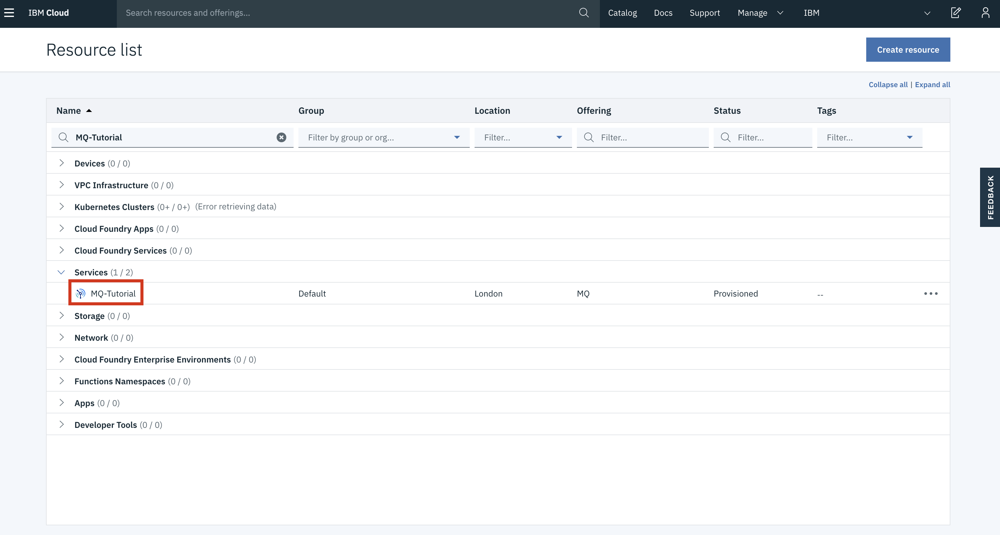

---
copyright:
  years: 2018, 2022
lastupdated: "2022-10-21"

subcollection: mqcloud

keywords: MFT, message, file, transfer, enable
---

{:new_window: target="_blank"}
{:shortdesc: .shortdesc}
{:screen: .screen}
{:codeblock: .codeblock}
{:pre: .pre}

# Getting started with Managed File Transfer
{: #mqoc_mft_qmgr_enablement}

## What is IBM MQ Managed File Transfer (MFT)?
{: #what_is_ibm_mqoc_mft}

IBM® MQ Managed File Transfer (MFT) transfers file between systems in a reliable, managed and secured way. File transfer activities are logged and this can be used for activity logging.
You can configure Managed File Transfer agents and enable queue managers to perform transfers.
Managed File Transfer (MFT) provides two topologies :
1. **Single queue manager topology :** uses a single queue manager as the agent queue manager, command queue manager and coordination queue manager. These terms are described in the next section.
2. **Multiple queue manager topology :** uses multiple queue managers that act as the agent queue manager, command queue manager and coordination queue manager. More specificially, this topology requires at least 3 queue managers, with one acting as the coordination queue manager, one as the Source Agent queue manager (for creating a Managed File transfer agent) and a command queue manager, and the third queue manager acting as the Destination Agent Queue Manager (for creating an another File transfer agent) and a command queue manager.

   **Note** : In the multiple queue manager topology, you can have the required queue managers all on cloud, all on prem, or a mix of both.

MFT is an integrated component of IBM MQ Advanced. For the latest and complete details of this product, please refer to [Managed File Transfer](https://www.ibm.com/support/knowledgecenter/en/SSFKSJ_9.0.0/com.ibm.wmqfte.doc/wmqfte_intro.htm) in IBM Knowledge Center.

## Components of IBM MFT
{: #components_mft}

There are three main components of IBM MQ Managed File Transfer. These three components are described below:
    1. **Coordination Queue Manager :**  responsible for the collection of agent status, transfer status and transfer activity information.
    2. **Command Queue Manager :** the interface queue manager which bridges the MFT commands and the MQ infrastructure. For example, we submit a MFT file transfer command to a command queue manager which instruct the agent to start or cancel a transfer.
    3. **Agents :** Each agent has its own set of queues associated with a queue manager (agent queue manager) and it is the key for sending and receiving the files, that are transferred. So agents are created on system where files are to be transferred from or to.

This tutorial will cover the following :
1. Configure the MQ on Cloud queue manager(s) to be an MFT Coordination, Command and Agent queue manager, and then create MFT Agents(as source or destination agent).
The tutorial provides steps for both of the supported topologies.
    - **1.1 :** Single Queue Manager Topology: Single queue manager is configured as agents queue manager, commands queue manager and coordination queue manager.
    - **1.2 :** Multiple Queue Manager Topology: In this topology multiple queue managers will be used.

2.  Perform a File Transfer

---

## Prerequisites
{: #prereqs_mqoc_mft_qmgr_enablement}

In order to proceed with this tutorial, it is vital that you have completed the following prerequisites:

1. Basic knowledge of **MFT** :  to get a basic understanding on how MFT works with IBM MQ, refer to [How does MFT work with IBM MQ?](https://www.ibm.com/support/knowledgecenter/en/SSFKSJ_9.0.0/com.ibm.wmqfte.doc/how_stuff_works.htm) in IBM Knowledge Center.

    for more detail of MFT refer to [Managed File Transfer](https://www.ibm.com/support/knowledgecenter/en/SSFKSJ_9.0.0/com.ibm.wmqfte.doc/wmqfte_intro.htm) in IBM Knowledge Center.

2. **Create an {{site.data.keyword.mq_full}} queue manager**

    If you do not already have an {{site.data.keyword.mq_full}} queue manager, you can create one by following the guided tour here:
    [Getting started with {{site.data.keyword.mq_full}}](/docs/services/mqcloud?topic=mqcloud-mqoc_getting_started)
    Having followed the guided tour, or the manual steps provided on the same page, or if you will use an existing MQ on Cloud queue manager, you should have:
    - An MQ on Cloud queue manager
    - Connection details downloaded in a connection_info.txt file
        - Consult *Appendix 1* at the bottom of this tutorial if you do not have this file
    - An admin username and apikey downloaded in a platformApiKey.json file
        - Consult *Appendix 2* at the bottom of this tutorial if you do not have this file

3. **IBM MQ Client** :
    To complete this tutorial you will require the IBM MQ command line tool '*runmqsc*' installed and on your PATH. If you do not have these commands, you can get them by installing the IBM MQ Client. *Appendix 3* at the end of this tutorial details how to do this.

4. **IBM MQ MFT Component** :
To install the IBM MQ MFT component, refer to [Installing Managed File Transfer](https://www.ibm.com/support/knowledgecenter/en/SSFKSJ_9.0.0/com.ibm.mq.ins.doc/q129810_.htm) in IBM Knowledge Center.

---

## Setting up your terminal environment
{: #setup_environment_mqoc_mft}

1. Open a terminal window  
    - This terminal will be the **admin terminal**, used to configure your coordination queue manager.

2. Specify the queue manager details in an MQSERVER environment variable in the admin terminal by completing the following steps:
    - The `runmqsc` cli requires an environment variable be set to identify the remote queue manager that it should connect to. In the **admin terminal**, export MQSERVER variable with the following command:

    - For Windows : `SET MQSERVER=CLOUD.ADMIN.SVRCONN/TCP/<HOSTNAME>(<PORT>)`
    - For Linux : `export MQSERVER="CLOUD.ADMIN.SVRCONN/TCP/<HOSTNAME>(<PORT>)"`
        - `<HOSTNAME>` - this is '*hostname*' in the file connection_info.txt
        - `<PORT>` - this is '*listenerPort*' in the file connection_info.txt

This step is required on any new terminal that will be used for remote administration of a queue manager, such as when using **runmqsc cli**

---

## Step 1 : Configure the MQ on Cloud Queue Manager for Managed File Transfer (MFT)
{: #mqoc_mft_qmgr_enablement_setup_agent}

This section will guide you to configure an MQ on Cloud Queue Manager as an Agent queue manager. There are two widely used topologies for this configuration. You can choose either configuration and then follow the appropriate section:

- 1.1. **Single Queue Manager Topology -** In this topology the same queue manager will be configured to perform all the MFT operations. We do this by configuring it as Coordination queue manager, Command queue manager and Agent queue manager. [Click here to follow the steps](/docs/services/mqcloud?topic=mqcloud-mqoc_mft_single_qmgr_topology).

- 1.2. **Muliple Queue Manager Topology -** In this topology, we will create three queue managers to perform MFT operations. We will name them as **QMCOORD**, **QMSRC** and **QMDEST**. [Click here to follow the steps](/docs/services/mqcloud?topic=mqcloud-mqoc_mft_multiple_qmgr_topology).

---

## Step 2 : Initiate a File Transfer
{: #mqoc_mft_qmgr_enablement_initiate}

In this section, we verify our MFT setup by performing a file transfer. At present, MFT file transfers can be created using the MFT Command Line Interface (CLI) or by using the MFT tab in the MQ Explorer tool. This tutorial demonstrates the file transfer by using MFT CLI.
The `fteCreateTransfer` command creates and starts a new file transfer from the command line. This command can start a file transfer immediately, schedule a file transfer for a future time and date, repeat a scheduled transfer one or more times, and trigger a file transfer based on certain conditions.

For the simplicity of this tutorial we will only create an immediate transfer. Follow the instructions [here](/docs/services/mqcloud?topic=mqcloud-mqoc_mft_create_transfer) to initiate a transfer.

For more details on transfer, Refer to this [MFT Knowledge Center link](https://www.ibm.com/support/knowledgecenter/en/SSFKSJ_9.0.0/com.ibm.wmqfte.doc/start_new_transfer_cmd.htm)

---

## Appendix
{: #appendix_mqoc_qm_mft}

### Appendix 1: **connection_info.txt**
To retrieve the connection_info.txt file containing queue manager connection details:
    1. Log in to the IBM Cloud service instance by clicking on the relevant service shown in the table
    
    2. This will open the queue manager view. Select the queue manager you wish to retrieve the connection info from
    
    3. Click **Connection information**
    
    4. Download this file in 'JSON text format'

### Appendix 2: **platformApiKey.json**

To create or reset your administrator api key:
    1. Login to the IBM Cloud service instance by clicking on the relevant service shown in the table
    
    2. This will open the queue manager view. Select the queue manager you wish to retrieve the connection info from
    
    3. Next, select the **Administration** tab
    
    4. Now click the **Reset IBM Cloud API Key/ Create IBM Cloud API Key**

     - **Note:** The previous admin API key for this MQ Username will **no longer be valid**

    

    - **Note:** If the button says **Create IBM Cloud API Key**, then you have not created an api key in this way before. Click the **Create IBM Cloud API Key** button.

    5. Click **Download** to download platformApiKey.json containing an admin username and apikey
    

### Appendix 3: **IBM MQ C Client**

If you do not have the IBM MQ Client command line tool and samples (runmqsc, amqsputc, amqsgetc), you can download it from [here](http://www-01.ibm.com/support/docview.wss?uid=swg24042176#1)

1. Select the latest package as shown below, the latest version at time of writing being 9.0.5

2. Select the 'IBM MQC redistributable client for [Your Operating System]' by ticking the box on the left of the package as shown below. It should have **Redist** in the file name. This tutorial was created using the Linux Ubuntu Operating system

3. Select to download via HTTPS, this will allow you to download the client directly through your browser as shown below

    - **Note**: if you do not have this option, try in an alternative browser.
4. After clicking on continue. You will be redirected to screen shown below. Click on the symbol as shown by the red circle to begin your download

5. Once downloaded, extract the file to a directory of your choice `<PATH_TO_MQCLIENT_DIR>`
    - `tar -xvzf <IBM-MQC-Redist>.tar.gz <PATH_TO_MQCLIENT_DIR>`
6. Add commands to path
    - `export PATH=$PATH:<PATH_TO_MQCLIENT_DIR>/bin:<PATH_TO_MQCLIENT_DIR>/samp/bin`

### Appendix 4: **Sample MQMFTCredentials.xml file**
{: #appendix-4-sample-mqmftcredentialsxml-file}

Files of this type store credential information for agent processes. They can contain user names and passwords which are used to authenticate with the MQ on Cloud Queue Manager.
Below is a sample file which can be referred :

    <?xml version="1.0" encoding="UTF-8"?>
    
    <?xml version="1.0" encoding="UTF-8"?>
    <tns:mqmftCredentials xmlns:tns="http://wmqfte.ibm.com/MQMFTCredentials" xmlns:xsi="http://www.w3.org/2001/XMLSchema-instance" xsi:schemaLocation="http://wmqfte.ibm.com/MQMFTCredentials MQMFTCredentials.xsd">
    <tns:qmgr name="<QUEUE_MANAGER_NAME>" mqUserId="<ADMIN_MQ_USER>" mqPassword="<ADMIN_API_KEY>" useMQCSPAuthentication="true" />
    </tns:mqmftCredentials>

    - `<ADMIN_MQ_USER>` - this is 'mqUsername' in the file platformApiKey.json of your queue manager.
    - `<QUEUE_MANAGER_NAME>` - this is 'queueManagerName' in the file connection_info.json of your queue manager.   
   - `<ADMIN_API_KEY>` = '*apiKey*' in the file platformApiKey.json of your queue manager.

For a detailed information on MQMFTCredentials.xml file, refer to [MFT credentials file format](https://www.ibm.com/support/knowledgecenter/en/SSFKSJ_9.0.0/com.ibm.wmqfte.doc/mqm_credentials_format.htm) in IBM Knowledge Center.
