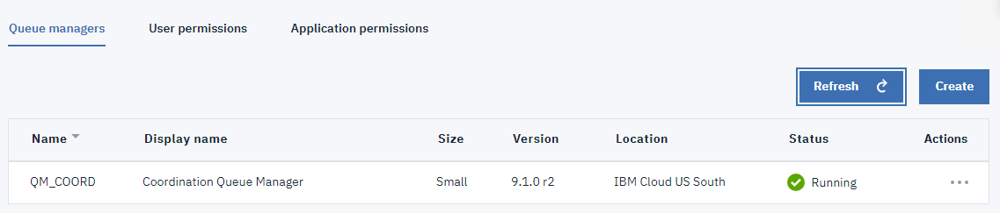
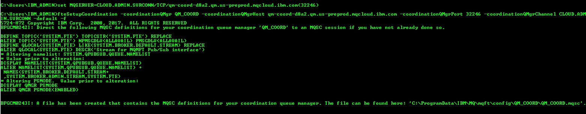
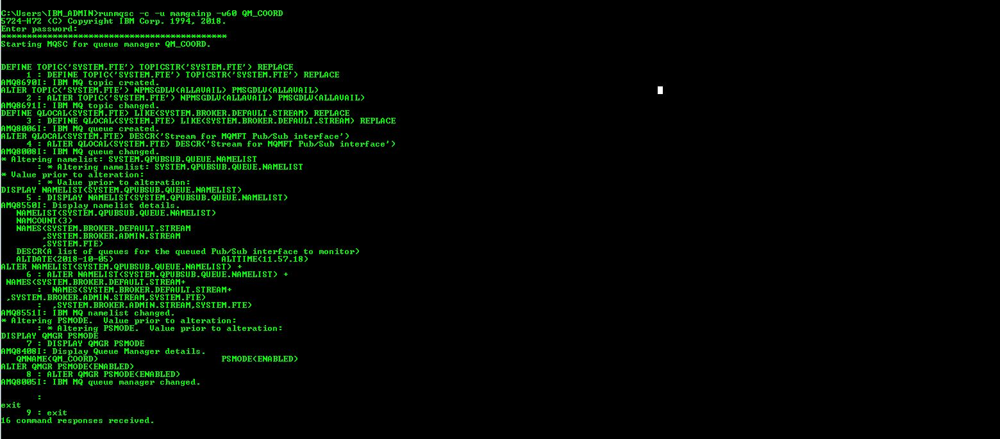
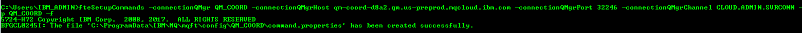
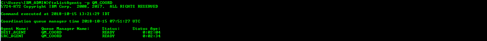

---
copyright:
  years: 2018, 2022
lastupdated: "2022-10-21"

subcollection: mqcloud

keywords: MFT, message, file, transfer, topology
---

{:new_window: target="_blank"}
{:shortdesc: .shortdesc}
{:screen: .screen}
{:codeblock: .codeblock}
{:pre: .pre}

# Single queue manager topology for Managed File Transfer
{: #mqoc_mft_single_qmgr_topology}

---

## Step 1.1 Single Queue Manager Topology
{: #mqoc_mft_single_qmgr_topology_step11}

We expect you have read the information provided in this [link](/docs/services/mqcloud?topic=mqcloud-mqoc_mft_qmgr_enablement). We will use a single {{site.data.keyword.mq_short}} Queue Manager and configure it to be the coordination queue manager, commands queue manager, and agents queue manager.

**Configuration details:**

We will be using one {{site.data.keyword.mq_short}} queue manager and will name it as **QM_COORD**.
On all the system we are using profiles with administrative privileges.

- QM_COORD queue manager: acts as the Coordination queue manager, Command queue manager, source agent queue manager, and destination agent queue manager.
- SRC_AGENT: source agent which is connected to the QM_COORD queue manager.
- DEST_AGENT: destination agent which is connected to the QM_COORD queue manager.

**Prerequisites :**

You should have one {{site.data.keyword.mq_short}} Queue Manager running:

1. Create a new {{site.data.keyword.mq_short}} Queue Manager and name it QM_COORD. Then, download Connection Details (save this file as coordinationQMgrConnectionDetails.json) and store the secret API key. Follow the same steps (as suggested in PreRequisites step 2).
    

2. Follow the steps documented below to configure the **QM_COORD** as the coordination queue manager, command queue manager and agents queue manager.

3. Create File transfer

### Setting up a Coordination Queue Manager
{: #mqoc_mft_setting_coordination_qmgr}

In this section, you will setup a coordination queue manager which is running in IBM Cloud. As part of the configuration for the coordination queue manager, several MQ resources like queues, channels, topics will be created in the queue manager. This queue manager broadcasts audit and file transfer information.

1. Switch to the **admin terminal** you setup previously.
2. Run the following command
    - `fteSetupCoordination -coordinationQMgr <queueManagerName> -coordinationQMgrHost <queueManagerHostname> -coordinationQMgrPort <queueManagerPort> -coordinationQMgrChannel <queueManagerChannel> -credentialsFile <filePath> -default -f`
        - `<queueManagerName>` - this is '*queueManagerName*' in the file coordinationQMgrConnectionDetails.json
        - `<queueManagerHostname>` - this is the 'hostname' in the file coordinationQMgrConnectionDetails.json
        - `<queueManagerPort>` - this is the 'listenerPort' in the file coordinationQMgrConnectionDetails.json
        - `<queueManagerChannel>` - this is the 'adminChannelName' in the file coordinationQMgrConnectionDetails.json
        - `<filePath>` - this is the 'filePath' where credentials file is present
            - **e.g.** -  
                - Windows: `C:\Users\Administrator\MQMFTCredentials.xml`   
                - Linux: `/home/usr/MQMFTCredentials.xml`
        refer [appendix 4](/docs/services/mqcloud?topic=mqcloud-mqoc_mft_qmgr_enablement#appendix-4-sample-mqmftcredentialsxml-file) for more details
        - `-default` - Optional. Updates the default configuration options to those associated with the coordination queue manager specified in this command
        - `-f` - Optional. forces the command to overwrite existing configuration
    - **e.g -**
        - **for windows :** fteSetupCoordination -coordinationQMgr QM_COORD -coordinationQMgrHost qm-coord-d8a2.qm.us-preprod.appdomain.cloud -coordinationQMgrPort 32246 -coordinationQMgrChannel CLOUD.ADMIN.SVRCONN -credentialsFile "C:\Users\Administrator\MQMFTCredentials.xml" -default -f
        - **for linux :** fteSetupCoordination -coordinationQMgr QM_COORD -coordinationQMgrHost qm-coord-d8a2.qm.us-preprod.appdomain.cloud -coordinationQMgrPort 32246 -coordinationQMgrChannel CLOUD.ADMIN.SVRCONN -credentialsFile "/home/document/MQMFTCredentials.xml" -default -f

    * For a full list of command arguments of **fteSetupCoordination**, Refer to this link [fteSetupCoordination KnowledgeCenter](https://www.ibm.com/support/knowledgecenter/en/SSFKSJ_9.0.0/com.ibm.wmqfte.doc/setup_coord_cmd.html)

        

3. Run `runmqsc` to connect to the remote queue manager
    - `runmqsc -c -u <ADMIN_MQ_USER> -w60 <QUEUE_MANAGER_NAME>`
        - `<ADMIN_MQ_USER>` - this is '*mqUsername*' in the file coordinationQMgrConnectionDetails.json
        - `<QUEUE_MANAGER_NAME>` - this is '*queueManagerName*' in the file coordinationQMgrConnectionDetails.json
        - `-c` informs runmqsc it should connect to a remote queue manager using the MQSERVER variable
    - **e.g. -** runmqsc -c -u mamgainp -w60 QM_COORD

4. The terminal will prompt you for a **Password**
    - This is your <ADMIN_API_KEY> = '*apiKey*' in the file platformApiKey.json
5. The terminal will now be waiting for input. Do not close this terminal as we will use this terminal to create MQ objects.
6. Create the MQ objects required by the queue manager to work as a coordination queue manager that targets your {{site.data.keyword.mq_short}} queue manager
    - When you ran fteSetupCoordination in step 2, an mqsc file will have been created at location `MQ_DATA_PATH\mqft\config\coordination_qmgr_name\<coordination_qmgr_name>.mqsc`. Copy and paste the content of this file into your terminal.

    

---

### Setting up a Command Queue Manager
{: #mqoc_mft_setting_command_qmgr}

In this section, you will setup a command queue manager that is targeted at the {{site.data.keyword.mq_short}} Queue Manager. As part of the configuration for the Command Queue Manager, following commands have to be executed:

1. Switch to the **admin terminal**  you setup previously.
2. Run the following command
   - `fteSetupCommands -connectionQMgr <queueManagerName> -connectionQMgrHost <queueManagerHostname> -connectionQMgrPort <queueManagerPort> -connectionQMgrChannel <queueManagerChannel> -credentialsFile <filePath> -p <configurationOptions> -f`
        - `<queueManagerName>` - this is '*queueManagerName*' in the file coordinationQMgrConnectionDetails.json
        - `<queueManagerHostname>` - this is the 'hostname' in the file coordinationQMgrConnectionDetails.json
        - `<queueManagerPort>` - this is the 'listenerPort' in the file coordinationQMgrConnectionDetails.json
        - `<queueManagerChannel>` - this is the 'adminChannelName' in the file coordinationQMgrConnectionDetails.json
        - `<filePath>` - this is the 'filePath' where credentials file is present **e.g.** - `C:\Users\Administrator\MQMFTCredentials.xml` refer [appendix 4](/docs/services/mqcloud?topic=mqcloud-mqoc_mft_qmgr_enablement#appendix-4-sample-mqmftcredentialsxml-file) for more details
        - `configurationOptions` - by convention this is the name of a coordination queue manager
        - `-f` - Optional. forces the command to overwrite existing configuration
   - **e.g. -** fteSetupCommands -connectionQMgr QM_COORD -connectionQMgrHost qm-coord-d8a2.qm.us-preprod.appdomain.cloud -connectionQMgrPort 32246 -connectionQMgrChannel CLOUD.ADMIN.SVRCONN -p QM_COORD -f

        

- For a full list of command arguments of **fteSetupCommands**, Refer to this link [fteSetupCommands KnowledgeCenter](https://www.ibm.com/support/knowledgecenter/en/SSFKSJ_9.0.0/com.ibm.wmqfte.doc/setup_cmds_cmd.html)

### Setting up an Agent Queue Manager and Agents
{: #mqoc_mft_setting_agent_qmgr}

In this section, you will setup an agent queue manager that is targeted at the {{site.data.keyword.mq_short}} Queue Manager. As part of the configuration for the Agent Queue Manager, the following commands should be executed.

Configuration Steps :
1. Open two **admin_terminals** and name them as terminal 1 and terminal 2.
2. Go to terminal 1 and create a SRC_AGENT:

   2.1. In **terminal 1** run the following commands to create a **SRC_AGENT** (Source Agent):
      - `fteCreateAgent -agentName <agentName> -agentQMgr <agentQueueManager> -agentQMgrHost <agentQueueManagerHost> -agentQMgrPort <agentQueueManagerPort> -agentQMgrChannel <agentQueueManagerChannel> -p <configurationOptions> -f   -credentialsFile <filePath>`
           - `agentName` - Required. Name of the agent to create.
           - `agentQueueManager` - Required. Name of the agents's Queue Manager.This is ’queueManagerName’ in the file coordinationQMgrConnectionDetails.json
           - `agentQueueManagerHost` - Required. this is the ‘hostname’ in the file coordinationQMgrConnectionDetails.json
           - `agentQueueManagerPort` - Required. this is the ‘listenerPort’ in the file coordinationQMgrConnectionDetails.json
           - `agentQueueManagerChannel` - Required. this is the ‘adminChannelName’ in the file coordinationQMgrConnectionDetails.json
           - `configurationOptions` - by convention this is the name of a coordination queue manager
           -  `<filePath>` - this is the 'filePath' where credentials file is present
           **e.g.** -
            - **In windows** : `C:\Users\Administrator\MQMFTCredentials.xml` refer [appendix 4](/docs/services/mqcloud?topic=mqcloud-mqoc_mft_qmgr_enablement#appendix-4-sample-mqmftcredentialsxml-file) for more details
            - **In linux** : `/home/document/MQMFTCredentials.xml`            
            refer [appendix 4](/docs/services/mqcloud?topic=mqcloud-mqoc_mft_qmgr_enablement#appendix-4-sample-mqmftcredentialsxml-file) for more details
           - `-f` -  Optional. Forces the command to overwrite the existing configuration.
      - **e.g.-**
        - **In windows** - fteCreateAgent -agentName src_agent -agentQMgr QM_COORD -agentQMgrHost qm-coord-d8a2.qm.us-preprod.appdomain.cloud -agentQMgrPort 32246 -agentQMgrChannel CLOUD.ADMIN.SVRCONN -p QM_COORD -credentialsFile "C:\Users\Administrator\MQMFTCredentials.xml" -f
        - **In linux** - fteCreateAgent -agentName src_agent -agentQMgr QM_COORD -agentQMgrHost qm-coord-d8a2.qm.us-preprod.appdomain.cloud -agentQMgrPort 32246 -agentQMgrChannel CLOUD.ADMIN.SVRCONN -p QM_COORD -credentialsFile "/home/document/MQMFTCredentials.xml" -f

    2.2 Run `runmqsc` to connect to your remote queue manager
    - `runmqsc -c -u <ADMIN_MQ_USER> -w60 <QUEUE_MANAGER_NAME>`
        - `<ADMIN_MQ_USER>` - this is '*mqUsername*' in the file coordinationQMgrConnectionDetails.json
        - `<QUEUE_MANAGER_NAME>` - this is '*queueManagerName*' in the file coordinationQMgrConnectionDetails.json
        - `-c` informs runmqsc it should connect to a remote queue manager using the MQSERVER variable
    - **e.g.-** runmqsc -c -u mamgainp -w60 QM_COORD

    2.3 The terminal will prompt you for a **Password**
    - This is your <ADMIN_API_KEY> = '*apiKey*' in the file platformApiKey.json

    2.4 Terminal will now be waiting for input.

    2.5 Create the MQ objects required by the queue manager to work as an agent queue manager that targets your mqoc queue manager.
    - An mqsc file will be created at location `MQ_DATA_PATH\mqft\config\coordination_qmgr_name\agents\agent_name\agent_name_create.mqsc`. You should copy and paste the content of this file into your terminal 1.

    2.6. Start the agent created above using the following command:
    - `fteStartAgent -p <configurationOptions> <agentName>` where
        - `configurationOptions` - by convention this is the name of a coordination queue manager
        - `agentName` - Required. name of the IBM MQ Managed File Transfer agent to start.
    - **e.g.-** fteStartAgent -p QM_COORD SRC_AGENT

3. Go to  **terminal 2** to create a **DEST_AGENT** :

   3.1.  In **terminal 2** run following commands to create a **DEST_AGENT** (Destination Agent):
     -  `fteCreateAgent -agentName <agentName> -agentQMgr <agentQueueManager> -agentQMgrHost <agentQueueManagerHost>
-agentQMgrPort <agentQueueManagerPort> -agentQMgrChannel <agentQueueManagerChannel> -p <configurationOptions> -f   -credentialsFile <filePath>`
        - `agentName` - Required. Name of the agent to create.
        - `agentQueueManager` - Required. Name of the agents's Queue Manager.This is ’queueManagerName’ in the file coordinationQMgrConnectionDetails.json
        - `agentQueueManagerHost` - Required. this is the ‘hostname’ in the file coordinationQMgrConnectionDetails.json
        - `agentQueueManagerPort` - Required. this is the ‘listenerPort’ in the file coordinationQMgrConnectionDetails.json
        - `agentQueueManagerChannel` - Required. this is the ‘adminChannelName’ in the file coordinationQMgrConnectionDetails.json
        - `configurationOptions` - by convention this is the name of a coordination queue manager
        - `<filePath>` - this is the 'filePath' where credentials file is present.
          - **e.g.** -
            - **In windows** - `C:\Users\Administrator\MQMFTCredentials.xml`
            - **In linux** - `/home/document/MQMFTCredentials.xml`            

        refer [appendix 4](/docs/services/mqcloud?topic=mqcloud-mqoc_mft_qmgr_enablement#appendix-4-sample-mqmftcredentialsxml-file) for more details
        - `-f` -  Optional. Forces the command to overwrite the existing configuration.
     - **e.g.-**
       - **In windows** - fteCreateAgent -agentName dest_agent -agentQMgr QM_COORD -agentQMgrHost qm-coord-d8a2.qm.us-preprod.appdomain.cloud -agentQMgrPort 32246 -agentQMgrChannel CLOUD.ADMIN.SVRCONN -p QM_COORD -credentialsFile "C:\Users\Administrator\MQMFTCredentials.xml" -f
       - **In linux** - fteCreateAgent -agentName dest_agent -agentQMgr QM_COORD -agentQMgrHost qm-coord-d8a2.qm.us-preprod.appdomain.cloud -agentQMgrPort 32246 -agentQMgrChannel CLOUD.ADMIN.SVRCONN -p QM_COORD -credentialsFile "/home/document/MQMFTCredentials.xml" -f

   3.2.  Run `runmqsc` to connect to your remote queue manager
    - `runmqsc -c -u <ADMIN_MQ_USER> -w60 <QUEUE_MANAGER_NAME>`
        - `<ADMIN_MQ_USER>` - this is '*mqUsername*' in the file coordinationQMgrConnectionDetails.json
        - `<QUEUE_MANAGER_NAME>` - this is '*queueManagerName*' in the file coordinationQMgrConnectionDetails.json
        - `-c` informs runmqsc it should connect to a remote queue manager using the MQSERVER variable
    - **e.g.-** runmqsc -c -u mamgainp -w60 QM_COORD

   3.3. The terminal will prompt you for a **Password**
    - This is your <ADMIN_API_KEY> = '*apiKey*' in the file platformApiKey.json

   3.4. Terminal will now be waiting for input

   3.5. Create the MQ objects required by the queue manager to work as an agent queue manager that targets your {{site.data.keyword.mq_short}} Queue Manager.
    - A mqsc file will be created at location `MQ_DATA_PATH\mqft\config\coordination_qmgr_name\agents\agent_name\agent_name_create.mqsc`. You should copy and paste the content of this file into your terminal 1.

   3.6. Start the agent created above using following command
    - `fteStartAgent -p <configurationOptions> <agentName>` where
        - `configurationOptions` - by convention this is the name of a coordination queue manager
        - `agentName` - Required. name of the IBM MQ Managed File Transfer agent to start.
    - **e.g.-** fteStartAgent -p QM_COORD DEST_AGENT

4. Now both of your newly created agents should be in Active/Ready state. To check there status execute.
    - `fteListAgents -p <configurationOptions>`
        - `configurationOptions` - by convention this is the name of a coordination queue manager
    - **e.g.-** fteListAgents -p QM_COORD

    

You have now configured the IBM MQ Managed File transfer queue managers to transfer a file.

---

### What to do next

Go to Step 2 to [Initiate a File Transfer](/docs/services/mqcloud?topic=mqcloud-mqoc_mft_create_transfer)
