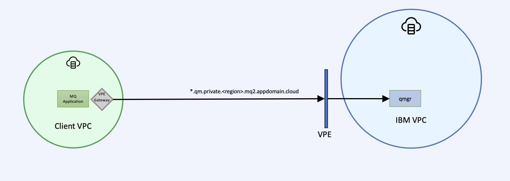
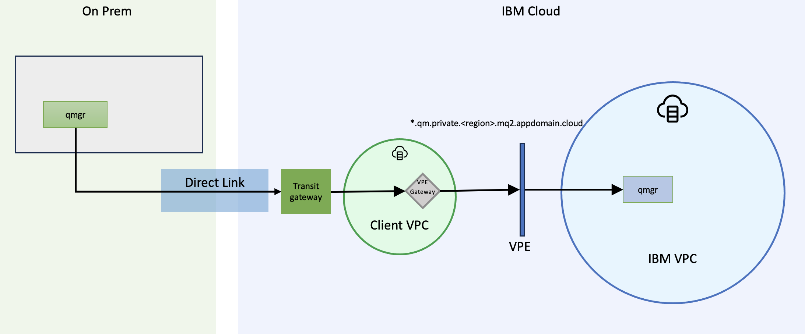
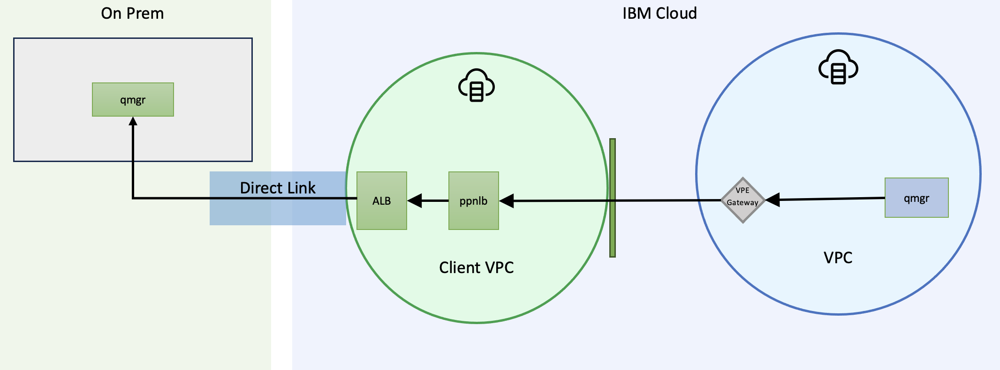
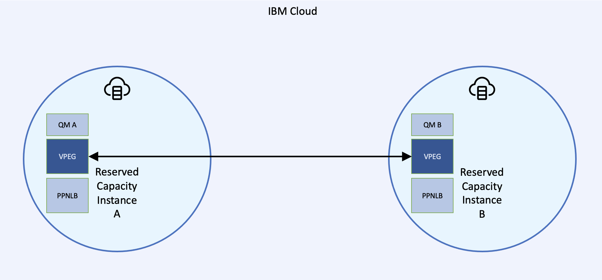

---
copyright:
  years: 2023
lastupdated: "2023-11-08"

subcollection: mqcloud

keywords: virtual private endpoint gateway
---

{{site.data.keyword.attribute-definition-list}}

# Virtual Private Endpoints (VPE)

{: #mqoc_private_vpe}

This guide walks you through accessing {{site.data.keyword.mq_full}} using Virtual Private Endpoints.
{: shortdesc}

When using Virtual Private Cloud (VPC) you can access both the {{site.data.keyword.mq_full}} deployment APIs and queue managers over the private IBM network by configuring Virtual Private Endpoint Gateways.

Using private endpoints requires the Server Name Indication (SNI) header to contain the hostname of the queue manager. Therefore IBM MQ's multiple certificates capability is not supported in this environment.
{: attention}

## How to access the deployment API

{: #mqoc_private_vpe_api}

These steps will describe how to create a private connection between a VPC and the {{site.data.keyword.mq_full}} deployment APIs.

These instructions require that you already have created a {{site.data.keyword.mq_full}} **Reserved Deployment** service instance, deployed a queue manager and configured a VPC running the MQ Client.
{: requirement}

1. Create a virtual private endpoint gateway for the MQ VPE endpoint ending in **mq2.cloud.ibm.com** following [these steps](#mqoc_private_vpe_instructions)
1. Obtain an IAM access token using the API Key from the **User Credential** in the {{site.data.keyword.mq_full}} service instance using the [documented API](https://cloud.ibm.com/apidocs/iam-identity-token-api#gettoken-apikey)
1. Obtain the GUID of the MQ service instance from the IBM Cloud resource list view or using the [documented API](https://cloud.ibm.com/apidocs/resource-controller/resource-controller#list-resource-instances)
1. Call the {{site.data.keyword.mq_full}} deployment API

   ```sh
   # ACCESS_TOKEN - IAM access token for the MQ user credential
   # REGION - Select to required region from running "ibmcloud regions"
   # GUID - The GUID of the service instance

   curl -X GET -H "Authorization: Bearer ${ACCESS_TOKEN}" "https://api.private.${REGION}.mq2.cloud.ibm.com/v1/${GUID}/options"
   ```

   {: codeblock}

For more details on the {{site.data.keyword.mq_full}} deployment APIs see [API documentation](https://cloud.ibm.com/apidocs/mq-on-cloud)

## How to connect an MQ client to a {{site.data.keyword.mq_full}} queue manager

{: #mqoc_private_vpe_qm}



These instructions require that you already have created a {{site.data.keyword.mq_full}} **Reserved Deployment** service instance, deployed a queue manager and configured a VPC running the MQ Client.
{: requirement}

1. Within a VPC, create a virtual private endpoint gateway for the MQ VPE endpoint ending in **mq2.appdomain.cloud** following [these steps](#mqoc_private_vpe_instructions)
1. Configure access for the MQ client as described [here](https://cloud.ibm.com/docs/mqcloud?topic=mqcloud-mqoc_configure_app_qm_access)
1. Configure the MQ Client ini file to enable TLS1.3 and ensure that Server Name Indication (SNI) headers are populated with the queue manager host name:

   ```sh
   echo -e "SSL:\n  AllowTLSV13=TRUE\n  OutboundSNI=HOSTNAME" > ${HOME}/mqclient.ini
   export MQCLNTCF=${HOME}/mqclient.ini
   ```

   {: codeblock}

1. Configure and test the MQ client as described [here](https://cloud.ibm.com/docs/mqcloud?topic=mqcloud-mqoc_connect_app_qm)
1. To administer the queue manager see available options [here](https://cloud.ibm.com/docs/mqcloud?topic=mqcloud-mqoc_admin_qm)

## How to connect an on-prem queue manager to a {{site.data.keyword.mq_full}} queue manager

{: #mqoc_private_vpe_qm_qm}

### Inbound Connections



When connecting an an on-premise queue manager to a cloud queue manager, an inbound private networking connection is required. This allows connections to be initiated from the on-prem queue manager only. This section describes how to configure MQ to create a bi-direction connection initiated from the on-prem queue manger. If you also require connections to be initiated from the cloud queue manager (required for sender or cluster sender channels), then an outbound connection is also required. Steps for completing an outbound connection can be found in the next section.
{: attention}

These instructions require that you already have created a {{site.data.keyword.mq_full}} **Reserved Deployment** service instance, deployed a queue manager and configured a VPC running the MQ Client.
{: requirement}

1. Configure your on-prem to IBM Cloud connectivity using [VPN](https://cloud.ibm.com/docs/vpc?topic=vpc-vpn-onprem-example) or [IBM Cloud Direct Link](https://cloud.ibm.com/docs/dl?topic=dl-get-started-with-ibm-cloud-dl)
1. Interconnect your [VPC](https://cloud.ibm.com/docs/dl?topic=dl-interconnectivity)
1. Create a virtual private endpoint gateway for the MQ VPE endpoint ending in **mq2.appdomain.cloud** following [these steps](#mqoc_private_vpe_instructions)
1. Using runmqsc, the web console or the MQ REST API configure the following on the cloud queue manager

   ```text
   * Receiver Channel
   DEFINE CHANNEL(CLIENT.TO.CLOUD) CHLTYPE(RCVR) TRPTYPE(TCP) SSLCIPH('ANY_TLS12_OR_HIGHER') SSLCAUTH(OPTIONAL)
   SET CHLAUTH('CLIENT.TO.CLOUD') TYPE(QMGRMAP) QMNAME('CLIENT01') ACTION(ADD) USERSRC(CHANNEL)
   REFRESH SECURITY(*) TYPE(CONNAUTH)

   * Server Channel
   DEFINE QLOCAL('TO.ONPREM') USAGE(XMITQ)
   DEFINE CHANNEL(CLOUD.TO.CLIENT) CHLTYPE(SVR) TRPTYPE(TCP) XMITQ('TO.ONPREM') SSLCIPH('ANY_TLS12_OR_HIGHER') CERTLABL('qmgrcert') SSLCAUTH(OPTIONAL)
   REFRESH SECURITY(*) TYPE(SSL)
   SET CHLAUTH('CLOUD.TO.CLIENT') TYPE(QMGRMAP) QMNAME('CLIENT01') ACTION(ADD) USERSRC(CHANNEL)
   REFRESH SECURITY(*) TYPE(CONNAUTH)

   * Remote Queue
   DEFINE QREMOTE (ONPREM.REMOTE.QUEUE) RNAME (DEV.QUEUE.1) RQMNAME ('CLIENT01') XMITQ ('TO.ONPREM')
   ```

1. Using runmqsc, the web console or the MQ REST API configure the following on the on prem queue manager

   ```text
   * Sender Channel
   DEFINE QLOCAL('TO.CLOUD') USAGE(XMITQ)
   DEFINE CHANNEL(CLIENT.TO.CLOUD) CHLTYPE(SDR) CONNAME('<cloudqm_hostname>(443)') TRPTYPE(TCP) XMITQ('TO.CLOUD') SSLCIPH('ANY_TLS12_OR_HIGHER')
   SET CHLAUTH('CLIENT.TO.CLOUD') TYPE(QMGRMAP) QMNAME('CLOUDQM1') ACTION(ADD) USERSRC(CHANNEL)
   REFRESH SECURITY(*) TYPE(CONNAUTH)
   START CHANNEL('CLIENT.TO.CLOUD')

   * Requester Channel
   DEFINE CHANNEL(CLOUD.TO.CLIENT) CHLTYPE(RQSTR) CONNAME('<cloudqm_hostname>(443)') TRPTYPE(TCP) SSLCIPH('ANY_TLS12_OR_HIGHER') CERTLABL('qmgrcert')
   REFRESH SECURITY(*) TYPE(SSL)
   SET CHLAUTH('CLOUD.TO.CLIENT') TYPE(QMGRMAP) QMNAME('CLOUDQM1') ACTION(ADD) USERSRC(CHANNEL)
   REFRESH SECURITY(*) TYPE(CONNAUTH)
   START CHANNEL('CLOUD.TO.CLIENT')

   * Local Queue
   DEFINE QLOCAL(DEV.QUEUE.1)

   * Remote Queue
   DEFINE QREMOTE (CLOUD.REMOTE.QUEUE) RNAME (DEV.QUEUE.1) RQMNAME ('CLOUDQM1') XMITQ ('TO.CLOUD')
   ```

### Outbound Connections



{: #mqoc_private_vpe_instructions}

When initiating a connection from a cloud queue manager to an an on-premise queue manager, an outbound private networking connection is required. The steps below describe how to connect a queue managers that exists in a reserved capacity instances, running on a VPC to a [Private Path Service](https://cloud.ibm.com/docs/vpc?topic=vpc-private-path-service-intro). Routing from the PPNLB back to on-premise will be up to your own implementation.

This will require using the deployment APIs so ensure that the instructions above on accessing the deployment API have been followed. These steps allow connections to be initiated from the cloud queue manager only, in order to have a bi-directional connection you will also need to complete the inbound connection instructions above.

These instructions require that you already have created a {{site.data.keyword.mq_full}} **Reserved Deployment** service instance, deployed a queue manager and configured a VPC running the PPNLB and routing logic such as a load balancer.
{: requirement}

1. Choose one of the reserved capacity plans and access its deployment API using the instructions above, this service instance will be referred to as the source
1. Retrieve the unique CRN of the PPS. This can be found by selecting your PPS from the [IBM Cloud UI](https://cloud.ibm.com/infrastructure/network/privatePathServices)
1. Use the [VPEG API](https://cloud.ibm.com/apidocs/mq-on-cloud#create-virtual-private-endpoint-gateway) to create a virtual private endpoint gateway connecting the capacity plans to the PPS, e.g

   ```sh
      # ACCESS_TOKEN - IAM access token for the MQ user credential
      # REGION - Select to required region from running "ibmcloud regions"
      # GUID - The GUID of the source reserved capacity service instance
      # NAME - The name you want for you VPEG
      # TARGET_CRN - this is the CRN of the PPNLB/PPS created earlier

      curl -X POST -H "Content-Type: application/json" -H "Authorization: Bearer ${ACCESS_TOKEN}" "https://api.private.${REGION}.mq2.cloud.ibm.com/v1/${GUID}/virtual_private_endpoint_gateway" \
      -d '{
           "name": ${NAME},
           "target_crn": ${TARGET_CRN}
       }'
   ```

1. When successful, the API call will return details of the newly created VPEG
1. Create a self signed certificate/private key with a CN that matches the private path service, import the cert/key into the target queue manager key store and set it as default using runmqsc:

   ```text
    ALTER QMGR CERTLABL('targetqm')
    REFRESH SECURITY(*) TYPE(SSL)
   ```

   - Then import the self signed public certificate into the source queue manager trust store and refresh security using runmqsc:

   ```text
       REFRESH SECURITY(*) TYPE(SSL)
   ```

1. Using runmqsc, the web console or the MQ REST API configure the following on the queue manager:

   ```text
    DEFINE CHANNEL(SOURCEQM.TO.TARGETQM) CHLTYPE(RCVR) TRPTYPE(TCP) SSLCIPH('ANY_TLS12_OR_HIGHER') SSLCAUTH(OPTIONAL) REPLACE
    SET CHLAUTH('SOURCEQM.TO.TARGETQM') TYPE(ADDRESSMAP) ADDRESS(*) ACTION(ADD) USERSRC(CHANNEL)
    REFRESH SECURITY(*) TYPE(CONNAUTH)
   ```

1. Using runmqsc, the web console or the MQ REST API configure the following on the queue manager:

   ```text
    DEFINE QLOCAL('SOURCEQM.TO.TARGETQM.XMIT') USAGE(XMITQ)
    DEFINE QREMOTE('TARGETQM.REMOTE') QREMOTE('DEV.QUEUE.1') RQMNAME('<qmgr1>') XMITQ('SOURCEQM.TO.TARGETQM.XMIT')
    SET AUTHREC PROFILE('TARGETQM.REMOTE') OBJTYPE(QUEUE) GROUP('mqwriter') AUTHADD(PUT,GET,BROWSE,INQ)

    DEFINE CHANNEL(SOURCEQM.TO.TARGETQM) CHLTYPE(SDR) TRPTYPE(TCP) XMITQ('SOURCEQM.TO.TARGETQM.XMIT') SSLCIPH('ANY_TLS12_OR_HIGHER') CONNAME('<PPS-ENDPOINT>(443)') HBINT(15) KAINT(15) REPLACE
   ```

1. In the queue managers, set the auth and refresh security:

   ```text
    SET CHLAUTH('SOURCEQM.TO.TARGETQM') TYPE(ADDRESSMAP) ADDRESS(*) ACTION(ADD) USERSRC(CHANNEL)
    REFRESH SECURITY(*) TYPE(CONNAUTH)
   ```

1. In the queue manager, start the sender channel and ensure it starts correctly:

   ```text
    START CHANNEL('SOURCEQM.TO.TARGETQM')
    DISPLAY CHSTATUS('SOURCEQM.TO.TARGETQM')
   ```

## How to connect a {{site.data.keyword.mq_full}} queue manager to another {{site.data.keyword.mq_full}} queue manager



These instructions require that you already have created a {{site.data.keyword.mq_full}} **Reserved Deployment** service instance.
{: requirement}

When connecting instances in this way, Context Based Restriction (CBR) rules cannot be applied between capacity instances and by creating this connection you are explicitly allowing connectivity to be configured between any queue managers deployed in those instances.
{: attention}

No additional configuration steps are required when you are connecting a queue manager to another queue manager in the same reserved capacity instance. These instructions are for connecting across two different reserved capacity instances.
{: attention}

### Inbound Connections

When connecting a cloud queue manager to another cloud queue manager running in a different VPC, an inbound private networking connection is required. In these instructions, one of these queue managers will be the source of the connections and the other will be the target and will allow connections to be initiated from the source queue manager only. If you also require connections to be initiated from the target cloud queue manager (required for sender or cluster sender channels), then you will need to repeat these instructions whilst swapping which queue manager is the source and which is the target.

The steps below describe how to connect two queue managers that exist in two seperate reserved capacity instances and are therefore running on two seperate VPCs. This will require using the deployment APIs so ensure that the instructions above on accessing the deployment API have been followed.

1. Choose one of the reserved capacity plans and access its deployment API using the instructions above, this service instance will be referred to as the source
1. Retreive the unique CRN of the other reserved capacity plan, this service instance will be referred to as the target. This can be retrieve via the [IBM Cloud Resources List](https://cloud.ibm.com/resources); selecting the row containing the service instance will bring up a sidebar which displays the CRN. Alternatively the IBM Cloud CLI can be used:

   ```sh
      ibmcloud resource service-instance <SERVICE_INSTANCE_NAME>
   ```

1. Use the [VPEG API](https://cloud.ibm.com/apidocs/mq-on-cloud#create-virtual-private-endpoint-gateway) to create a virtual private endpoint gateway connecting the two capacity plans, e.g

   ```sh
      # ACCESS_TOKEN - IAM access token for the MQ user credential
      # REGION - Select to required region from running "ibmcloud regions"
      # GUID - The GUID of the source reserved capacity service instance
      # NAME - The name you want for you VPEG
      # TARGET_CRN - The CRN of the target reserved capacity instance you are trying to connect to

      curl -X POST -H "Content-Type: application/json" -H "Authorization: Bearer ${ACCESS_TOKEN}" "https://api.private.${REGION}.mq2.cloud.ibm.com/v1/${GUID}/virtual_private_endpoint_gateway" \
      -d '{
           "name": ${NAME},
           "target_crn": ${TARGET_CRN}
       }'
   ```

1. When successful, the API call will return details of the newly created VPEG
1. Using runmqsc, the web console or the MQ REST API configure the following on the target queue manager:

   ```text
    DEFINE CHANNEL(SOURCEQM.TO.TARGETQM) CHLTYPE(RCVR) TRPTYPE(TCP) SSLCIPH('ANY_TLS12_OR_HIGHER') SSLCAUTH(OPTIONAL) REPLACE
    SET CHLAUTH('SOURCEQM.TO.TARGETQM') TYPE(ADDRESSMAP) ADDRESS(*) ACTION(ADD) USERSRC(CHANNEL)
    REFRESH SECURITY(*) TYPE(CONNAUTH)
   ```

1. Using runmqsc, the web console or the MQ REST API configure the following on the source queue manager:

   ```text
    DEFINE QLOCAL('SOURCEQM.TO.TARGETQM.XMIT') USAGE(XMITQ)
    DEFINE QREMOTE('TARGETQM.REMOTE') QREMOTE('DEV.QUEUE.1') RQMNAME('<qmgr1>') XMITQ('SOURCEQM.TO.TARGETQM.XMIT')
    SET AUTHREC PROFILE('TARGETQM.REMOTE') OBJTYPE(QUEUE) GROUP('mqwriter') AUTHADD(PUT,GET,BROWSE,INQ)

    DEFINE CHANNEL(SOURCEQM.TO.TARGETQM) CHLTYPE(SDR) TRPTYPE(TCP) XMITQ('SOURCEQM.TO.TARGETQM.XMIT') SSLCIPH('ANY_TLS12_OR_HIGHER') CONNAME('<qmgr1_hostname>(443)') HBINT(15) KAINT(15) REPLACE
   ```

1. In both queue managers, set the auth and refresh security:

   ```text
    SET CHLAUTH('SOURCEQM.TO.TARGETQM') TYPE(ADDRESSMAP) ADDRESS(*) ACTION(ADD) USERSRC(CHANNEL)
    REFRESH SECURITY(*) TYPE(CONNAUTH)
   ```

1. In the source queue manager, start the sender channel and ensure it starts correctly:

   ```text
    START CHANNEL('SOURCEQM.TO.TARGETQM')
    DISPLAY CHSTATUS('SOURCEQM.TO.TARGETQM')
   ```

### Outbound Connections

Connections created by the instructions above are one way, so connections will only be able to be initiated from the source queue manager. If you want this connection to be bi-directional the instructions above will need to be repeated while swapping which queue manager is the source and target.

## How to create a Virtual Private Endpoint Gateway (VPEG)

{: #mqoc_private_vpe_instructions}

The steps below describe how to create the virtual private endpoint gateway using the UI. For more details on using the CLI or API see this [documentation](https://cloud.ibm.com/docs/vpc?topic=vpc-ordering-endpoint-gateway&interface=api)

1. Access the [IBM Cloud Console](https://cloud.ibm.com)
1. In the left side Navigation Menu select **VPC Infrastructure > Virtual private endpoint gateways**
1. Click the **Create** button
1. Under **Location**
   1. Select the **Geography** and **Region** that matches your {{site.data.keyword.mq_full}} instance
1. under **Details**
   1. Enter a **Name**
   1. Select a **Resource Group** or create a new one
   1. Optionally add tags
   1. Optionally add access management tags
   1. Select your Virtual Private Cloud (VPC) from the drop down
1. Under **Security groups**
   1. Select the Security Group you wish to use for controlling inbound and outbound traffic
   1. Update you security group rules to allow TCP traffic on port 443
      1. Click on the security group
      1. Click on the **Rules** tab
      1. Under **Inbound rules** click the **Create** button
      1. Select the Protocol **TCP**
      1. Select **Port Range** and specify a min of `443` and max of `443`
      1. Leave the **Source Type** as **Any**
      1. Click **Create**
1. Under **Request connection to service**
   1. For **Cloud service offerings** select **MQ**
   1. Select the **Cloud service region** that matches your {{site.data.keyword.mq_full}} instance
   1. Select the MQ VPE endpoint thats required
1. Under **Reserved IP**
   1. For **VPC endpoints** select **Select one for me**
   1. Enter a **Name** for the IP
   1. Select a **Subnet**
1. Click **Create virtual private endpoint gateway**
1. To ensure multi zone support an IP is required for each subnet in the VPC
   1. In the list of virtual private endpoint gateways click the one you just created
   1. Click the **Attached Resources** tab
   1. For each subnet Under **Reserved IPs**
      1. Click the **Reserve or bind IP** button
      1. For **VPC endpoints** select **Select one for me**
      1. Name the IP
      1. Select the subnet from the drop down
      1. Click **Reserve IP address**
