---
copyright:
  years: 2018
lastupdated: "2018-07-05"
---

{:new_window: target="_blank"}
{:shortdesc: .shortdesc}
{:screen: .screen}
{:codeblock: .codeblock}
{:pre: .pre}

# Enabling Queue Manager Advanced Message Security (AMS)
{: #mqoc_qm_ams}

## What is IBM MQ Advanced Message Security?
{: #what_is_AMS_mqoc_qm_ams}

IBM® MQ Advanced Message Security expands IBM MQ security services to provide encryption at the 'message' level to protect sensitive data, such as high-value financial transactions and personal information. There are two approaches to IBM MQ AMS, which we will refer to as [Application AMS](/docs/services/mqcloud/mqoc_app_ams.html) and Queue Manager AMS. This tutorial focuses on Queue Manager AMS.

Queue Manager AMS provides the following functions:
* Comprehensive security without writing complex security code or modifying or recompiling existing applications
* Support for encryption and digital signing of messages
* Public Key Infrastructure (PKI) technology to provide authentication, authorization, confidentiality, and data integrity services for messages

{:shortdesc}

---

## Tutorial Overview  
{: #tutorialoverview_mqoc_qm_ams}

Diagram: Queue Manager AMS ensures message data has not been modified between when it is placed on a queue and when it is retrieved.

Note: This tutorial passes messages in plain text over the network to the queue manager. In a production system, it is recommended that you use a TLS enabled channel in order to protect the message in transit.

This tutorial will guide you through the steps to configure queue manager AMS for encryption on an IBM MQ queue on an IBM Cloud queue manager. You will begin by putting and getting plain text messages to confirm that the messages sit on the queue in plain text. You will then enable queue manager AMS encryption, thus ensuring that messages on the queue are encrypted. You will then demonstrate that messages on the queue are now encrypted, ensuring the message data cannot be accessed or modified by unauthorised users or applications.

---

## Prerequisites
{: #prereqs_mqoc_qm_ams}

In order to proceed with this tutorial, it is vital that you have the following prerequisites:

1. **IBM MQ on Cloud queue manager**

  If you do not already have an IBM MQ on Cloud queue manager, you can create one by following the guided tour here:

  [Getting started with MQ on IBM Cloud](/docs/services/mqcloud/index.html#index)

  - **Note**. The queue manager should **not** already have TLS enabled on it

  Having followed the guided tour, or the manual steps provided on the same page, you should have:
  - An MQ on Cloud queue manager
  - Connection details downloaded in a connection_info.txt file
    - Consult *Appendix 1* at the bottom of this tutorial if you do not have this file
  - An admin username and apikey downloaded in a platformApiKey.json file
    - Consult *Appendix 2* at the bottom of this tutorial if you do not have this file
  - An application username and apikey downloaded in an apiKey.json file
    - Consult *Appendix 3* at the bottom of this tutorial if you do not have this file

2. **IBM MQ Client**

  To complete this tutorial you will require the IBM MQ command line tool '*runmqsc*' as well as the IBM MQ sample applications '*amqsputc*' and '*amqsgetc*' installed and on your PATH. If you do not have these commands, you can get them by installing the IBM MQ Client. *Appendix 4* at the end of this tutorial details how to do this.

  - **Note**. The IBM MQ Client is only available for *Windows* and *Linux*

---

## Setting up your terminal environment
{: #setup_environment_mqoc_qm_ams}

1. Open 2 terminal windows
  - One terminal will be the **admin terminal**, used to administer your queue manager
  - One terminal will be the **app terminal**, used to represent an application connecting to the queue manager and performing message 'put' and 'get' operations

2. Specify queue manager details in the admin terminal

  The `runmqsc` command that you will use later requires an environment variable be set to identify the remote queue manager it should connect to. In the **admin terminal**, export MQSERVER variable with the following command:

  - `export MQSERVER="CLOUD.ADMIN.SVRCONN/TCP/<HOSTNAME>(<PORT>)"`
    - `<HOSTNAME>` - this is '*hostname*' in the file connection_info.txt
    - `<PORT>` - this is '*listenerPort*' in the file connection_info.txt

3. Specify queue manager details in the app terminal

  The `amqsputc` and `amqsgetc` commands that you will use later also requires the environment variable be set to identify the remote queue manager they should connect to. In the **app terminal**, export MQSERVER variable with the following command:
  In the **app terminal**, export MQSERVER variable with the following command:

  - `export MQSERVER="CLOUD.APP.SVRCONN/TCP/<HOSTNAME>(<PORT>)"`
    - `<HOSTNAME>` - this is '*hostname*' in the file connection_info.txt
    - `<PORT>` - this is '*listenerPort*' in the file connection_info.txt

4. Specify the app username

  The `amqsputc` and `amqsgetc` commands also require an environment variable be set to specific which username they should use. In the **app terminal**, export MQSAMP_USER_ID with the following command:

  - `export MQSAMP_USER_ID="<APP_MQ_USER>"`
    - `<APP_MQ_USER>` - this is '*mqUsername*' in the file apiKey.json

5. Disable Application AMS in the app terminal

  In this tutorial we are enabling Queue Manager AMS. We therefore need to disable Application AMS (sometimes called Client AMS), so that only the queue manager performs AMS encryption and decryption, and the client does not. In the **app terminal**:

  - **IBM MQ Client 7.5**:
    - `export AMQ_DISABLE_CLIENT_AMS=TRUE`
  - **IBM MQ Client 8.0** onwards:
    - `export MQS_DISABLE_ALL_INTERCEPT=TRUE`

---

## Create an alias queue, targeted at the default queue
{: #aliasqueue_mqoc_qm_ams}

In this section, you will create an alias queue which is targeted at the default queue. Once QM AMS has been enabled, the AMS interceptors will trigger when a 'put' or 'get' is performed on the default queue. Therefore, despite the fact that the messages are encrypted on the queue, the message will be readable as plain text when retrieved. In order to demonstrate that the messages are encrypted, we can use an alias queue. Retrieving messages via the alias queue will not trigger the interceptors on the default queue, so the message will be retrieved as is, without decryption, and so will give an accurate view on whether the message is plain text or encrypted.

1. Switch to the **admin terminal**
2. Run `runmqsc` to connect to your remote queue manager
- `runmqsc -c -u <ADMIN_MQ_USER> -w60 <QUEUE_MANAGER_NAME>`
  - `<ADMIN_MQ_USER>` - this is '*mqUsername*' in the file platformApiKey.json
  - `<QUEUE_MANAGER_NAME>` - this is '*queueManagerName*' in the file connection_info.txt
  - `-c` informs runmqsc it should connect to a remote queue manager using the MQSERVER variable
3. The terminal will prompt you for a **Password**
  - This is your <ADMIN_API_KEY> = '*apiKey*' in the file platformApiKey.json
4. Terminal will now be waiting for input
5. Create an alias queue that targets your default queue
- `DEFINE QALIAS (DEV.ALIAS.QUEUE.1) TARGET (DEV.QUEUE.1)`
  - **DEV.ALIAS.QUEUE.1** is our name for the alias queue
  - **DEV.QUEUE.1** is the default queue we are using in this tutorial

---

## Test the alias queue before enabling queue manager AMS
{: #testbefore_mqoc_qm_ams}

In order to demonstrate that the alias queue is working correctly and that the messages are currently on the default queue in plain text, you will now perform a 'put' of a message against the default queue and a 'get' of a message against the alias queue.

1. Switch to the **app terminal**
2. Run **amqsputc** to put a message on the default queue
  - `amqsputc DEV.QUEUE.1`
3. The terminal will prompt you for a **Password**
  - This is your <APP_API_KEY> = '*apiKey*' in the file apiKey.json
4. Terminal will now be waiting for input. Enter a message
  - Hit **Enter key** twice to **exit from amqsputc**

5. Run **amqsgetc** against the alias queue to get the messages from the default queue
  - `amqsgetc DEV.ALIAS.QUEUE.1`
    - **DEV.ALIAS.QUEUE.1** is our name for the alias queue
6. The terminal will prompt you for a **Password**
  - This is your <APP_API_KEY> = '*apiKey*' in the file apiKey.json
7. Terminal will now output the messages from the default queue

- Note that the message comes back in plain text, as this is how it is stored on the default queue.

---

## Select a certificate to use for AMS encryption
{: #selectcert_mqoc_qm_ams}

A queue manager channel must be configured to encrypt messages. MQ on Cloud comes with a default certificate provided by DigiCert, which we will use to encrypt the messages. Follow these steps to configure a queue manager channel for Queue Manager AMS:

1. In IBM Cloud (http://console.bluemix.net/) find the IBM MQ on Cloud queue manager you created as part of the guided tour.

2. Select the **Key store** tab
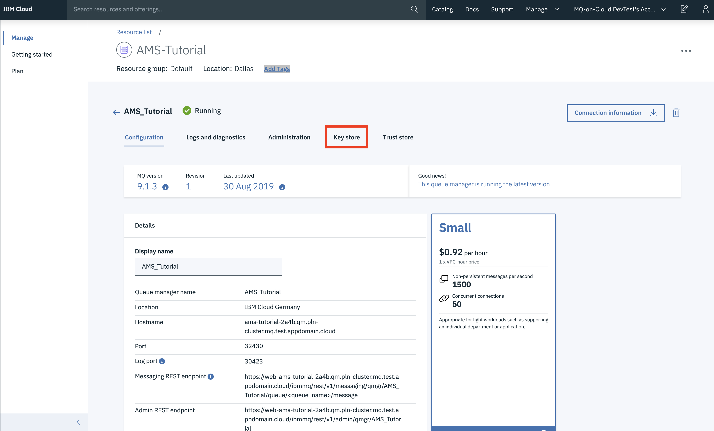
3. On the default certificate, click the 3 dots
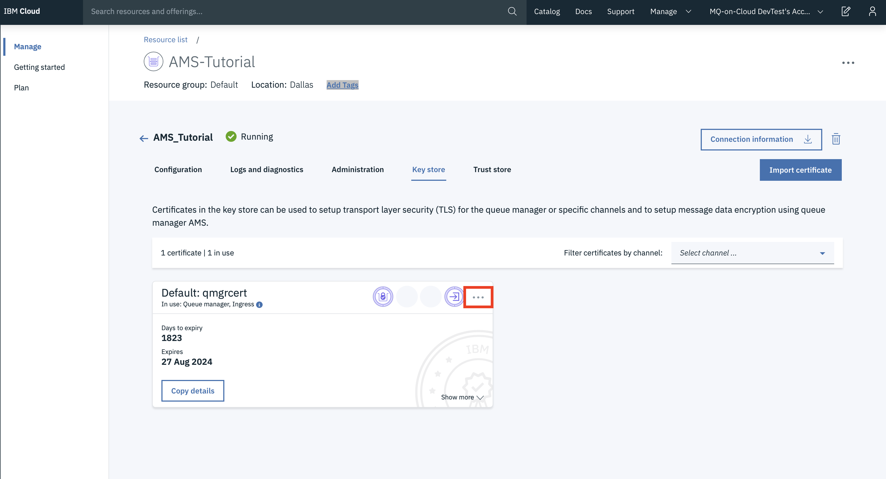
4. Click **Manage**
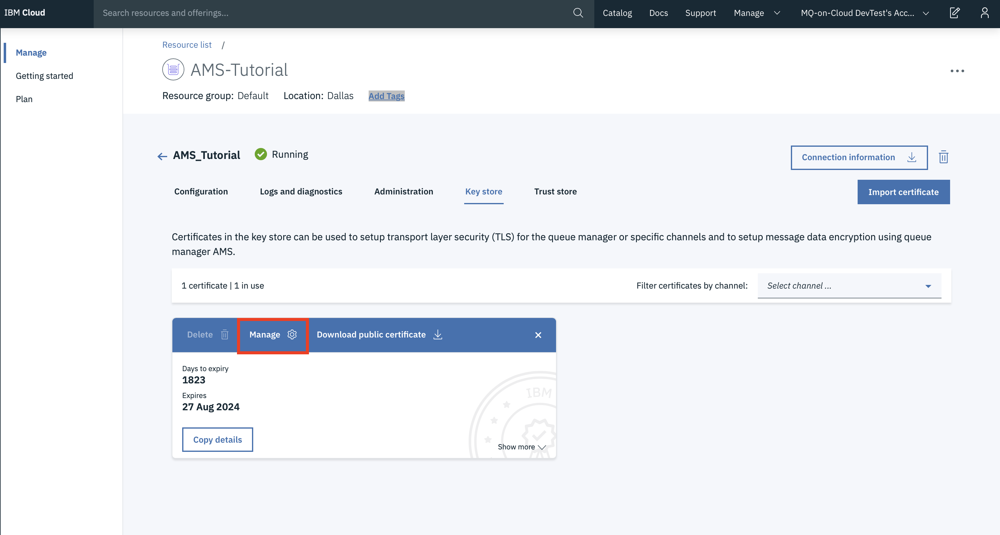
5. Enable **Use this certificate for queue manager AMS**

6. Select the app channel **CLOUD.APP.SVRCONN**

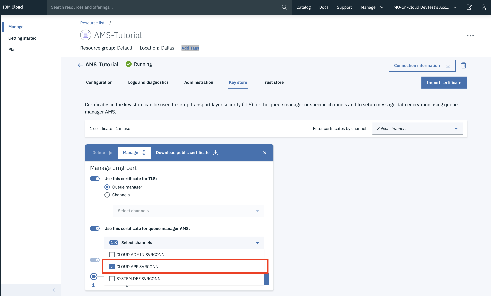
7. Click **Next**
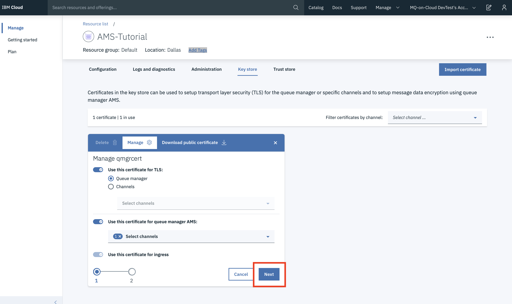
8. Read the warning, then tick **I understand** and click **Save**

You have now enabled queue manager AMS for the selected channel and selected the certificate to use for encryption
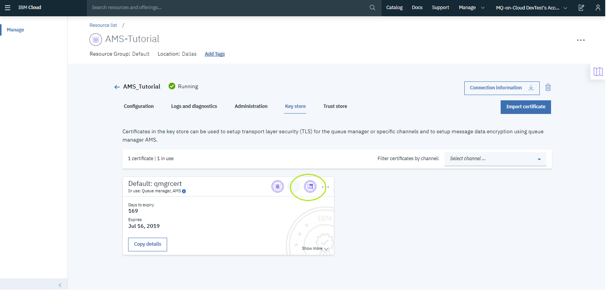
9. Click **Copy details** and paste into a text editor of your choice. Save this as **default_cert.txt** as you will need the DN field contents later.
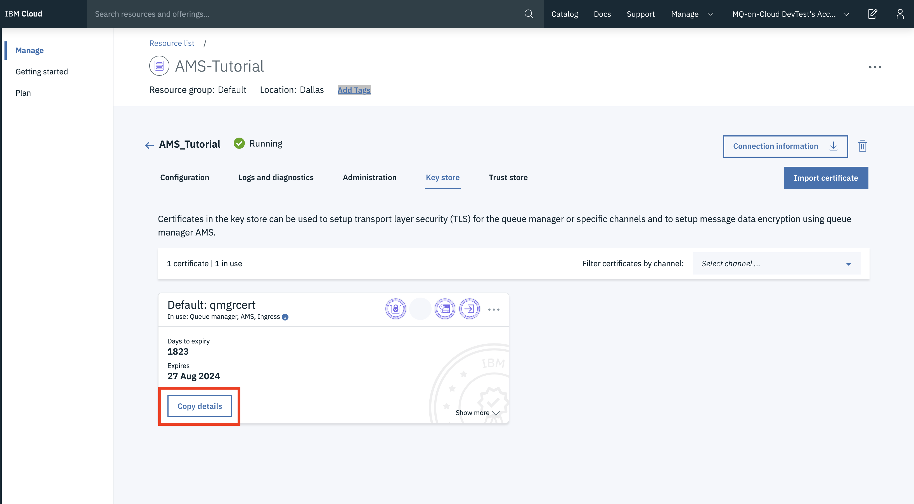

---

## Create a policy to enable AMS encryption
{: #createpolicy_mqoc_qm_ams}

You will now configure the security policy on the individual queue in order to enable AMS. You will identify that we will perform encryption, but not signing. No encryption or signing takes place until the security policy is configured on the relevant queues.

1. In the **admin terminal**
2. The terminal should still be inside **runmqsc**. If not, run **runmqsc** against your queue manager as you did above
3. Create the policy with the following command:
- `SET POLICY (DEV.QUEUE.1) ENCALG (AES256) RECIP ('<SUBJECT_DN>')`
  - **DEV.QUEUE.1** is the default queue we are using in this tutorial
  - **AES256** - the encryption we are using for this tutorial. Other algorithms can be found [here](https://www.ibm.com/support/knowledgecenter/en/SSFKSJ_9.1.0/com.ibm.mq.ref.adm.doc/q120800_.html)
  - `<SUBJECT_DN>` - this is the '*Subject DN*' in the file default_cert.txt, created at the last step of *'Select a certificate'*
  - Note. The **single quotes** around the **Subject DN** are **required**
4. Exit **runmqsc**, by typing:
  - `END`

---

## Test the queue now that queue manager AMS is enabled
{: #testafter_mqoc_qm_ams}

1. Inside the **app terminal**
2. Run **amqsputc** to put a message on the **default queue**
  - `amqsputc DEV.QUEUE.1`
3. The terminal will prompt you for a **Password**
  - This is your <APP_API_KEY> = '*apiKey*' in the file apiKey.json
4. Terminal will now be waiting for input. Enter a message
  - Hit **Enter key** twice to **exit from amqsputc**
5. Run **amqsgetc** against the **alias queue** to get the messages from the default queue
  - `amqsgetc DEV.ALIAS.QUEUE.1`
    - **DEV.ALIAS.QUEUE.1** is our name for the alias queue
6. The terminal will prompt you for a **Password**
  - This is your <APP_API_KEY> = '*apiKey*' in the file apiKey.json
7. Terminal will now output the **encrypted** messages from the default queue

- Note: the message is not shown in plain text. This is because the message is encrypted on the default queue.

---

## Conclusion
{: #conclusion_mqoc_qm_ams}

You have now completed this tutorial. You have enabled IBM MQ AMS on a queue, and you have demonstrated that this ensures that messages stored on the specified queue are encrypted.

---

## Troubleshooting
{: #troubleshoot_mqoc_qm_ams}

- **amqsputc returns reason code 2063**
  - This can occur if you have **not selected a certificate** for your channel
  - Follow ['Select a certificate to use for AMS encryption'](/docs/services/mqcloud/mqoc_qm_ams.html#selectcert_mqoc_qm_ams)

- **amqsputc returns reason code 2035**
  - This can occur if you have not run `export MQS_DISABLE_ALL_INTERCEPT=TRUE`
  - Last step of ['Setting up your terminal environment'](/docs/services/mqcloud/mqoc_qm_ams.html#setup_environment_mqoc_qm_ams)

---

## Appendix
{: #appendix_mqoc_qm_ams}

### Appendix 1: **connection_info.txt**
To retrieve the connection_info.txt file containing queue manager connection details:
  1. Login to the IBM Cloud service instance by clicking on the relevant service shown in the table
  
  2. This will open the queue manager view. Select the queue manager you wish to retrieve the connection info from
  
  3. Click **Connection information**
  
  4. Download this file in 'JSON text format'

### Appendix 2: **platformApiKey.json**
To create or reset your administrator api key:
  1. Login to the IBM Cloud service instance by clicking on the relevant service shown in the table
  
  2. This will open the queue manager view. Select the queue manager you wish to retrieve the connection info from
  
  3. Next, select the **Administration** tab
  
  4. Now click the **Reset IBM Cloud API Key**
    - **Note:** The previous admin API key for this MQ Username will **no longer be valid**

  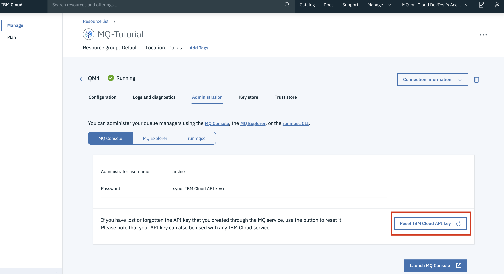
    - **Note:** If the button says **Create IBM Cloud API Key**, then you have not created an api key in this way before. Click the **Create IBM Cloud API Key** button.
  5. Click **Download** to download platformApiKey.json containing an admin username and apikey
  

### Appendix 3: **apiKey.json**
To create a new application api key:
  1. Login to the IBM Cloud service instance by clicking on the relevant service shown in the table
  
  2. This will open the queue manager view. Select the **Application permissions** tab
  
  3. Now click the 3 dots next to the application you will use for the AMS tutorial
  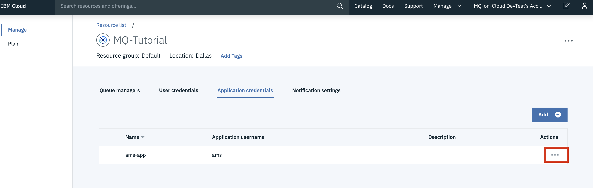
  4. Click **Add new API key**
    - Note. Existing app API keys will continue to work

  
  5. Click **Download** to download apiKey.json containing an app username and apikey
  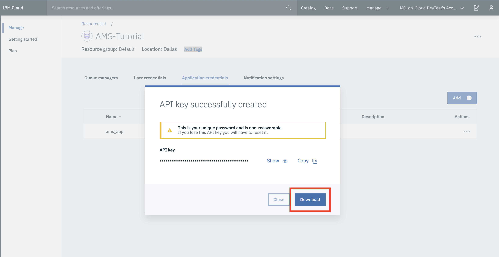

### Appendix 4: **IBM MQ C Client**

If you do not have the IBM MQ Client command line tool and samples (runmqsc, amqsputc, amqsgetc), you can download it from [here](http://www-01.ibm.com/support/docview.wss?uid=swg24042176#1)

1. Select the latest package as shown below, the latest version at time of writing being 9.0.5

2. Select the 'IBM MQC redistributable client for <Your Operating System>' by ticking the box on the left of the package as shown below. It should have **Redist** in the file name. This tutorial was created using the Linux Ubuntu Operating system

3. Select to download via HTTPS, this will allow you to download the client directly through your browser as shown below
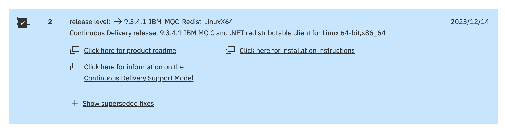
  - **Note**: if you do not have this option, try in an alternative browser.
4. After clicking on continue. You will be redirected to screen shown below. Click on the symbol as shown by the red circle to begin your download

5. Once downloaded, extract the file to a directory of your choice `<PATH_TO_MQCLIENT_DIR>`
  - `tar -xvzf <IBM-MQC-Redist>.tar.gz <PATH_TO_MQCLIENT_DIR>`
6. Add commands to path
  - `export PATH=$PATH:<PATH_TO_MQCLIENT_DIR>/bin:<PATH_TO_MQCLIENT_DIR>/samp/bin`
