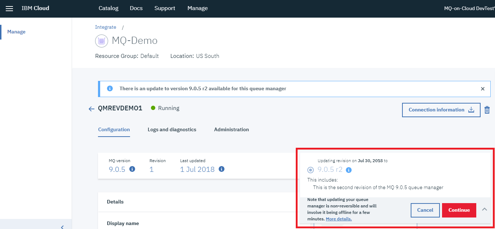
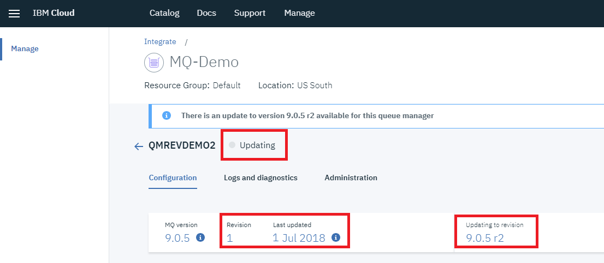
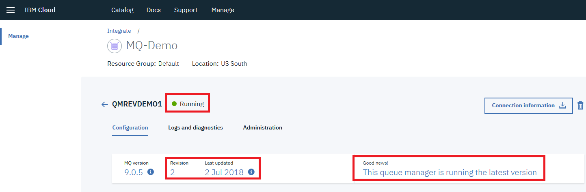

---
copyright:
  years: 2018, 2022
lastupdated: "2022-02-24"

subcollection: mqcloud

keywords: queue, manager, update, version, revision
---

{:new_window: target="_blank"}
{:shortdesc: .shortdesc}
{:screen: .screen}
{:codeblock: .codeblock}
{:pre: .pre}

# Applying queue manager updates
{: #mqoc_qm_update}

Perform an update of a running queue manager.
{: shortdesc}

## Prerequisites
{: #mqoc_qm_update_prereq}

An existing queue manager that has a pending version or revision update.

---

## Perform update
{: #mqoc_prep_for_update}

**Note:** Updating your queue manager is non-reversible and will involve it being offline for a few minutes.

1. Log in to the IBM Cloud console.
2. Click on the 'hamburger menu'.
3. Click **Dashboard**.
4. Locate and click on your IBM MQ service instance, found under the 'Services' heading.
5. From the list of your queue managers, click on the one you want to update.
6. Click **Update now** and review the contents of the update.
7. Click **Continue**.
  
8. The update will take a few minutes to complete during which time the queue manager details view will show a status of **Updating**.
  
9. When the update has completed, the queue manager details view will show a status of **Running** as well as the updated version/revision and when it was last updated.
  
