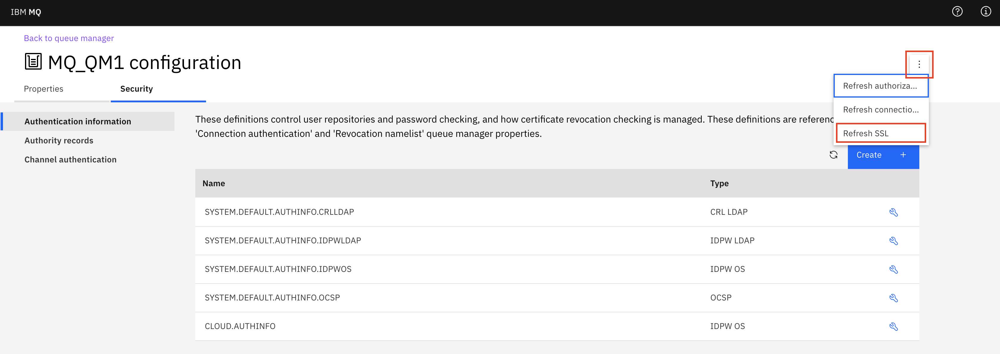

---
copyright:
  years: 2018, 2020
lastupdated: "2020-04-07"

subcollection: mqcloud

keywords: refresh, security, SSL, TLS
---

{:new_window: target="_blank"}
{:shortdesc: .shortdesc}
{:screen: .screen}
{:codeblock: .codeblock}
{:pre: .pre}

# Refreshing the queue manager TLS security
{: #mqoc_refresh_security}

If you make a change to the queue manager key store or trust store, or change channel certificate configuration, a TLS security refresh is required for the new configuration to take effect.

A TLS security refresh will update the in memory copy of the key store and trust store.  All channels that are enabled for TLS will be stopped and use the refreshed configuration to recreate a secure connection.  A client's secure connection will only be re-established if the client application has retry logic to re-initiate a broken connection.

## When to refresh TLS security

* If you add a client or queue manager certificate to the trust store, they will not be trusted to make a secure connection until a TLS security refresh has been performed
* If you add a certificate to the key store and configure it for use with TLS or AMS, the affected channels will not use the certificate to create a secure connection until a TLS security refresh has been performed
* If you change the certificate configured on a TLS enabled channel, the certificate will not be used to create a secure connection until a TLS security refresh has been performed

## How to refresh TLS security

### Using the web console
1. Launch the queue manager web console using steps described [here](/docs/services/mqcloud?topic=mqcloud-mqoc_admin_mqweb#connect_mqoc_admin_mqweb)
2. On the queue manager page, select **Configuration**.
    
3. Select the **Security** tab.
   
4. Select the three dots, then **Refresh SSL**
   
5. Confirm by clicking **Refresh**

### Using runmqsc
1. Connect to the queue manager using steps described [here](/docs/services/mqcloud?topic=mqcloud-mqoc_admin_mqcli#connect_mqoc_admin_mqcli)
2. Run `REFRESH SECURITY TYPE(SSL)`
3. Run `end`

### Using MQ Explorer
1. Connect to the queue manager using steps described [here](/docs/services/mqcloud?topic=mqcloud-mqoc_admin_mqexp#connect_mqoc_admin_mqexp)
2. In the Navigator view, right-click the queue manager for which you want to refresh the cached copy of the key repository, then click **Security > Refresh SSL**
3. When prompted, click *Yes*.
