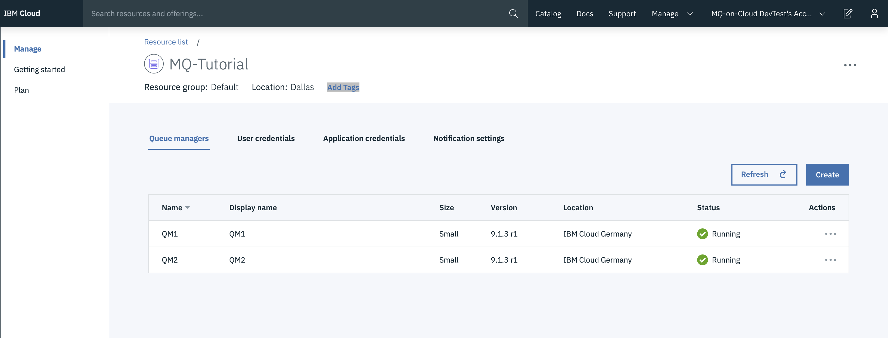
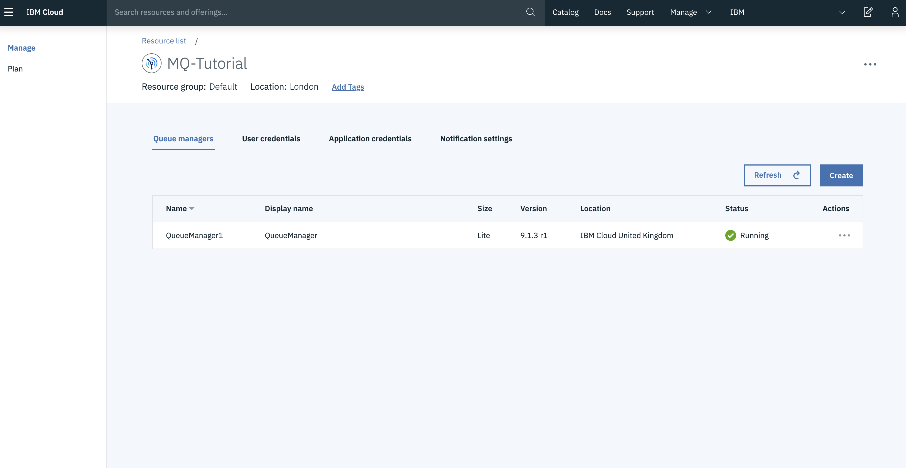
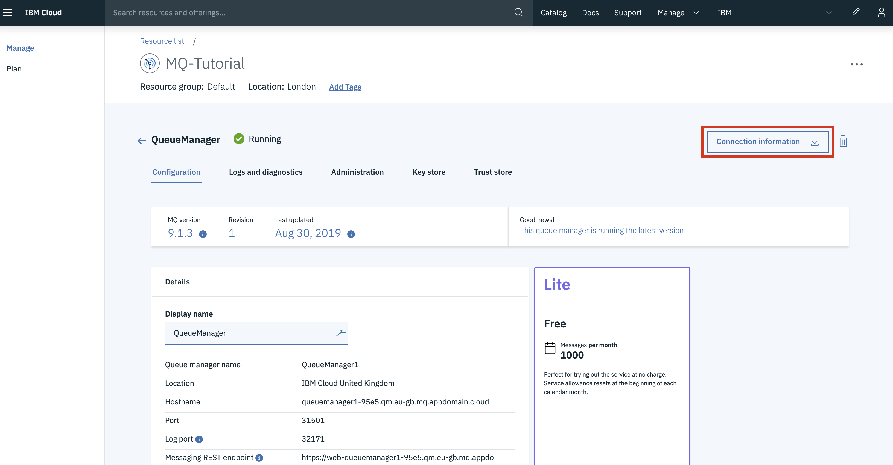

---
copyright:
  years: 2018, 2019
lastupdated: "2019-03-01"
---

{:new_window: target="_blank"}
{:shortdesc: .shortdesc}
{:screen: .screen}
{:codeblock: .codeblock}
{:pre: .pre}

# MQ Remote Administration using REST API gateway
{: #mqoc_remote_administration_restapi}

## What is Remote Administration using the REST API
{: #what_is_ibm_mqoc_remote_administration_restapi}

IBM® MQ allows you to administer IBM® MQ objects, such as queue managers and queues using the administrative REST API. Information is sent to, and received from, the administrative REST API in JSON format. These RESTful APIs can help you to embed IBM MQ administration into popular DevOps and automation tooling.

This tutorial will cover the following :
1. We will create two MQ on cloud queue managers, first queue manager will act as a gateway queue manager and the second queue manager will act as a remote queue manager.
2. Configure the MQ on cloud gateway queue manager(s) to administer remote queue managers. That is, we will configure transmission queues, listeners, and sender and receiver channels between the gateway queue manager and remote queue manager.
3. We will send a REST request to the remote queue manager by specifying the queue manager name in the resource URL, the gateway queue manager is specified in a header that is sent with the request.

The request is sent through the gateway queue manager to the remote queue manager. On successful submission of request, a response is returned with a header that indicates the queue manager that was used as the gateway queue manager.

---

## Prerequisites
{: #prereqs_mqoc_remote_administration_restapi}

To use the administrative REST API gateway to administer remote queue managers, we will prepare the queue managers for remote administration. The gateway queue manager is then specified by setting the `ibm-mq-rest-gateway-qmgr` attribute in a header that is sent with the request. The request is sent through the gateway queue manager to the remote queue manager. The response is returned with a header that indicates the queue manager that was used as the gateway queue manager.

In order to proceed with this tutorial, it is vital that you have completed the following prerequisites:

1. **Create two IBM MQ on Cloud queue manager**

    If you do not already have an IBM MQ on cloud queue manager, you can create them by following the guided tour here:
  [Getting started with MQ on IBM Cloud](/docs/services/mqcloud?topic=mqcloud-mqoc_getting_started)
  Having followed the guided tour, or the manual steps provided on the same page, or if you use an existing MQ on cloud queue manager, you should have:
    - An MQ on cloud queue manager
    - Connection details downloaded in a connection_info.txt file
        - Consult *Appendix 1* at the bottom of this tutorial if you do not have this file
    - An admin username and apikey downloaded in a platformApiKey.json file
        - Consult *Appendix 2* at the bottom of this tutorial if you do not have this file

2. Knowledge on [Administering MQ using REST API](/docs/services/mqcloud?topic=mqcloud-mqoc_qm_rest_api#mqoc_qm_restadmin) is recommended.

---
## Configuration details:
{: #configuration_details}

We expect you have read the information provided in the pre-requisites. By now you should have two MQ on cloud queue managers . We will name first MQ on cloud queue manager as **QM1** and the other MQ on cloud queue manager as **QM2**.

where  
  - QM1: acts as the gateway queue manager
  - QM2: acts as the remote queue manager

    


1. Configure communications between the gateway queue manager and the remote queue manager that you want to administer. We will be creating a sender-receiver channel, a transmission queue and use the listener port provided in queue manager connection properties for each queue manager:

   1.1. On queue manager QM1, we create following IBM MQ objects:
      - Sender channel QM1.to.QM2
      - Receiver channel QM2.to.QM1
      - Transmission queue QM2
      - listener port which is provided in the MQ on cloud Queue Manager(QM1) connection information file.

   1.2. On queue manager QM2, we create following IBM MQ objects:
      - Sender channel QM2.to.QM1
      - Receiver channel QM1.to.QM2
      - Transmission queue QM1
      - listener port which is provided in the MQ on cloud Queue Manager(QM2) connection information file.<br>

    **Note** : In both the queue managers i.e. QM1 and QM2, appropriate authority to access the queue and channels must be provided.

2. Once the above steps are performed, you can observe the channels created in step1 are running in your MQ on cloud Queue Manger Web Console.

   - **for QM1**, following is how MQ Web console looks like :
      <br> <br>

   - **for QM2**, following is how MQ Web console looks like :
     

3. Now, you can make administrative REST API call on the remote queue manager (i.e. QM2) via the gateway queue manager (i.e. QM1) by setting an gateway queue manager header property on queue manager Admin REST endpoint. We have to specify the gateway queue manager in the HTTP header like `ibm-mq-rest-gateway-qmgr:<GATEWAY_QM_NAME>`

    **e.g.** `ibm-mq-rest-gateway-qmgr:QM1` where QM1 is the gateway queue manager name.

You can use any other tool to make a Get request and make a following REST API call.

`GET https://<Admin_REST_endpoint>:<Listener_Port>/ibmmq/rest/v1/admin/qmgr/<Remote_Queue_Manager_Name>/queue`
  -   **e.g.**  `GET 	https://web-qm1-b779.qm2.us-preprod.mq.test.appdomain.cloud/ibmmq/rest/v1/admin/qmgr/QM2/queue`

For the simplicity I will use the curl command, you can use any other tool or application for making HTTP request.

**syntax** :
```curl -u <ADMIN_MQ_USER>:<ADMIN_API_KEY> -H "Accept: application/json" -H "Content-Type: application/json" -H "ibm-mq-rest-gateway-qmgr: <GATEWAY_QUEUE_MANAGER>" <ADMIN_REST_ENDPOINT>/<REMOTE_QUEUE_MANAGER_NAME>/queue -k
```
  - **e.g.**
```curl -u mamgainp:xxxxxxxxxxxxxxxxxxxxxxxxxxxxxxxxxxx -H "Accept: application/json" -H "Content-Type: application/json" -H "ibm-mq-rest-gateway-qmgr: QM1" https://web-qm1-b779.qm2.us-preprod.mq.test.appdomain.cloud/ibmmq/rest/v1/admin/qmgr/QM2/queue -k
```

The above command returns the list of queue running in the remote queue manager.

where
  - `<ADMIN_MQ_USER>` - this is 'mqUsername' in the file platformApiKey.json of your gateway queue manager(i.e. QM1 in our case) .
  - `<QUEUE_MANAGER_NAME>` - this is 'queueManagerName' in the file connection_info.json of your gateway queue manager(i.e. QM1 in our case).
  - `<ADMIN_API_KEY>` = '*apiKey*' in the file platformApiKey.json of your gateway queue manager(i.e. QM1 in our case).
  - `<ADMIN_REST_ENDPOINT>` = this is 'adminREST' in the file connection_info.json of your gateway queue manager(i.e. QM1 in our case).

     **Note** - In this case the `adminREST` property point will be pointing to the gateway queue manager name, replace the gateway queue manager with the remote queue manager name.
       e.g. - `https://web-qm1-b779.qm2.us-preprod.mq.test.appdomain.cloud/ibmmq/rest/v1/admin/qmgr/QM1` replace QM1 with QM2 like `https://web-qm1-b779.qm2.us-preprod.mq.test.appdomain.cloud/ibmmq/rest/v1/admin/qmgr/QM2`
  - `<Remote_Queue_Manager_Name>` -  this is 'queueManagerName' in the file connection_info.json of your remote queue manager(i.e. QM2 in our case).

---
## Result
{: #result}

1. An `ibm-mq-rest-gateway-qmgr` header is returned with the REST response. This header specifies which queue manager was used as the gateway queue manager.

Following is a snippet of the response header containing `ibm-mq-rest-gateway-qmgr` as one of the attribute.
```< HTTP/1.1 200 OK
Date: Mon, 04 Mar 2019 05:29:49 GMT
Content-Type: application/json
Content-Length: 4653
Connection: keep-alive
X-Powered-By: Servlet/3.1
Cache-Control: no-cache, no-store, must-revalidate
Content-Language: en-US
ibm-mq-rest-gateway-qmgr: QM1
Strict-Transport-Security: max-age=31536000; includeSubDomains
```


**Note** : Any of the queue managers used above i.e. gateway queue manager or remote queue manager can be replaced with any other IBM MQ queue managers and used.

---

## Appendix
{: #appendix_mqoc_remote_administration_restapi}

### Appendix 1: **connection_info.txt**
To retrieve the connection_info.txt file containing queue manager connection details:
  1. Log in to the IBM cloud service instance by clicking on the relevant service shown in the table
  
  2. This will open the queue manager view. Select the queue manager you wish to retrieve the connection info from
  
  3. Click **Connection information**
  
  4. Download this file in 'JSON text format'

### Appendix 2: **platformApiKey.json**

To create or reset your administrator api key:
  1. Login to the IBM cloud service instance by clicking on the relevant service shown in the table
  
  2. This will open the queue manager view. Select the queue manager you wish to retrieve the connection info from
  
  3. Next, select the **Administration** tab
  
  4. Now click the **Reset IBM cloud API Key/ Create IBM cloud API Key**

     - **Note:** The previous admin API key for this MQ Username will **no longer be valid**

  

  - **Note:** If the button says **Create IBM Cloud API Key**, then you have not created an api key in this way before. Click the **Create IBM Cloud API Key** button.

  5. Click **Download** to download platformApiKey.json containing an admin username and apikey
  

  - `<ADMIN_MQ_USER>` - this is 'mqUsername' in the file platformApiKey.json of your queue manager.
  - `<QUEUE_MANAGER_NAME>` - this is 'queueManagerName' in the file connection_info.json of your queue manager.   
  - `<ADMIN_API_KEY>` = '*apiKey*' in the file platformApiKey.json of your queue manager.
