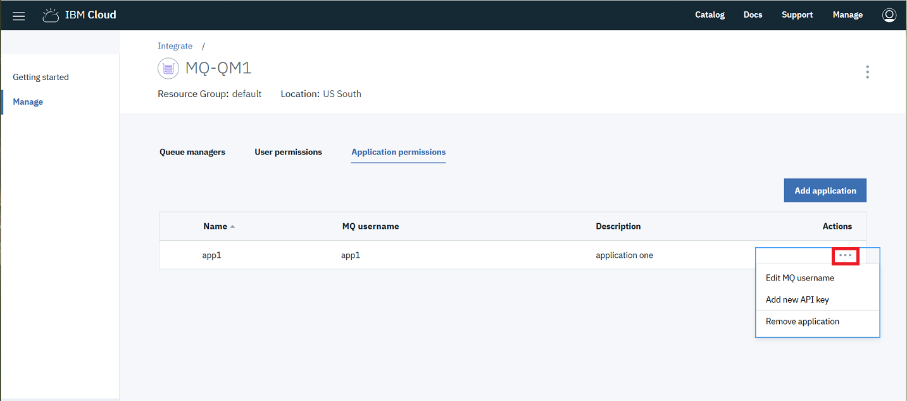

---
copyright:
  years: 2017, 2018
lastupdated: "2018-03-05"
---

{:new_window: target="_blank"}
{:shortdesc: .shortdesc}
{:screen: .screen}
{:codeblock: .codeblock}
{:pre: .pre}

# Removing access for an existing application
{: #mqoc_remove_app_qm_access}

These instructions will **remove** access for an existing application.
  * **Warning:** your application will no longer be able to connect to queue managers within your IBM MQ service instance.

1. Log in to the IBM Cloud console.
2. Click on the 'hamburger menu'.
3. Click **Dashboard**.
  * Ensure that **RESOURCE GROUP** is set to **All Resources**.
4. Locate and click on your IBM MQ service instance, found under the 'Services' heading.
5. Click the **Application permissions** tab.
6. Click the **Actions** menu **...** for the application's entry in the list of Application permissions.

 

7. Click **Remove application**.
8. Click **Remove**.
