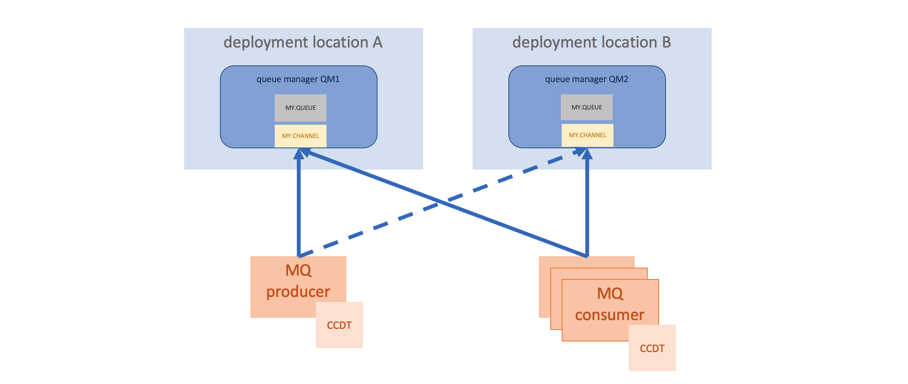
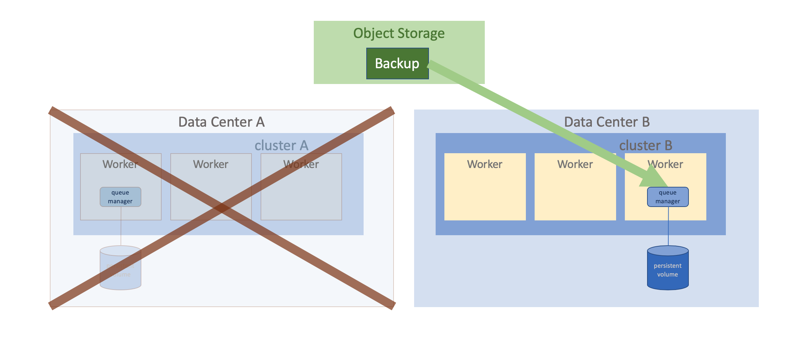

---
copyright:
  years: 2020, 2023
lastupdated: "2023-05-17"
---

{{site.data.keyword.attribute-definition-list}}

# Default and Custom Enterprise Plan
{: #mqoc_ha}

This section describes the High Availability (HA) provided by the {{site.data.keyword.mq_full}} service, how to create a queue manager HA solution architecture and details of disaster recovery.
The information here is a specifc to the Default and Custom Enterprise plans.

## High Availability
{: #mqoc_ha_qm}

Internally, {{site.data.keyword.mq_full}} is deployed using a series of components that are built and deployed as containers into a Kubernetes cluster that runs in the particular geographical region you have selected. Each paid queue manager that you deploy exists in its own isolated container and has dedicated CPU, RAM and disk allocated for its use.

A Kubernetes cluster consists of multiple worker nodes (e.g. virtual machines) across which the deployed containers are distributed and each container has a health-check and liveness-check defined so that Kubernetes will automatically cause the container to be moved from one worker to another in the event of certain types of failure.

At the current time MQ on Cloud infrastructure is deployed to a single data center (also referred to as "single Availability Zone") within each Region, so each of the workers in the Kubernetes cluster is within a single data center.

The persistent state of a queue manager such as the defined queues, persistent messages that are contained in those queues and channel sequence state of queue manager channels is stored on a persistent volume that exists outside the container image, so when a queue manager container is restarted on a different worker node it still has exactly the same persistent state as when it was running on the original worker node.

The approach described above forms the basis for High Availability within {{site.data.keyword.mq_full}} and ensures that queue managers are able to continue running even in the event of the failure of an individual worker in the cluster.

## Required solution architecture for HA queue manager configuration
{: #mqoc_ha_architecture}

The MQ on Cloud architecture described above provides very good levels of availability for individual queue managers by ensuring they are able to continue running when parts of the underlying infrastructure might fail, however an individual queue manager is still a single point of failure in that it will be taken offline for short periods of time in cases such as when a queue manager fails over to a new worker to avoid an outage, when the queue manager is restarted in order to apply security fixes or feature updates, or if there is a region-scoped failure.

The following bullets describe how to use {{site.data.keyword.mq_full}} to deploy a highly available solution architecture that provides uninterrupted service availability even in the event of an individual queue manager being offline for a period of time. This solution architecture also defines the **"HA identified configuration"** for {{site.data.keyword.mq_full}} as prescribed by the IBM Cloud contractual service level agreement (SLA) for high availability configuration as referenced in Section 3.2 of the [IBM Cloud Service Description](https://www-03.ibm.com/software/sla/sladb.nsf/sla/bm).

- Users must deploy two or more queue managers in different deployment locations in order to ensure continued availability in the event of a region-scoped outage (for example London and Frankfurt regions, or IBM Cloud Dallas and AWS US East 1, but not both queue managers in IBM Cloud Dallas)
- Each queue manager must be configured with the same connectivity and set of objects (such as queues/topics/channels) so that applications can connect equivalently to either queue manager in order to carry out their work
- Applications should be configured so that they can connect to any available queue manager
- Producer applications should be configured such that they are able to connect to either of the queue managers (e.g active/active workload balancing, or active/passive fall back to the second queue manager if the first one is not available)
- Multiple instances of consumer applications should be deployed and distributed across the available queue managers so that messages are not left unconsumed on available instances of queues/topics
- Applications should be configured with auto-reconnect to ensure that they will automatically re-establish a connection to a queue manager in the event of a failure

### IBM MQ techniques for implementing the HA solution architecture
{: #mqoc_ha_architecture_technique}

The IBM MQ product includes various capabilities on both the client side and the server (queue manager) side that support the configuration of the highly available solution architecture described above;

- [ConnectionNameList](https://www.ibm.com/support/knowledgecenter/SSFKSJ_9.1.0/com.ibm.mq.dev.doc/q119450_.htm) is a comma separated list of queue manager endpoints of the form "host1(port1),host2(port2)" which will be tried in sequential order when the application creates a connection, so is ideal for active/passive style scenarios where applications should prefer to connect to host1 if it is available
- [CCDT (Client Channel Definition Table)](https://www.ibm.com/support/knowledgecenter/SSFKSJ_9.1.0/com.ibm.mq.dev.doc/q032510_.htm) is a file format that defines the set of available queue managers, and allows the user to define groups of equivalent queue managers, and policies for distributing connection requests across those queue managers. By default it will randomise connections to sets of queue managers in the group (which is ideal for active/active scenarios), however it can also be configured to define a preference (e.g. active/passive scenarios)
- Applications that use the [IBM MQ REST Messaging API](https://cloud.ibm.com/docs/services/mqcloud?topic=mqcloud-mqoc_qm_rest_api) attach to a different REST URL endpoint for each queue manager, and can use the capabilities of their programming environment to select which endpoint to use, and how to handle failover in the event that one of the endpoints is not available

## Cold Disaster Recovery
{: #mqoc_ha_disaster_recovery}

The sections above describe how {{site.data.keyword.mq_full}} provides high availability to handle outages or failures that might occur for individual workers on which queue managers are running, however there is a more extreme failure scenario in which a catastrophic failure causes all of the existing infrastructure and data to be unavailable or corrupted. We call the process of restoring the service following this type of failure "Cold Disaster Recovery", shortened to "Cold DR".

As an example a Cold DR scenario would occur if the entire data center in which MQ on Cloud infrastructure for a given region has been deployed is taken offline, for example due to a major natural disaster. In this case the persistent volume on which the queue manager runtime state is stored is no longer available (because it is stored within the single data center) so it will not be possible to restore the queue manager to its exact original state from before the catastrophic failure.

### IBM Responsibilities
{: #mqoc_ha_ibm_resp}

To enable IBM to restore the service following this type of catastrophic failure a configuration backup of every paid queue manager is taken every 24 hours and saved in an encrypted format in a storage location outside the active data center. The configuration backup includes the admin definitions of the queues, topics and channels that exist within the queue manager as well as TLS certificates that have been applied, but does not include runtime state such as persistent messages or channel sequence state because runtime state in a queue manager changes so frequently that restoring a copy of that data up to 24 hours old is typically less desirable to an enterprise than starting from a clean state.

Since restoring a queue manager from this configuration backup results in the loss of the runtime state such as persistent messages it is not an action that is taken lightly by IBM and so the IBM Operations team will first work with the infrastructure provider (e.g. IBM or Amazon Web Services) to recover the existing infrastructure. Only once it has been determined that the original infrastructure cannot be recovered in an acceptable timeframe will the Cold DR process be activated.

Once the decision has been made to trigger the Cold DR process IBM will launch new infrastructure in a different data center to host the paid queue managers, and use the configuration backup for each paid queue manager to recreate a copy of the queue manager deployed in the new infrastructure. Finally the DNS hostname that is used by applications to access the queue manager is updated to point to the new infrastructure deployment.

### RTO and RPO (recovery time objective and recovery point objective)
{: #mqoc_ha_rto_rpo}

- RTO is 24 hours
- RPO is 24 hours

| Queue manager region | Processing availability zone | Alternate availability zone | Backup multi-az region |
|:-------              |:------------                 |:------------                |:------------           |
| us-south             | dal12                        | dal14                       | us-south               |
| us-east              | wdc04                        | wdc06                       | us-east                |
| eu-de                | fra02                        | fra05                       | eu-de                  |
| eu-gb                | lon04                        | lon02                       | eu-gb                  |
| AWS us-east-1        | us-east-1d                   | us-east-1b                  | us-east                |
| AWS eu-west-1        | eu-west-1c                   | eu-west-1b                  | eu-west                |
{: caption="Table 1. {{site.data.keyword.mq_full}} processing and backup locations" caption-side="top"}

### Customer Responsibilities
{: #mqoc_ha_cust_resp}

Since the cold restore of the queue manager does not retain runtime state such as channel sequence state there may be some administrative action that you will need to take to re-integrate the restored queue manager with your other infrastructure, for example by resetting channel sequence numbers so that channels will successfully communicate. To aid this final recovery step you are recommended to configure a [Disaster Recovery notification handler as described here](/docs/services/mqcloud?topic=mqcloud-mqoc_dr_notifications) when you deploy your queue managers so that you can receive a notification from the IBM Operations team when the disaster recovery process has been completed.
