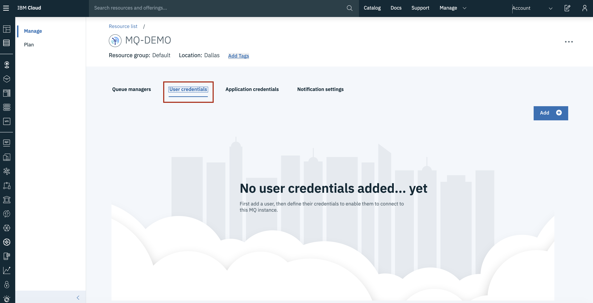
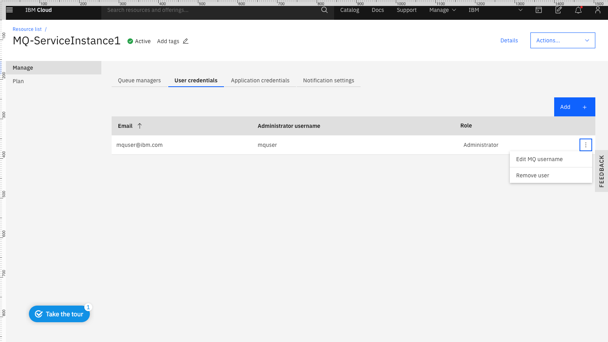

---
copyright:
  years: 2017, 2018
lastupdated: "2018-02-06"
---

{:new_window: target="_blank"}
{:shortdesc: .shortdesc}
{:screen: .screen}
{:codeblock: .codeblock}
{:pre: .pre}

# Configuring administrator access for a queue manager
{: #tut_mqoc_configure_admin_qm_access}

To administer a queue manager (using IBM MQ Web Console, IBM MQ Explorer or runmqsc) a user must be granted permissions to access queue managers within their IBM MQ service instance.  They must connect to the queue manager using their **MQ username** and the password must be their **platform API key**.
{:shortdesc}

By completing the following task, you can:
1. Grant user permissions to access queue managers within your IBM MQ service instance.
2. Obtain your MQ username.
3. Create your platform API key.

If you want to know more about IBM MQ users and applications before proceeding, you
can find [information here](/docs/services/mqcloud/mqoc_configure_users_and_apps.html)

---

## Part A. Granting user permissions to access queue managers within your IBM MQ service instance
{: #parta_tut_mqoc_configure_admin_qm_access}

If you have **Administrator** privileges for your IBM MQ service instance.  Follow these instructions to grant yourself and other users (as required) access to queue managers within your IBM MQ service instance.
  * **Note:** if you are the administrator of your IBM Cloud Account, then you should have the necessary privileges to perform these instructions.

If you **do not** have the necessary privileges, someone with the required privileges should follow these instructions to grant you access to queue managers within your IBM MQ service instance.

1. Log in to the IBM Cloud console.
2. Click on the 'hamburger menu'.
3. Click **Dashboard**.
4. Locate and click on your IBM MQ service instance, found under the 'Services' heading.
  * Ensure that **RESOURCE GROUP** is set to **All Resources** and **REGION** is set to **US South Region**.
5. Click the **User permissions** tab.

 

6. Click **Add user**.
7. Enter the user's **Email address**.
8. Click **Generate MQ username**.
  * Note: a unique MQ username will be auto-generated for you.  You can edit the text-box to change this to your preferred username.  It must have a maximum of 12 characters and be lower case a-z or 0-9.  It must also be unique within your IBM MQ service instance.
9. Click **Add permissions**.

The user that was added will now have permissions to access queue managers within your IBM MQ service instance.  They should follow **Part B** to obtain their **MQ username** and **Part C** to create their **platform API Key**.

## Part B. Obtaining your MQ username
{: #partb_tut_mqoc_configure_admin_qm_access}

Your **MQ username** is set when you are granted user permissions to access queue managers within your IBM MQ service instance (see **Part A**).  You can view your MQ username as follows:

1. Log in to the IBM Cloud console.
2. Click on the 'hamburger menu'.
3. Click **Dashboard**.
4. Locate and click on your IBM MQ service instance, found under the 'Services' heading.
  * Ensure that **RESOURCE GROUP** is set to **All Resources** and **REGION** is set to **US South Region**.
5. Click the **User permissions** tab.
6. Your **MQ username** should be listed next to your **Email** address.

**Note:** if there are no entries in the list for your **Email** address, then you need to be granted user permissions to access queue managers within your IBM MQ service instance (see **Part A**).

If you wish to **edit** your MQ username, this can be done as follows:

1. Click the **Actions** menu **...** for your entry in the list of **User permissions**.

 

2. Click **Edit MQ username**.
3. Enter a new MQ username.
  * Note: the MQ username must have a maximum of 12 characters and be lower case a-z or 0-9.  It must also be unique within your IBM MQ service instance.
4. Click **Save**.

## Part C. Creating your platform API Key
{: #partc_tut_mqoc_configure_admin_qm_access}

The API Key that is generated in these steps is used to authenticate with **IBM Cloud** as the **user** who created it.  Therefore, it should not be shared with any other users and should be stored securely.

1. From the top right menu bar, click **Manage > Security > Platform API Keys**.
2. Click **Create**.
3. Enter a **Name** and **Description** that will help you identify your platform API Key.
4. Click **Create**.
5. Click **Show** to display the API key to copy and save it for later, or click **Download** to store the API Key in a file.
6. Click **Close**.

**Note:** For security reasons, the API key is only available to be copied or downloaded at the time of creation.  If the API key is lost, you must create a new API key.

---

## Next step
{: #next_tut_mqoc_configure_admin_qm_access}

Administer a queue manager, using one of the [queue manager administration options](/docs/services/mqcloud/mqoc_admin_qm.html)
