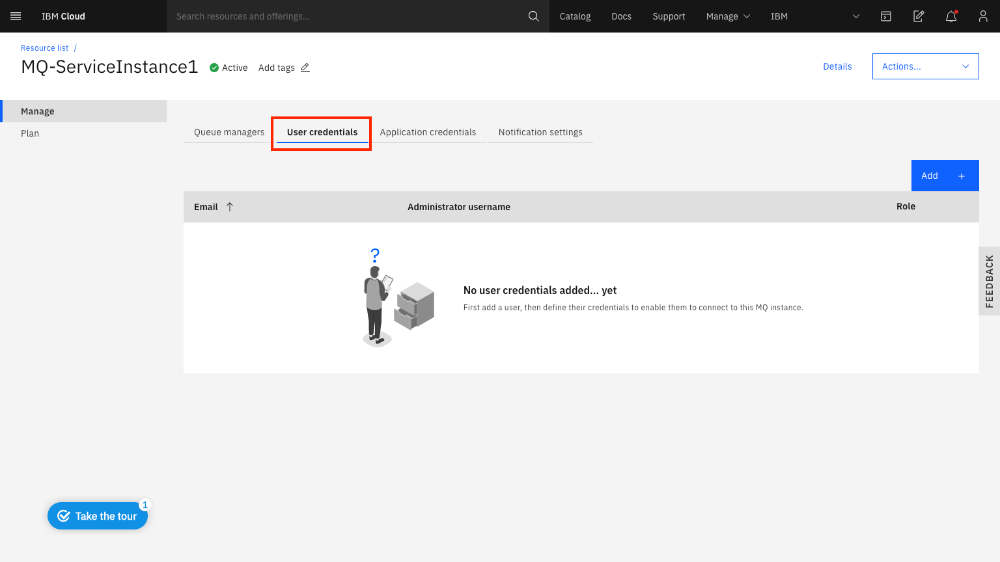

---
copyright:
  years: 2017, 2019
lastupdated: "2018-03-05"
---

{:new_window: target="_blank"}
{:shortdesc: .shortdesc}
{:screen: .screen}
{:codeblock: .codeblock}
{:pre: .pre}

# Configuring administrator access for a queue manager
{: #tut_mqoc_configure_admin_qm_access}

To administer a queue manager (using IBM MQ Web Console, IBM MQ Explorer or runmqsc) an administrator must be granted permissions to access queue managers within their IBM MQ service instance.  They must connect to the queue manager using their **Administrator username** and the password must be their **Administrator API key**.
{:shortdesc}

If you want to know more about IBM MQ administrators and applications before proceeding, you
can find [information here](/docs/services/mqcloud?topic=mqcloud-mqoc_users_and_apps).

---

## Granting administrator permissions to access queue managers within your IBM MQ service instance
{: #grant_tut_mqoc_configure_admin_qm_access}

If you have **Administrator** privileges for your IBM MQ service instance, then you will already have access to queue managers within your IBM MQ service instance.  You can follow these instructions to grant access to other users.

If you are the administrator of your IBM Cloud Account, then you should have the necessary administrator privileges for your IBM MQ service instance.

If you **do not** have the necessary privileges, someone with the required privileges should follow these instructions to grant you access to queue managers within your IBM MQ service instance.

1. Log in to the IBM Cloud console to view the dashboard.
2. In the **Resource summary** panel click **Services**.
3. In the **Offering** filter box type `MQ`.
4. Locate and click on your IBM MQ service instance, found under the 'Services' heading.
5. Once in the MQ on Cloud service, click the **User credentials** tab.

 

6. Click **Add**.
7. Enter the user's **Email address**.
8. Click **Generate MQ username**.
  * **Note:** a unique administrator username will be auto-generated for the user.  You can edit the text-box to change this to the preferred username.  It must have a maximum of 12 characters and be lower case a-z or 0-9.  It must also be unique within your IBM MQ service instance.
9. Click **Add credentials**.

The user that was added will now have permissions to access queue managers within your IBM MQ service instance.  The user can view their **Administrator username** and obtain their **Administrator API key** by following the instructions for administering a queue manager (see **Next step**).

---

## Next step
{: #next_tut_mqoc_configure_admin_qm_access}

Administer a queue manager, using one of the [queue manager administration options](/docs/services/mqcloud?topic=mqcloud-mqoc_admin_qm)
