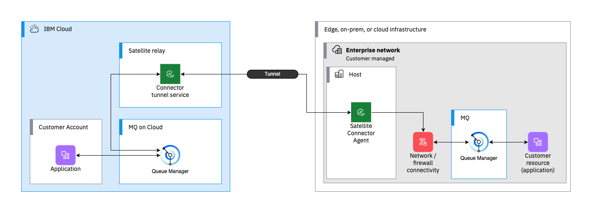

---
copyright:
  years: 2024
lastupdated: "2024-03-28"

subcollection: mqcloud

keywords: connect, onprem, satellite, connector, agent, secure, gateway

content-type: tutorial
completion-time: 1h

---

# Connecting to an on-premises queue manager by using IBM Cloud Satellite Connector
{: #mqoc_connect_onprem_satellite_connector}
{: toc-content-type="tutorial"}
{: toc-services="mqcloud, Satellite"}
{: toc-completion-time="60m"}

Satellite Connector is the replacement service for the deprecated service IBM Cloud Secure Gateway - [see notice](/docs/satellite?topic=satellite-connector-and-secure-gateway) {:attention}

Satellite Connector provides an endpoint for establishing a secure connection between IBM Cloud services and on-premises applications.

{{site.data.keyword.mq_full}} queue managers that are deployed to an IBM Cloud [deployment location](/docs/mqcloud?topic=mqcloud-deploy_locations#deploy_qm_locations) can use Satellite Connectors to connect to secure on-premises applications.



The Satellite Connector endpoint is only contactable within the IBM Cloud private endpoint network, and is only reachable from within IBM Cloud. 
When connecting an IBM MQ queue manager on cloud to an on-premises queue manager using the IBM Cloud Satellite Connector, channels must be started from the IBM Cloud queue manager to account for this.
The Satellite Connector agent in the on-premises network routes the connection to the correct endpoint for the on-premises queue manager.

To achieve this the following channel definitions can be used:
- Requester (cloud) - Server (on-premises)
  - This pattern enables message flow from on-premises to the cloud.
  - The Requester channel is given the hostname and port of the Satellite Connector as its connection details.
  - The Server channel is started by the Requester channel.
- Sender (cloud) - Receiver (on-premises)
  - This pattern enables message flow from cloud to on-premises.
  - The Sender channel is given the hostname and port of the Satellite Connector as its connection details.
  - The Receiver channel is started by the Sender channel.

## Before you begin
{: #mqoc-satellite-connector-before-you-begin}

The following scenario has four main components; a cloud queue manager, an on-premises queue manager, a Satellite Connector Instance, and a Satellite Connector Agent.

1. A cloud-hosted queue manager in an {{site.data.keyword.mq_full}} on Cloud service instance. 
  - In the following steps, the name of the queue manager is referred to as `CLOUD`.
  - For instructions to create a cloud-hosted queue manager, follow the [creating a queue manager](/docs/mqcloud?topic=mqcloud-mqoc_create_qm) guide.
  - [Configure administrator access for a queue manager in IBM Cloud](/docs/mqcloud?topic=mqcloud-tutorial-configure-admin-access)
2. An IBM MQ queue manager set up in your on-premises environment.
  - In the following steps, the name of the on-premises queue manager is referred to as `ONPREM`.
  - Follow these [instructions](https://developer.ibm.com/tutorials/mq-secure-msgs-tls/) to set up an IBM MQ queue manager in a container with TLS configured.
3. [Create a Satellite Connector in your IBM Cloud account](/docs/satellite?topic=satellite-create-connector&interface=ui)
4. [Set up a Satellite Connector Agent in your on-premises environment](/docs/satellite?topic=satellite-run-agent-locally&interface=ui)
5. Set up a [user endpoint](/docs/satellite?topic=satellite-connector-create-endpoints#create-connector-endpoint-console) in your Satellite Connector instance
  - If you are using an IBM MQ container, run the following commands to get its IP address
  - `docker inspect <container-id> | grep IPAddress`

To enable connectivity between the two queue managers, channels must be defined that can connect over the TLS tunnel that is created by the Satellite Connector. On each queue manager, a local and remote queue configuration must also be configured to enable the flow of messages to and from each queue manager.

## Set up on-premises queue manager
{: step}

To set up the on-premises queue manager, you need to complete these steps:
- Adding the cloud queue manager public certificate to the on-premises queue manager truststore.
- Configure queues to send messages to the cloud queue manager
- Define a server channel that is initiated from the cloud queue manager to allow messages to be sent from on-premises to the cloud
- Set a channel authentication record to allow connection from cloud queue manager
- Define a local queue that receives messages from the cloud queue manager
- Define a receiver channel for the cloud queue manager to connect by using a sender channel to enable message traffic from cloud to on-premises
- Set a channel authentication record for the receiver channel
- Refresh security settings to enable new SSL configuration

If you have not setup a queue manager yet, follow these [instructions](https://developer.ibm.com/tutorials/mq-secure-msgs-tls/) to set up an IBM MQ in a container with TLS enabled. {:note .note}

### Add cloud queue manager public certificate to on-premises queue manager keystore

To enable mutual TLS between the two queue managers, we must add the public certificates to each other's respective truststore configuration.

To obtain the public certificate for the cloud queue manager;

- Log in to your service instance in the IBM Cloud service console
- Click the row for your queue manager in the table to open its details page
- Click **Key store**, and find the certificate with the prefix `Default:`. 
- Click the **Actions** icon  and then click **Download public certificate**.
- Save this certificate in a suitable location and continue.

Once downloaded you can now add this certificate to the keystore of your on-premises queue manager.

If you have setup an IBM MQ container, you can follow these steps to add the certificate to its truststore. 

```
docker cp qmgrcert <container-id>:/run/runmqserver/tls

docker exec -ti <container-id> bash

cd /run/runmqserver/tls
runmqakm -cert -add -db key.kdb -stashed -label ibmwebspeheremqcloud -file /run/runmqserver/tls/qmgrcert.pem
```
{:codeblock: .codeblock}

Check the contents of the keystore with the following command, refer to the example output to see what a typical response looks like.

```
runmqakm -cert -list -db key.kdb -stashed

Certificates found
* default, - personal, ! trusted, # secret key
!	ibmwebspeheremqcloud
!	"CN=R3,O=Let's Encrypt,C=US"
!	"CN=ISRG Root X1,O=Internet Security Research Group,C=US"
-	mykey
```
{:screen: .screen}

### Define queues on the on-premises queue manager

Start `runmqsc` on the on-premises queue manager and run the following commands to create the required queues.
- The local queue named "TO.CLOUD" in this example is the transmission queue that sends the message through a channel.
- The remote queue named "CLOUD" is where we put messages that are intended to be sent to the cloud queue manager.

```sh
DEFINE QLOCAL(TO.CLOUD) USAGE(XMITQ)
DEFINE QREMOTE(CLOUD) RNAME(CLOUD) RQMNAME('CLOUD') XMITQ(TO.CLOUD)
```
{:codeblock: .codeblock}

Keep the `runmqsc` session open and continue on to the next step.

### Define the server channel on the on-premises queue manager

Define the server channel that is connected from the requester channel on the cloud queue manager 

```sh
DEFINE CHANNEL(ONPREM.TO.CLOUD) CHLTYPE(SVR) XMITQ(TO.CLOUD) TRPTYPE(TCP) SSLCIPH(ANY_TLS12_OR_HIGHER) SSLCAUTH(REQUIRED) HBINT(15) KAINT(15) DISCINT(0)
```
{:codeblock: .codeblock}

Next, define the channel authentication record to allow the remote queue manager to connect to the new channel.

```sh
SET CHLAUTH(ONPREM.TO.CLOUD) TYPE(QMGRMAP) QMNAME('CLOUD') ACTION(ADD) USERSRC(CHANNEL)
```
{:codeblock: .codeblock}

### Define the local queue on the on-premises queue manager

To receive messages from the cloud queue manager, define a local queue with the name `ONPREM`.

```sh
DEFINE QLOCAL(ONPREM)
```
{:codeblock: .codeblock}

### Define the receiver channel on the on-premises queue manager

A receiver channel is required to allow messages to be sent from the cloud queue manager to the on-premises queue manager.

```sh
DEFINE CHANNEL(CLOUD.TO.ONPREM) CHLTYPE(RCVR) TRPTYPE(TCP) SSLCIPH(ANY_TLS12_OR_HIGHER) SSLCAUTH(REQUIRED) CERTLABL('mykey') HBINT(15) KAINT(15)
```
{:codeblock: .codeblock}

Set the required channel authentication record for this channel.

```sh
SET CHLAUTH(CLOUD.TO.ONPREM) TYPE(QMGRMAP) QMNAME('CLOUD') ACTION(ADD) USERSRC(CHANNEL)
```
{:codeblock: .codeblock}

Now refresh the TLS security configuration, ensuring that the certificate data in the keystore file is updated on the queue manager.

```sh
REFRESH SECURITY TYPE(SSL)
```
{:codeblock: .codeblock}
Exit from this runmqsc session and continue to the next steps where you will set up the cloud queue manager.

## Set up cloud queue manager
{: step}

Next, it is now time to create and configure the cloud queue manager, with its corresponding channels and queues to enable the connection between the two queue managers.

### Upload on-premises certificate to cloud queue manager

To set up mutual TLS configuration on the cloud queue manager, you must upload the public certificate for your on-premises queue manager. 

First access the on-premises queue manager and extract a copy of its certificate, copy this certificate to your local workspace, and then upload to the cloud queue manager.

- Access your on-premises environment, here is an example of running the commands against an IBM MQ queue manager container.
```
docker exec <container> bash

cd /run/runmqserver/tls

runmqakm -cert -extract -db key.kdb -stashed -label mykey -target onpremcert.pem -format ascii -fips

exit
```
{:screen: .screen}

Then, copy the file to your local workstation.

```
docker cp <container>:/run/runmqserver/tls/onpremcert.pem onpremcert.pem
```
{:screen: .screen}

- In your web browser, go to the IBM Cloud console and find your {{site.data.keyword.mq_full}} service instance.
- From the list of queue managers, click the row containing your queue manager to go to its details view, and then click the **Trust store** tab.
- Click **Import certificate**, then click **Browse files** and find the `onpremcert.pem` file that you downloaded in the previous steps and select it.s
- Then, click **Next**. Set the certificate label to `ibmmqonprem` and then click **Save**.

The newly imported certificate should now appear in the list of certificates in the truststore and it should show as being trusted

### Connect to a cloud queue manager that uses runmqsc

To perform the setup of the cloud queue manager, you need to connect an instance of runmqsc to apply the necessary configuration.

Follow these [instructions](/docs/mqcloud?topic=mqcloud-mqoc_remote_ssl_runmqsc_admin#mqoc_remote_ssl_runmqsc_admin_tasks) to configure runmqsc to use standard "one-way" TLS connection.

Once configured and connected to the cloud queue manager proceed on to the next steps.

### Define a local queue on the cloud queue manager

To receive messages from the on-premises queue manager, you must define a local queue. This queue matches the name of the remote queue on the on-premises queue manager.

```sh
DEFINE QLOCAL(CLOUD)
```
{:codeblock: .codeblock}

### Define requester channel on cloud queue manager

Next, define the requester channel on the cloud queue manager. This is used to initiate the connection with the remote on-premises queue manager.

```sh
DEFINE CHANNEL(ONPREM.TO.CLOUD) CHLTYPE(RQSTR) CONNAME('<connector-hostname>(<port>)') TRPTYPE(TCP) SSLCIPH(ANY_TLS12_OR_HIGHER) SSLCAUTH(REQUIRED) HBINT(15) KAINT(15)
```

Apply the corresponding channel authentication record for this channel.

```sh
SET CHLAUTH(ONPREM.TO.CLOUD) TYPE(QMGRMAP) QMNAME('CLOUD') ACTION(ADD) USERSRC(CHANNEL)
```

### Define queues on the cloud queue manager

In runmqsc targeting the cloud queue manager, run the following commands to create the required queues
- The local queue named "TO.ONPREM" in this example is the transmission queue that sends the message through a channel.
- The remote queue named "ONPREM" is where we put messages that are intended to be sent to the on-premises queue manager.

```sh
DEFINE QLOCAL(TO.ONPREM) USAGE(XMITQ)
DEFINE QREMOTE(ONPREM) RNAME(ONPREM) RQMNAME('ONPREM') XMITQ(TO.ONPREM)
```

### Define the sender channel on the cloud queue manager

In the same runmqsc session, define the sender channel that allows the cloud queue manager to initiate a connection with the on-premises queue manager receiver channel.
- The server (SVR) channel is called by a requester channel

```sh
DEFINE CHANNEL(CLOUD.TO.ONPREM) CHLTYPE(SDR) CONNAME('<connector-hostname>(<port>)') TRPTYPE(TCP) XMITQ(TO.ONPREM) SSLCIPH(ANY_TLS12_OR_HIGHER) DISCINT(0) HBINT(15) KAINT(15)
```
{:codeblock: .codeblock}

Then, you can define the channel authentication record to allow the remote queue manager to connect to the new channel.

```sh
SET CHLAUTH(CLOUD.TO.ONPREM) TYPE(QMGRMAP) QMNAME('ONPREM') ACTION(ADD) USERSRC(CHANNEL)
```
{:codeblock: .codeblock}

Now refresh the TLS security configuration. This ensures that the certificate data in the keystore file is updated on the queue manager.

```sh
REFRESH SECURITY TYPE(SSL)
```
{:codeblock: .codeblock}

## Validate the connection
{: step}
Start the connection by running the following commands with runmqsc.

```sh
START CHANNEL(CLOUD.TO.ONPREM)
START CHANNEL(ONPREM.TO.CLOUD)
```
{:codeblock: .codeblock}

Check the statuses of each of the channels to see whether they are now running.

```sh
DIS CHSTATUS(CLOUD.TO.ONPREM)
DIS CHSTATUS(ONPREM.TO.CLOUD)
```
{:codeblock: .codeblock}

Now the channels are connected and running, you can proceed to put and get messages.

### Connect amqsput sample application to cloud queue manager

If you have the IBM MQ client installation or use the IBM MQ toolkit locally, you have access to the IBM MQ sample applications.

To connect an application to your cloud queue manager, you need to create an Application Credential. This is a username and API key combination, which is used to authenticate your application with the queue manager. Follow these [instructions](https://cloud.ibm.com/docs/mqcloud?topic=mqcloud-mqoc_configure_app_qm_access) to create an application credential.

Follow these [instructions](https://cloud.ibm.com/docs/mqcloud?topic=mqcloud-mqoc_connect_app_qm#prepconn1_mqoc_connect_app_qm) to set up a keystore and connection details for use with the sample application.

To send a message to the on-premises queue manager, you use the `amqsputc` application to put a message to the remote queue named `ONPREM`. Enter your application user password and then type your message, press enter to send the message. Note, each new line in this session is a new message. To exit press `ctrl+c`.

```sh
amqsputc <queue-name> <queue-manager>

amqsputc ONPREM CLOUD
Enter password: *******
hello from the cloud
```
{:screen: .screen}

### Read the message in the on-premises queue manager IBM MQ Console

For the purpose of this guide we assume that your queue manager has the IBM MQ console setup and installed. If you are using the IBM MQ Container install this should be configured by default. If not you can do so by following these [instructions](https://developer.ibm.com/tutorials/mq-setting-up-using-ibm-mq-console/).

Assuming you have this installed you navigate to **https://localhost:9443/ibmmq/console** in your browser to launch the console. 

Your browser might warn you about an unsafe connection. This is because the server running IBM MQ is using a self-signed certificate by default, as such it is okay to accept the warning and continue to the console. 

You will first be taken to the login page and be prompted to enter a username and password. In [step 2](https://developer.ibm.com/tutorials/mq-setting-up-using-ibm-mq-console/#step-2-access-the-mq-console) in the IBM MQ Console setup guide, it defines what the default username password for the IBM MQ container is. Enter the correct username and password and click **Log in**.

In the console, click **Manage** in the navigation side bar. Now in the queue manager view, click **Queues**, and then in the table locate the **Local** queue named **ONPREM**. This should have a **Maximum depth** of **1/5000** shown. Click the table row for this queue to open the message browser. You should see one message, and in the **Application data** column you should see the message **Hello from the cloud**

### Send a message from the on-premises queue manager IBM MQ Console

In the console, click **Manage** in the navigation side bar. Now in the queue manager view, click **Queues**, and then in the table locate the **Remote** queue named **CLOUD**. Click the **Actions** icon  on the table row for this queue, and then click **Create message**. In the text field under **Application Data**, enter the text `Hello from on-premises`, and then click **Create**.

### Connect amqsgetc sample application to cloud queue manager

To retrieve a message on the cloud queue manager, you use the `amqsget` application to get a message from the local queue named `CLOUD`.

```sh
amqsgetc <queue-name> <queue-manager>

amqsputc CLOUD CLOUD
Sample AMQSGET0 start
Enter password: ****
message <hello from on-premises>
```
{:screen: .screen}
